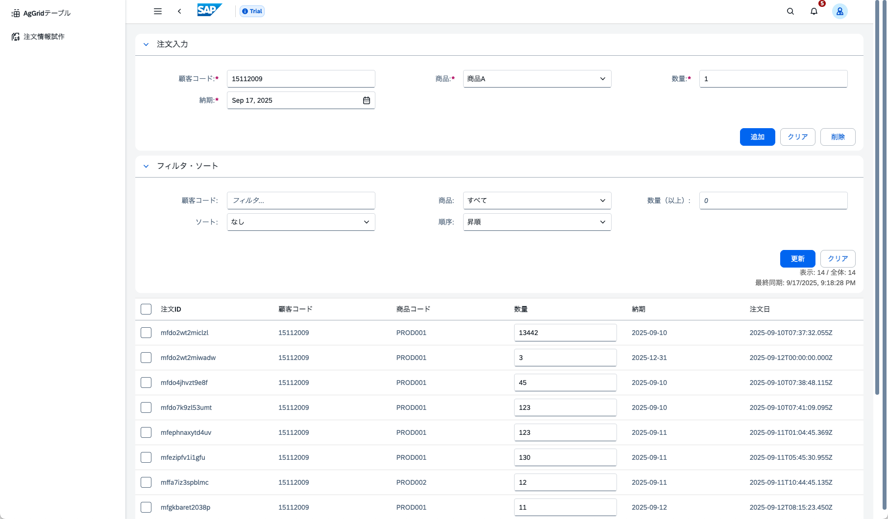
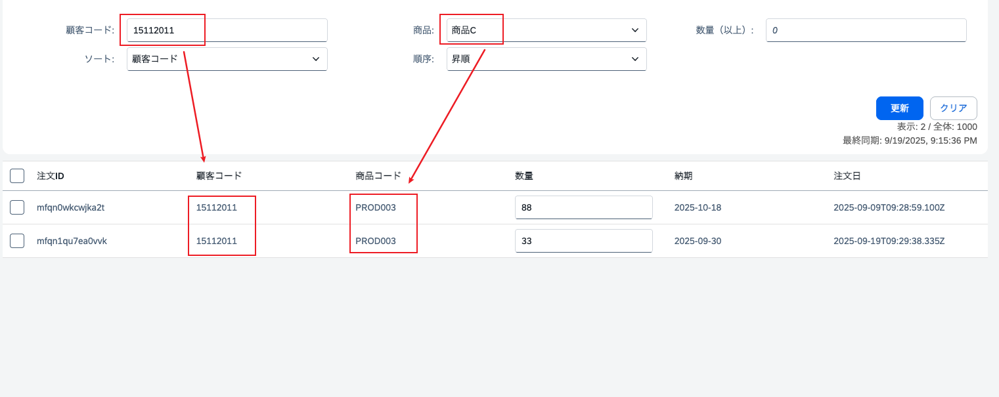
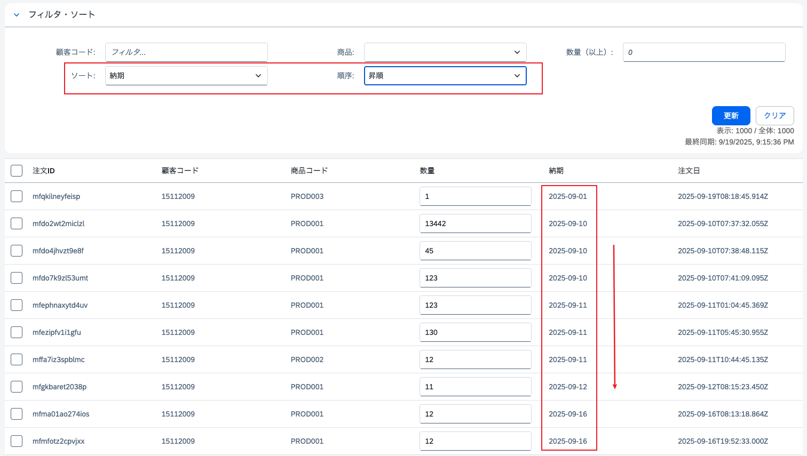

# Day 11: アプリケーション機能実装① - コード整理とフィルター・ソート機能の追加

## ゴール
!!! success "Day 11 Goals"
    - コードベースの整理
        - コンポーネントの分割
        - ストアの整理
        - ユーティリティ関数の整理
        - スタイルの整理
        - 不要コードの削除
    - フロントエンドで注文フィルターとソート機能を実装


## Step 1: コードベースの整理
次のステップで機能追加を行う前に、コードベースを整理します。コードの可読性と保守性を向上させるために、以下の整理を行います。
### `/lib/UI5FormComp.js`と`/src/pages/Orders2Page.vue`インポートの修正
`/src/lib/UI5FormComp.js`を更新し、UI5 Web Componentsのインポートを行います。
```
// UI5 Web Componentsのインポート
import "@ui5/webcomponents/dist/Avatar.js";
import "@ui5/webcomponents/dist/Input.js";
import "@ui5/webcomponents/dist/Button.js";
import "@ui5/webcomponents/dist/Text.js";
import "@ui5/webcomponents/dist/Tag.js";
import "@ui5/webcomponents/dist/Switch.js";
import "@ui5/webcomponents/dist/Label.js";
import "@ui5/webcomponents/dist/ToggleButton.js";
import "@ui5/webcomponents/dist/Menu.js";
import "@ui5/webcomponents/dist/MenuItem.js";
import '@ui5/webcomponents/dist/Assets';
import "@ui5/webcomponents/dist/ComboBox.js";
import "@ui5/webcomponents/dist/ComboBoxItem.js";
import "@ui5/webcomponents/dist/DatePicker.js";
import "@ui5/webcomponents/dist/TextArea.js";
import "@ui5/webcomponents/dist/Select.js";
import "@ui5/webcomponents/dist/Option.js";
import "@ui5/webcomponents/dist/BusyIndicator.js";
import "@ui5/webcomponents/dist/Panel.js";
import "@ui5/webcomponents/dist/Form.js";
import "@ui5/webcomponents/dist/FormGroup.js";
import "@ui5/webcomponents/dist/FormItem.js";
import "@ui5/webcomponents/dist/Table.js";
import "@ui5/webcomponents/dist/TableRow.js";
import "@ui5/webcomponents/dist/TableCell.js";
import "@ui5/webcomponents/dist/Toast.js";
import "@ui5/webcomponents/dist/TableHeaderRow.js";
import "@ui5/webcomponents/dist/TableHeaderCell.js";
import "@ui5/webcomponents/dist/TableSelection.js";

// Fioriのインポート
import '@ui5/webcomponents-fiori/dist/Assets';
import "@ui5/webcomponents-fiori/dist/ShellBar.js";
import "@ui5/webcomponents-fiori/dist/ShellBarItem.js";
import "@ui5/webcomponents-fiori/dist/ShellBarSpacer.js";
import "@ui5/webcomponents-fiori/dist/ShellBarSearch.js";
import "@ui5/webcomponents-fiori/dist/ShellBarBranding.js";
import "@ui5/webcomponents-fiori/dist/UserMenu.js";
import "@ui5/webcomponents-fiori/dist/UserMenuAccount.js";
import "@ui5/webcomponents-fiori/dist/UserMenuItem.js";
import "@ui5/webcomponents-fiori/dist/SideNavigation.js";
import "@ui5/webcomponents-fiori/dist/NavigationLayout.js";
import "@ui5/webcomponents-fiori/dist/IllustratedMessage.js";
import "@ui5/webcomponents-fiori/dist/illustrations/NoData.js";

// アイコンのインポート
import "@ui5/webcomponents-icons/dist/AllIcons.js";
```

`/src/pages/Orders2Page.vue`を更新し、UI5 Web Componentsのインポートを削除します。
```
// UI5 Web Componentsのインポートを削除
// 以下を追加
import "@/lib/UI5FormComp";
```

### `/src/stores/form-store.ts`と`/src/pages/Orders2Page.vue`の修正
フロントエンド処理とデータ処理を分離するために、`/src/stores/form-store.ts`にロジックを移動します。
`/src/stores/form-store.ts`に以下のコードを書き換えます。
```
// stores/form-store.ts
import { defineStore } from "pinia";
import type { Schema } from "../../amplify/data/resource";
import { generateClient } from "aws-amplify/data";

const client = generateClient<Schema>();

// 商品ごとの単価を定義
const productPrices: { [key: string]: number } = {
	PROD001: 89800,
	PROD002: 2500,
	PROD003: 8900,
};

// 商品コードに基づいて単価を設定
function updateUnitPrice(product_code : string): number {
	return productPrices[product_code] || 5000;
}

// localStorageキー
const ORDERS_KEY = 'orders';
// キャッシュタイムスタンプキー
const CACHE_TIMESTAMP_KEY = 'orders_cache_timestamp';

export const useFormStore = defineStore("form", {
	state: () => ({
		// フォームデータ初期化
		ID: "",
		customer_code: "15112009",
		product_code: "PROD001",
		quantity: "1",
		unit_price: updateUnitPrice("PROD001").toString(),
		delivery_date: new Date().toISOString().split('T')[0],
		created_at: new Date(),
		status: "新規",
		estimated_cost: "1000",

		// 注文データ
		allOrders: [] as Array<Schema['Order']["type"]>,
		// TODO:フィルタリングされた注文データ
		filteredOrders: [] as Array<Schema['Order']["type"]>,

		// ローディング状態
		isLoading: false,
		// 最後の同期時間
		lastSyncTime: null as Date | null,

		// ページネーション
		page: 1,
	}),
	getters: {
		// 注文数を取得
		ordersCount: (state) => state.allOrders.length,

		// 最後の同期時間を文字列で取得
		lastSyncTimeString: (state) => {
			return state.lastSyncTime ? state.lastSyncTime.toLocaleString() : "未同期";
		}
	},
  	// アクション定義
	actions: {
		// localStorage操作
		saveOrdersToLocalStorage() {
			localStorage.setItem(ORDERS_KEY, JSON.stringify(this.allOrders));
			localStorage.setItem(CACHE_TIMESTAMP_KEY, new Date().toISOString());
		},
		loadOrdersFromLocalStorage() {
			const stored = localStorage.getItem(ORDERS_KEY);
			return stored ? JSON.parse(stored) : [];
		},

		getCacheTimestamp(): Date | null {
			const timestamp = localStorage.getItem(CACHE_TIMESTAMP_KEY);
			return timestamp ? new Date(timestamp) : null;
		},
		// キャッシュクリア
		clearCache() {
			localStorage.removeItem(ORDERS_KEY);
			localStorage.removeItem(CACHE_TIMESTAMP_KEY);
			this.allOrders = [];
			this.lastSyncTime = null;
		},

		// 初期化: キャッシュから読み込み、必要に応じて同期
		async initialize() {
			// キャッシュから読み込み
			this.allOrders = this.loadOrdersFromLocalStorage();
			this.lastSyncTime = this.getCacheTimestamp();

			console.log("lastSyncTime:", this.lastSyncTime);
			// 必要に応じてサーバーと同期（例: 最後の同期から1時間以上経過している場合、またはキャッシュがない場合）
			if (!this.lastSyncTime || (new Date().getTime() - this.lastSyncTime.getTime()) > 3600000) {
				console.log("Syncing with server...");
				await this.syncWithServer();
			}

			this.page = 1;

		},
		// サーバーと同期
		async syncWithServer(): Promise<{ success: boolean; message: string }> {
			try{
				this.isLoading = true;
				const result = await client.queries.getOrder();

				if (result.data) {
					this.allOrders = result.data;
					this.lastSyncTime = new Date();
					this.saveOrdersToLocalStorage();
					return { success: true, message: "同期に成功しました" };
				} else {
					return { success: false, message: "データ取得に失敗しました" };
				}
			} catch (error) {
				console.error("Sync error:", error);
				return { success: false, message: "同期中にエラーが発生しました" };
			} finally {
				this.isLoading = false;
			}
		},

		// TODO: フィルタリング機能追加予定
		applyFiltersAndSort(){
			// フィルタリングとソートのロジックをここに実装
		},

		// フォームリセット
		reset() {
			this.customer_code = "15112009";
			this.quantity = "1";
			this.unit_price = updateUnitPrice(this.product_code).toString();
			this.delivery_date = new Date().toISOString().split('T')[0];
			this.product_code = "PROD001";
		},
		// フォームバリデーション
		validateForm() {
			const errors = [];

			if (this.customer_code === null || this.customer_code.trim() === "") {
				errors.push("顧客コードは必須です");
			}
			
			if (this.product_code === null || (this.product_code in productPrices) === false) {
				errors.push("商品を選択してください");
			}
			
			if (this.quantity === null || parseInt(this.quantity) <= 0) {
				errors.push("数量は1以上の数値を入力してください");
			}
			
			if (this.delivery_date == null || this.delivery_date.trim() === "") {
				errors.push("納期は必須です");
			}
			
			return errors;
		},
		
		// 注文数量更新
		async updateOrder(orderId: any, orderData: any) {
			console.log("Updating order:", orderId, orderData);
			if (!orderId) {
				return { success: false, message: "無効な注文IDです" };
			}
			if (!orderData || typeof orderData !== 'object') {
				return { success: false, message: "無効な注文データです" };
			}
			// 数量と単価を更新
			const quantity = parseInt(orderData.quantity);
			const unit_price = orderData.unit_price ? parseInt(orderData.unit_price) : updateUnitPrice(orderData.product_code);
			const estimated_cost = quantity * unit_price;
			if (isNaN(quantity) || quantity <= 0) {
				return { success: false, message: "数量は1以上の数値を入力してください" };
			}
			if (isNaN(unit_price) || unit_price <= 0) {
				return { success: false, message: "無効な商品コードです" };
			}
			const updatedOrder = {
				...orderData,
				quantity: quantity,
				unit_price: unit_price,
				estimated_cost: estimated_cost,
			};
			try {
				//localデータ更新
				const index = this.allOrders.findIndex((o: { ID: any; }) => o.ID === orderId);
				if (index !== -1) {
					this.allOrders[index] = updatedOrder;
					this.saveOrdersToLocalStorage();
				} else {
					return { success: false, message: "注文が見つかりません" };
				}
				// DB更新
				const result = await client.mutations.updateOrder(updatedOrder);
				if (result.data) {
					return { success: true, message: "注文が更新されました", order: result.data };
				}
				return { success: false, message: "更新に失敗しました" };
			} catch (error) {
				console.error("Update order error:", error);
				return { success: false, message: "更新中にエラーが発生しました" };
			}	
		},

		// 注文追加
		async addOrder(): Promise<{ success: boolean; message: string; order?: any }> {
			const validationErrors = this.validateForm();
			
			if (validationErrors.length > 0) {
				const errorMessage = validationErrors.join('\n');
				return { success: false, message: errorMessage };
			}
			
			// 新しい注文オブジェクトを作成
			const newOrder = {
				ID: Date.now().toString(36) + Math.random().toString(36).substring(2, 8),
				customer_code: this.customer_code,
				product_code: this.product_code,
				quantity: parseInt(this.quantity),
				unit_price: updateUnitPrice(this.product_code),
				estimated_cost: (parseInt(this.quantity) * updateUnitPrice(this.product_code)),
				delivery_date: this.delivery_date,
				status: "新規",
				created_at: new Date().toISOString(),
			};

			try {
				// DBに追加
				const result = await client.mutations.createOrder(newOrder);
				if (result.data) {
					// ローカルデータに追加
					this.allOrders.push(result.data);
					this.saveOrdersToLocalStorage();
					
					// フォームをリセット
					this.reset();
					return { success: true, message: "注文が追加されました", order: result.data };
				}
				return { success: false, message: "追加に失敗しました" };
			} catch (error) {
				console.error("Add order error:", error);
				return { success: false, message: "追加中にエラーが発生しました" };
			}
		},
		// 注文削除
		async deleteSelectedOrders(selectedOrderIds: string[]): Promise<{ success: boolean; message: string }> {
			if (selectedOrderIds.length === 0) {
				return { success: false, message: "削除する注文を選択してください" };
			}
			try {
				// ローカルデータから削除
				this.allOrders = this.allOrders.filter((order) => 
					order.ID && !selectedOrderIds.includes(order.ID)
				);

				this.saveOrdersToLocalStorage();

				// DBから削除
				for (const orderId of selectedOrderIds) {
					await client.mutations.deleteOrder({ ID: orderId });
				}
				
				return { 
					success: true, 
					message: `${selectedOrderIds.length}件の注文を削除しました` 
				};
			} catch (error) {
				console.error("Delete orders error:", error);
				return { success: false, message: "削除中にエラーが発生しました" };
			}
		},
  }
});
```

#### 修正解説
- `localStorage`の操作を関数化し、コードの重複を削減
    - `saveOrdersToLocalStorage`、`loadOrdersFromLocalStorage`、`getCacheTimestamp`、`clearCache`関数を追加
    - キャッシュのタイムスタンプを保存・取得する機能を追加
        - `CACHE_TIMESTAMP_KEY`を定義し、キャッシュの更新時間を保存
        - この後に手動で同期・キャッシュクリアする機能を追加予定
- `initialize`関数を追加し、アプリ起動時にキャッシュからデータを読み込み、必要に応じてサーバーと同期
    - キャッシュがない場合や最後の同期から1時間以上経過している場合にサーバーと同期
- `syncWithServer`関数を追加し、サーバーから最新の注文データを取得
- `updateOrder`関数を修正し、注文の数量変更時にローカルとサーバーの両方を更新
- `addOrder`関数を修正し、注文追加時にサーバーにデータを保存
- `deleteSelectedOrders`関数を追加し、選択した注文を一括削除
- 各関数でエラーハンドリングを強化し、ユーザーに適切なフィードバックを提供
    - `try-catch`ブロックを使用してエラーをキャッチし、コンソールにログを出力
    - 関数の戻り値に成功・失敗のステータスとメッセージを含める
- 状態管理を改善し、ローディング状態と最後の同期時間を追跡
- AllOrdersとFilteredOrdersを分離し、将来のフィルタリング機能に備える
- 不要なコードやコメントを削除し、コードの可読性を向上
- TypeScriptの型定義を強化し、コードの安全性を向上
    - `Array<Schema['Order']["type"]>`のように型を明示的に定義
    - `Promise<{ success: boolean; message: string; order?: any }>`のように関数の戻り値の型を定義
    - 関数パラメータの型を明示的に定義
    - `as Date | null`のように状態の型を定義

`/src/pages/Orders2Page.vue`に以下のコードを書き換えます。
```
<template>
  	<div class="mx-5 my-5">
    
    <!-- 注文入力フォーム -->
    <div id="container" style="max-width: 1500px; margin-bottom: 10px">
		<ui5-panel header-text="注文入力">
		<ui5-form>
			<ui5-form-item>
				<ui5-label slot="labelContent" required>顧客コード:</ui5-label>
				<ui5-input v-model="formStore.customer_code"></ui5-input>
			</ui5-form-item>

			<ui5-form-item>
				<ui5-label slot="labelContent" required>商品:</ui5-label>
				<ui5-select v-model="formStore.product_code">
					<ui5-option value="">選択してください</ui5-option>
					<ui5-option value="PROD001">商品A</ui5-option>
					<ui5-option value="PROD002">商品B</ui5-option>
					<ui5-option value="PROD003">商品C</ui5-option>
				</ui5-select>
			</ui5-form-item>

			<ui5-form-item>
				<ui5-label slot="labelContent" required>数量:</ui5-label>
				<ui5-input v-model="formStore.quantity"></ui5-input>
			</ui5-form-item>

			<ui5-form-item>
				<ui5-label slot="labelContent" required>納期:</ui5-label>
				<ui5-date-picker v-model="formStore.delivery_date"></ui5-date-picker>
			</ui5-form-item>

		</ui5-form>
		
		<!-- アクションボタン -->
		<div style="margin-top: 20px; display: flex; gap: 10px; justify-content: flex-end;">
			<ui5-button design="Emphasized" @click="addOrder()" style="min-width: 70px;">追加</ui5-button>
			<ui5-button @click="formStore.reset()" style="min-width: 70px;">クリア</ui5-button>
			<ui5-button @click="deleteOrder()" style="min-width: 70px;">削除</ui5-button>
		</div>
		</ui5-panel>
    </div>
	
    <!-- エラーメッセージ表示用トースト -->
    <ui5-toast id="message" ref="messageRef"></ui5-toast>
	<!-- オーダー一覧テーブル -->
    <ui5-table accessible-name-ref="title" id="table" style="max-width: 1500px;">
		<!-- 選択機能の追加 -->
      	<ui5-table-selection id="selection" slot="features" ref="selectionRef"></ui5-table-selection>
        <ui5-table-header-row slot="headerRow" sticky>
          	<ui5-table-header-cell>注文ID</ui5-table-header-cell>
          	<ui5-table-header-cell>顧客コード</ui5-table-header-cell>
          	<ui5-table-header-cell>商品コード</ui5-table-header-cell>
          	<ui5-table-header-cell>数量</ui5-table-header-cell>
          	<ui5-table-header-cell>納期</ui5-table-header-cell>
          	<ui5-table-header-cell>注文日</ui5-table-header-cell>
        </ui5-table-header-row>
        <ui5-illustrated-message slot="noData" name="NoData"></ui5-illustrated-message>

		<!-- オーダー一覧 -->
		<ui5-table-row v-for="order in formStore.allOrders" :row-key="order.ID" :key="order.ID">
			<ui5-table-cell><ui5-label>{{ order.ID }}</ui5-label></ui5-table-cell>
			<ui5-table-cell><ui5-label>{{ order.customer_code }}</ui5-label></ui5-table-cell>
			<ui5-table-cell><ui5-label>{{ order.product_code }}</ui5-label></ui5-table-cell>
			<ui5-table-cell><ui5-input  :value="String(order.quantity)" @input="updateOrder(order.ID, {...order, quantity: $event.target.value})"></ui5-input></ui5-table-cell>
			<ui5-table-cell><ui5-label>{{ order.delivery_date }}</ui5-label></ui5-table-cell>
			<ui5-table-cell><ui5-label>{{ order.created_at }}</ui5-label></ui5-table-cell>
		</ui5-table-row>

    </ui5-table>
  	</div>
</template>

<script setup lang="ts">
import { useFormStore } from "@/stores/form-store";
import "@/lib/UI5FormComp";
import { ref, onMounted, reactive, nextTick } from "vue";

// UIレファレンス
const messageRef = ref<any>(null);
const selectionRef = ref<any>(null);

// DataStoreクライアントの生成
const formStore = useFormStore();

// 初期データ取得
onMounted(async () => {
	console.log("Initializing form store...");
	await formStore.initialize();
});

// トースト表示関数
const showToast = (msg: string) => {
	if (messageRef.value) {
		messageRef.value.innerText = msg;
		messageRef.value.open = true;
	}
}

// 注文追加
const addOrder = async () =>{
	const result = await formStore.addOrder();
	showToast(result.message);
	if (result.success) {
		// 追加成功時はフォームクリアと選択解除
		formStore.reset();
	}
}

// 注文削除
const deleteOrder = async () => {
    const selectedRows = selectionRef.value?.selected.split(" ") || [];
	console.log("Selected rows for deletion:", selectedRows);
    const result = await formStore.deleteSelectedOrders(selectedRows);
    showToast(result.message);
    
    if (result.success) {
        // Clear selection
		formStore.reset();
    }
};

// 注文更新
const updateOrder = async (orderId: string, updatedOrder: any) => {
	const result = await formStore.updateOrder(orderId, updatedOrder);
	showToast(result.message);
	return result.success;
};


</script>
```

#### 修正解説
- `formStore`をインポートし、コンポーネント内で使用
- 注文追加、削除、数量更新のロジックを`formStore`の関数に委譲
- UI5コンポーネントのイベントハンドラで`formStore`の関数を呼び出し
- `onMounted`フックで`formStore.initialize()`を呼び出し、初期データを取得

**次に進める前に、コードをレビューし、修正した部分を理解してください。**

### ハンズオン 1:　フィルターとソート実装
次のステップで、フロントエンドで注文のフィルターとソート機能を実装します。まずはフィルターとソートのUIを追加し、その後にロジックを実装します。

`/src/pages/Orders2Page.vue`の注文一覧テーブルの上にフィルターとソートのUIを追加します。


#### ヒント

- オーダー注文のセクションに参照してください。
- `reactive`を使用してフィルターとソートの状態を管理します。
    - 
    ```
    // フィルターとソートの状態管理
    const filters = reactive({
        // 顧客コードフィルター
        customer_code: '',
        // 商品コードフィルター
        product_code: '',
        // 最小数量フィルター
        min_quantity: ''
    });
    const sortConfig = reactive({
        // ソート対象フィールド
        field: '',
        // ソート方向 'asc' or 'desc' (昇順 or 降順)
        direction: 'asc' as 'asc' | 'desc'
});　```
    - `filters`オブジェクトで顧客コード、商品コード、最小数量のフィルター条件を管理
    - `sortConfig`オブジェクトでソートするフィールドと方向を管理
    - v-modelを使用してUIコンポーネントと状態をバインド
- 表示: `{{ formStore.filteredOrders.length }} / 全体: {{ formStore.ordersCount }}`
- 最終同期: `{{ formStore.lastSyncTimeString }}`
    - getterを使用して、関数をプロパティのように扱う
- フィルターとソートの適用は`formStore`の`applyFiltersAndSort`関数で行う
- **filteredOrders**を使用して表示
	- `v-for="order in formStore.filteredOrders"`
    - `allOrders`と`filteredOrders`を分離し、フィルターとソート後のデータを`filteredOrders`に格納
    - `clearCache`、`Initialize`、`syncWithServer`関数は`filteredOrders`を更新
    - `updateOrder`、`addOrder`、`deleteSelectedOrders`関数は`filteredOrders`を更新、詳細は既存の`allOrders`の更新ロジックを参考
    - 
- ソートは`Array.prototype.sort`を使用して実装
    - data.sort((a, b) => { ... }), リターン値は{-1,0,1}
    - -1はaがbより前、1はaがbより後、0は同じ
    - 昇順: a < b -> -1, a > b -> 1
    - 降順: a < b -> 1, a > b -> -1
- フィルターは`Array.prototype.filter`を使用して実装
    - data.filter(item => { ... })
    - 条件に合う場合はtrue、合わない場合はfalseを返す
    - 複数条件を組み合わせる場合は論理演算子を使用
    
<details>
<summary>解答例</summary>
`Orders2Page.vue`のコードを以下のコードを追加してください。
```
	<!-- フィルタリング・ソートパネル -->
    <ui5-panel header-text="フィルタ・ソート" style="max-width: 1500px; margin-bottom: 10px;">
        <ui5-form>
            <ui5-form-item>
                <ui5-label slot="labelContent">顧客コード:</ui5-label>
                <ui5-input v-model="filters.customer_code" @input="applyFilters" placeholder="フィルタ..."></ui5-input>
            </ui5-form-item>
            
            <ui5-form-item>
                <ui5-label slot="labelContent">商品:</ui5-label>
                <ui5-select v-model="filters.product_code" @change="applyFilters">
                    <ui5-option value="">すべて</ui5-option>
                    <ui5-option value="PROD001">商品A</ui5-option>
                    <ui5-option value="PROD002">商品B</ui5-option>
                    <ui5-option value="PROD003">商品C</ui5-option>
                </ui5-select>
            </ui5-form-item>
            
            <ui5-form-item>
                <ui5-label slot="labelContent">数量（以上）:</ui5-label>
                <ui5-input v-model="filters.min_quantity" @input="applyFilters" type="Number" placeholder="0"></ui5-input>
            </ui5-form-item>
            
            <ui5-form-item>
                <ui5-label slot="labelContent">ソート:</ui5-label>
                <ui5-select v-model="sortConfig.field" @change="applyFilters">
                    <ui5-option value="">なし</ui5-option>
                    <ui5-option value="ID">注文ID</ui5-option>
                    <ui5-option value="customer_code">顧客コード</ui5-option>
                    <ui5-option value="product_code">商品コード</ui5-option>
                    <ui5-option value="quantity">数量</ui5-option>
                    <ui5-option value="delivery_date">納期</ui5-option>
                    <ui5-option value="created_at">注文日</ui5-option>
                </ui5-select>
            </ui5-form-item>
            
            <ui5-form-item>
                <ui5-label slot="labelContent">順序:</ui5-label>
                <ui5-select v-model="sortConfig.direction" @change="applyFilters">
                    <ui5-option value="asc">昇順</ui5-option>
                    <ui5-option value="desc">降順</ui5-option>
                </ui5-select>
            </ui5-form-item>
        </ui5-form>
        
        <!-- アクションボタンと情報表示 -->
        <div style="margin-top: 20px; display: flex; gap: 10px; justify-content: flex-end; flex-direction: row; align-items: flex-end;">
            <ui5-button design="Emphasized" @click="refreshFromServer" style="min-width: 70px;">更新</ui5-button>
			<ui5-button @click="clearFilters" style="min-width: 70px;">クリア</ui5-button>
        </div>
		<div style="font-size: 0.875rem; color: #666; text-align: right;">
                表示: {{ formStore.filteredOrders.length }} / 全体: {{ formStore.ordersCount }}
                <br>
                最終同期: {{ formStore.lastSyncTimeString }}
		</div>
    </ui5-panel>

    <!-- オーダー一覧 -->
    <!-- allOrders から filteredOrders に変更 -->
    <ui5-table-row v-for="order in formStore.filteredOrders" :row-key="order.ID" :key="order.ID">
        ...
    </ui5-table-row>

// サーバーから最新データを取得
const refreshFromServer = async () => {
    const result = await formStore.syncWithServer();
    showToast(result.message);
    if (result.success) {
        applyFilters(); // Refresh filtered view
    }
};

// フィルタ適用
const applyFilters = async () => {
	await nextTick();
    formStore.applyFiltersAndSort(filters, sortConfig);
};

// フィルタクリア
const clearFilters = () => {
    filters.customer_code = '';
    filters.product_code = '';
    filters.min_quantity = '';
    sortConfig.field = '';
    sortConfig.direction = 'asc';
    applyFilters();
};
```
`form-store.ts`の`applyFiltersAndSort`関数を以下のコードに置き換えてください。
```
// フィルタリング機能
applyFiltersAndSort(filters: {
    customer_code: string;
    product_code: string;
    min_quantity: string;
}, sort: {
    field: string;
    direction: 'asc' | 'desc';
}) {
    let result = [...this.allOrders];
    
    // フィルタリング
    if (filters.customer_code.trim()) {
		result = result.filter(order => 
			order.customer_code?.toLowerCase().includes(filters.customer_code.toLowerCase())
		);
	}
	
	if (filters.product_code) {
		result = result.filter(order => order.product_code === filters.product_code);
	}
	
	if (filters.min_quantity && !isNaN(Number(filters.min_quantity))) {
		result = result.filter(order => 
			Number(order.quantity) >= Number(filters.min_quantity)
		);
	}
    
    // ソート
    if (sort.field) {
        result.sort((a, b) => {
            const aVal = (a as any)[sort.field];
            const bVal = (b as any)[sort.field];
            
            const comparison = aVal > bVal ? 1 : aVal < bVal ? -1 : 0;
            return sort.direction === 'asc' ? comparison : -comparison;
        });
    }
    
    this.filteredOrders = result;
},
```
`clearCache`、に以下のコードを追加してください。
```
this.filteredOrders = [];
```
`initialize`、`syncWithServer`、`updateOrder`、関数に以下のコードを追加してください。
```
// allOrders更新後にfilteredOrdersも更新
this.filteredOrders = [...this.allOrders];
```
`addOrder`関数に以下のコードを追加してください。
```
// allOrders更新後にfilteredOrdersも更新
this.filteredOrders.push(result.data);
```
`deleteSelectedOrders`関数に以下のコードを追加してください。
```
// allOrders更新後にfilteredOrdersも更新
this.filteredOrders = this.filteredOrders.filter((order: { ID: string; }) => 
					!selectedOrderIds.includes(order.ID as string)
				);
```


</details>
&nbsp;

#### 解説

- フィルターとソートのUIを追加し、`filters`と`sortConfig`で状態を管理
- `applyFilters`関数でフィルターとソートを適用し、`formStore.applyFiltersAndSort`を呼び出し
    - `nextTick`を使用して状態更新後にフィルターを適用、UIの反映を確実に
- `clearFilters`関数でフィルターとソート条件をリセット
- `formStore`の`applyFiltersAndSort`関数でフィルターとソートのロジックを実装
    - `Array.prototype.filter`を使用して顧客コード、商品コード、最小数量でフィルタリング
    - `Array.prototype.sort`を使用して指定されたフィールドと方向でソート
- フィルターとソートの適用後、`filteredOrders`に結果を設定し、表示を更新
- 注文一覧表示を`formStore.allOrders`から`formStore.filteredOrders`に変更し、フィルターとソートの結果を反映
- フィルターとソートのUIは`ui5-panel`内に配置し、フォームアイテムとして各フィルター条件とソート条件を追加
- フィルターとソートの適用は、各入力フィールドの`@input`または`@change`イベントでトリガー
- フィルターとソートの状態は`reactive`で管理し、UIと双方向バインディング
- フィルターとソートのクリアボタンを追加し、すべての条件をリセットして再適用
- フィルターとソートの適用状況を表示する情報セクションを追加し、現在の表示件数と最終同期時間を表示
- サーバーから最新データを取得する「更新」ボタンを追加し、`formStore.syncWithServer`を呼び出してデータを同期

## トラブルシューティング
- フィルターやソートが正しく動作しない場合、`allOrders`と`filteredOrders`の状態を確認
    - `console.log`を使用してデバッグ
    - `applyFiltersAndSort`関数内でフィルターとソートの結果をログ出力
- 商品コードのフィルターが正しく動作しない場合、`nextTick`を使用して状態更新後にフィルターを適用
- 最終同期時間が正しく表示されない場合、`lastSyncTimeString`のgetterを確認
- ボタンの配置が崩れる場合、CSSスタイルを調整し、`flex`レイアウトを使用して整列


### 確認ポイント
- フィルターを使用して、顧客コード、商品コード、最小数量で注文を絞り込むと、表示が更新されることを確認
	- 
- ソートを使用して、指定したフィールドと方向で注文が並び替えられることを確認
	- 
- フィルターとソートのクリアボタンをクリックすると、すべての条件がリセットされ、全注文が表示されること