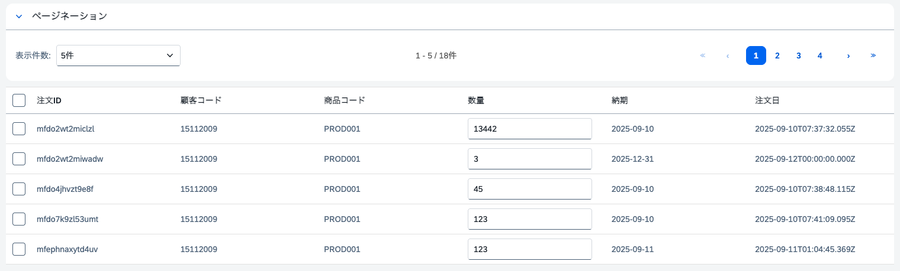
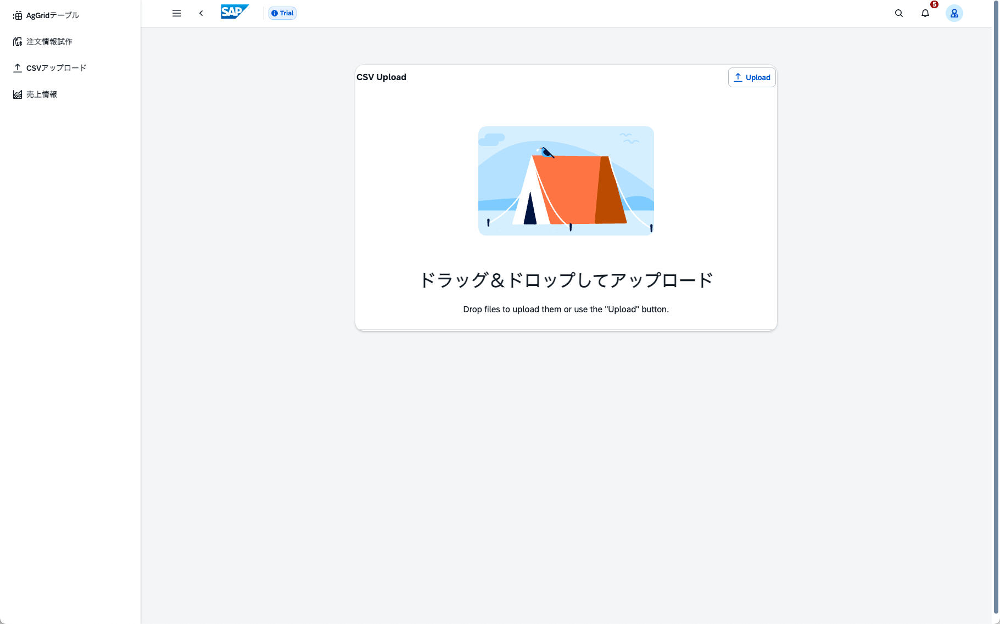
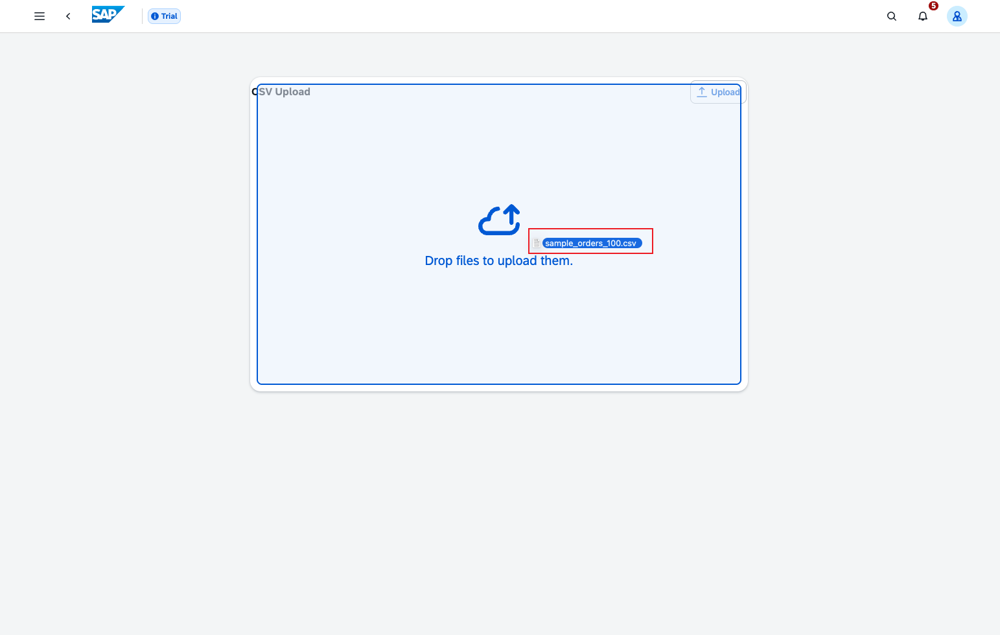
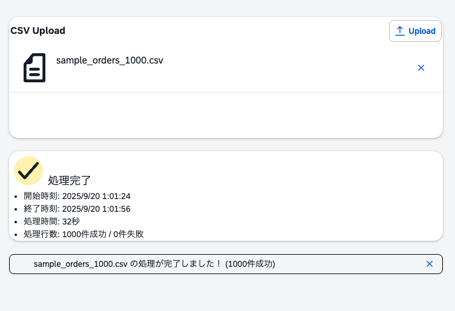

# Day 12: アプリケーション機能の実装②

## ゴール
!!! success "Day 12 Goals"
    - フロントエンドでページングの実装
    - CSVをS3にアップロードする機能の実装
    - SQSを使った非同期処理の実装
    - Lambda関数でODataバッチ処理の実装


## ページングの実装
以下のようにページングを実装します。


### 機能分析
- 1ページに表示する件数を選択できるように「表示件数」のドロップダウンを追加
- 現在のページと総ページ数を表示
- 「前へ」「次へ」ボタンでページ移動
- 「最初へ」「最後へ」ボタンでページ移動
- ページ移動時に表示データを更新
- ページ情報を表示

ページごとに表示される注文データを計算するために、以下の式を使用します。

1. \( ページ数 = \lceil \frac{総注文数}{1ページあたりの表示件数} \rceil \)

2. \( 始インデックス = (現在のページ - 1) \times 1ページあたりの表示件数 \)

3. \( 終了インデックス = 始インデックス + 1ページあたりの表示件数 \)
    - ただし、終了インデックスは総注文数を超えないようにする。

4. \( 表示データ = フィルタリングされた注文データ[始インデックス:終了インデックス] \)

5. \( 可視化ページ番号 = [max(1, 現在のページ - 2), min(総ページ数, 現在のページ + 2)] \)
    - 最大5つのページ番号を表示する。


### ステップ1: UIの追加
`src/components/OrderTable.vue`のテンプレートに以下のコードを追加します
```
<!-- ページネーション情報・コントロール -->
<ui5-panel header-text="ページネーション" style="max-width: 1500px; margin-bottom: 10px;">
    <div class="pagination-container">
        <!-- ページサイズ選択 -->
        <div class="page-size-section">
            <ui5-label>表示件数:</ui5-label>
            <ui5-select :model-value="formStore.rowsPerPage.toString()" @change="changeRowsPerPage">
                <ui5-option value="5">5件</ui5-option>
                <ui5-option value="10" selected>10件</ui5-option>
                <ui5-option value="20">20件</ui5-option>
                <ui5-option value="50">50件</ui5-option>
            </ui5-select>
        </div>

        <!-- ページネーション情報 -->
        <div class="pagination-info">
            <span v-if="formStore.filteredOrdersCount > 0">
                {{ formStore.paginationInfo.startItem }} - {{ formStore.paginationInfo.endItem }} 
                / {{ formStore.paginationInfo.totalItems }}件
            </span>
            <span v-else>該当するデータがありません</span>
        </div>

        <!-- ページネーションコントロール -->
        <div class="pagination-controls" v-if="formStore.totalPages > 1">
            <!-- 最初のページ -->
            <ui5-button 
                @click="formStore.goToFirstPage()" 
                :disabled="formStore.page === 1"
                design="Transparent">
                ≪
            </ui5-button>
            
            <!-- 前のページ -->
            <ui5-button 
                @click="formStore.goToPreviousPage()" 
                :disabled="formStore.page === 1"
                design="Transparent">
                ‹
            </ui5-button>
            
            <!-- ページ番号 -->
            <div class="page-numbers">
                <ui5-button 
                    v-for="pageNum in getVisiblePageNumbers()" 
                    :key="pageNum"
                    @click="formStore.setCurrentPage(pageNum)"
                    :design="pageNum === formStore.page ? 'Emphasized' : 'Transparent'"
                    class="page-number">
                    {{ pageNum }}
                </ui5-button>
            </div>
            
            <!-- 次のページ -->
            <ui5-button 
                @click="formStore.goToNextPage()" 
                :disabled="formStore.page === formStore.totalPages"
                design="Transparent">
                ›
            </ui5-button>
            
            <!-- 最後のページ -->
            <ui5-button 
                @click="formStore.goToLastPage()" 
                :disabled="formStore.page === formStore.totalPages"
                design="Transparent">
                ≫
            </ui5-button>
        </div>
    </div>
</ui5-panel>
```

`<script/>`セクションに以下のコードを追加します。
```
<style scoped>
.pagination-container {
    display: flex;
    justify-content: space-between;
    align-items: center;
    flex-wrap: wrap;
    gap: 16px;
    padding: 12px 0;
}

.page-size-section {
    display: flex;
    align-items: center;
    gap: 8px;
}

.pagination-info {
    font-size: 0.875rem;
    color: #666;
    font-weight: 500;
}

.pagination-controls {
    display: flex;
    align-items: center;
    gap: 4px;
}

.page-numbers {
    display: flex;
    gap: 2px;
    margin: 0 8px;
}

.page-number {
    min-width: 32px;
    height: 32px;
}

</style>
```

### ステップ2: `Resource.ts`、`form-store.ts`の修正
`amplify/data/resource.ts`を編集し、以下のコードを追加・書き換えます。
```
OrderResponse: a.customType({
      data: a.ref("Order").array(),
      count: a.integer()
}),

getOrder: a
  .query()
  .arguments({
    orderby: a.string(),
    filter: a.string(),
    top: a.integer(),
    skip: a.integer(),
    select: a.string(),
    search: a.string(),
  })
  .returns(a.ref("OrderResponse")) // リスポンス型をOrderResponseに変更
  .authorization(allow => [allow.publicApiKey()]) 
  .handler(
    a.handler.custom({
      dataSource: "OdataDataSource",
      entry:"./getOrder.js"
    })
),
```
リスポンス型を`OrderResponse`に変更し、`data`と`count`を含むようにします。
`src/stores/form-store.ts`を編集し、以下のコードを追加・書き換えます。
```
// サーバーと同期
		async syncWithServer(): Promise<{ success: boolean; message: string }> {
			try{
				this.isLoading = true;
				const result = await client.queries.getOrder({});
				console.log("Sync result:", result);
				if (result.data?.count) {
					this.count = result.data.count;
				}
        
        // リスポンス型をOrderResponseに変更したため、result.data.dataに変更
				if (result.data?.data) {
					this.allOrders = result.data.data as Array<Schema['Order']["type"]>;
					this.filteredOrders = [...this.allOrders];
					this.lastSyncTime = new Date();
					this.saveOrdersToLocalStorage();

          // 全データを取得するためにページングで繰り返し取得
					while (this.allOrders.length < this.count) {
						const nextResult = await client.queries.getOrder({
							skip: this.allOrders.length
						});
						if (nextResult.data?.data) {
							this.allOrders = this.allOrders.concat(nextResult.data.data as Array<Schema['Order']["type"]>);
							this.filteredOrders = [...this.allOrders];
							this.saveOrdersToLocalStorage();
						} else {
							break;
						}

					}

					return { success: true, message: "同期に成功しました" };
				} else {
					return { success: false, message: "データ取得に失敗しました" };
				}
			} catch (error) {
				console.error("Sync error:", error);
				return { success: false, message: "同期中にエラーが発生しました" };
			} finally {
				this.isLoading = false;
			}
		},
```


### ハンズオン1: ページングロジックの実装
ページングUIの作動に必要なロジックを`src/stores/formStore.ts`に実装します。

#### ページング状態の追加
以下の状態を追加します。
```
// 1ページあたりの表示件数
rowsPerPage: 10,
```
以下のgetterを追加します。
```
// フィルタリングされた注文データの件数
filteredOrdersCount() { //TODO }
// 総ページ数
totalPages() { //TODO }
// 現在のページに表示する注文データ
paginatedOrders() { //TODO }
// ページネーション情報
paginationInfo() { //TODO }
```

#### ページングアクションの追加
以下のアクションを追加します。
```
// 現在のページを設定
setCurrentPage(page: number) { //TODO }
//　最初のページへ移動
goToFirstPage() { //TODO }
//　最後のページへ移動
goToLastPage() { //TODO }
//　前のページへ移動
goToPreviousPage() { //TODO }
//　次のページへ移動
goToNextPage() { //TODO }
```

#### ページサイズ変更の実装
`src/components/OrderTable.vue`の`<script setup>`セクションに以下
のコードを追加します。
```
// ページサイズ変更
const changeRowsPerPage = (event: any) => { 
    //TODO 
};

// 可視化するページ番号のリストを取得
const getVisiblePageNumbers = () => {
    //TODO
};
```

#### ヒント

- `Math.ceil`を使用してページ数を計算
- `Array.prototype.slice`を使用して毎ページのデータを抽出
- ページサイズ変更時に現在のページを1にリセット
- `Math.max`と`Math.min`を使用して表示するページ番号の範囲を制御

<details>
<summary>解答例</summary>
`src/stores/formStore.ts`を編集します。
```
getters:{
    ...
    filteredOrdersCount: (state) => state.filteredOrders.length,

    totalPages: (state) => {
        return Math.ceil(state.filteredOrders.length / state.rowsPerPage);
    },

    paginatedOrders: (state) => {
        const start = (state.page - 1) * state.rowsPerPage;
        return state.filteredOrders.slice(start, start + state.rowsPerPage);
    },

    // ページネーション情報
    paginationInfo: (state) => {
        const startItem = (state.page - 1) * state.rowsPerPage + 1;
        const endItem = Math.min(state.page * state.rowsPerPage, state.filteredOrders.length);
        return {
            startItem,
            endItem,
            totalItems: state.filteredOrders.length,
            currentPage: state.page,
            totalPages: Math.ceil(state.filteredOrders.length / state.rowsPerPage)
        };
    },
}

actions:{
    ...
    // ページネーション関連
    setCurrentPage(page: number) {
        if (page >= 1 && page <= this.totalPages) {
            this.page = page;
        }
    },

    setRowsPerPage(rows: number) {
        this.rowsPerPage = rows;
        this.page = 1; // ページをリセット
    },

    goToFirstPage() {
        this.page = 1;
    },

    goToLastPage() {
        this.page = this.totalPages;
    },

    goToNextPage() {
        if (this.page < this.totalPages) {
            this.page++;
        }
    },

    goToPreviousPage() {
        if (this.page > 1) {
            this.page--;
        }
    },
}
```
`src/pages/Orders2Page.vue`を編集します。
```
// ページネーション関連の関数
const changeRowsPerPage = (event: any) => {
    const newSize = parseInt(event.target.value);
    formStore.setRowsPerPage(newSize);
};

// 表示するページ番号を計算（最大5個まで表示）
const getVisiblePageNumbers = () => {
    const current = formStore.page;
    const total = formStore.totalPages;
    const visible = [];
    
    if (total <= 5) {
        // 総ページ数が5以下の場合は全て表示
        for (let i = 1; i <= total; i++) {
            visible.push(i);
        }
    } else {
        // 現在のページを中心に5個表示
        let start = Math.max(1, current - 2);
        let end = Math.min(total, start + 4);
        
        // 末尾に寄りすぎた場合の調整
        if (end - start < 4) {
            start = Math.max(1, end - 4);
        }
        
        for (let i = start; i <= end; i++) {
            visible.push(i);
        }
    }
    
    return visible;
};
```
</details>
&nbsp;

### 確認ポイント
- ページサイズを変更すると、表示件数が変わる
- 「前へ」「次へ」「最初へ」「最後へ」ボタンでページ移動できる
- 現在のページと総ページ数が正しく表示され
- ページ移動時に表示データが更新される
- ページ情報が正しく表示される
- 最大5つのページ番号が表示され、現在のページが強調表示される

## Step2: CSVアップロード機能の実装

### 機能分析
- CSVファイルを選択するためのファイル入力コンポーネントとページを追加
- 選択したCSVファイルをS3バケットにアップロード
- アップロード完了後にS3イベントをトリガーとしてCSVファイルを処理するLambda関数を呼び出す
- Lambda関数内でCSVファイルを解析し、10件ずつSQSキューにメッセージを送信
- SQSキューにメッセージが到着するとトリガーされる別のLambda関数を作成し、バッチ処理を実行
- バッチ処理では、SQSメッセージから注文データを取得し、SAP Hanaに登録
- 処理結果をDynamoDBに保存し、フロントエンドから確認できるようにする (未定)
- 1000件の注文データは約1分で処理される

### フォルダー構成
現在のプロジェクト構成は以下の通りです。
```
amplify-vue-ts-project/
├── amplify/
│   ├── auth/
│        |── resource.ts
│   ├── data/
│        |── resource.ts
│        |── getOrder.js
│        |── addOrder.js
│        |── updateOrder.js
│   ├── backend.ts
│   |── tsconfig.json
│   └── package.json
├── src/
│   └── (your Vue.js app)
└── amplify_outputs.json     
```
以下のようにフォルダーとファイルを追加します。
```
amplify-vue-ts-project/
├── amplify/
│   ├── auth/
│        |── resource.ts
│   ├── data/
│        |── resource.ts
│        |── getOrder.js
│        |── addOrder.js
│        |── updateOrder.js
│   ├── storage/                # S3バケット定義フォルダー
│        |── resource.ts
│   ├── function/               # Lambda関数定義フォルダー
│       ├── csv-reader/         # CSV読み取り関数
│           |── resource.ts
│           |── handler.ts
│       ├── job-processor/      # ジョブ処理関数
│           |── resource.ts
│           |── handler.ts
│   ├── backend.ts
│   |── tsconfig.json
│   └── package.json
├── src/
│   └── (your Vue.js app)
└── amplify_outputs.json     
```

### 依存関係のインストール
以下のコマンドを実行し、Lambda関数で使用するAWS SDK v3モジュールをインストールします。
```
npm install @aws-sdk/client-s3 @aws-sdk/client-sqs @aws-sdk/client-dynamodb 
npm install --save-dev @types/node
```

### ステップ1: S3バケットの作成
`amplify/storage/resource.ts`を作成し、以下のコードを追加します。
```
import { defineStorage } from '@aws-amplify/backend';

export const storage = defineStorage({
  name: 'csvProcessingStorage',
  access: (allow) => ({
    'public/csv-uploads/*': [
      allow.guest.to(['read', 'write', 'delete']),
      allow.authenticated.to(['read', 'write', 'delete'])
    ]
  })
});
```

### ステップ2:　Lambda関数の作成
#### CSV読み取り関数
`amplify/function/csv-reader/resource.ts`を作成し、以下のLambdaリソース定義関数を追加します。
```
import { defineFunction } from '@aws-amplify/backend';
export const csvReader = defineFunction({
  name: 'csv-reader',
  entry: './handler.ts',
  timeoutSeconds: 900,
  memoryMB: 512,
  resourceGroupName: 'storage'
});
```
`amplify/function/csv-reader/handler.ts`を作成し、以下のcsv読み取り、解析、SQS送信のコードを追加します。
```
// amplify/functions/csv-reader/handler.ts
import { S3Event } from 'aws-lambda';
import { S3Client, GetObjectCommand } from '@aws-sdk/client-s3';
import { SQSClient, SendMessageCommand } from '@aws-sdk/client-sqs';
import { DynamoDBClient, PutItemCommand } from '@aws-sdk/client-dynamodb';
import crypto from 'crypto';

const s3Client = new S3Client({});
const sqsClient = new SQSClient({});
const dynamoClient = new DynamoDBClient({});

export const handler = async (event: S3Event) => {
  for (const record of event.Records) {
    const bucket = record.s3.bucket.name;
    const key = decodeURIComponent(record.s3.object.key.replace(/\+/g, ' '));
    const jobId = crypto.randomUUID();
    
    try {
        // S3からCSVファイルを取得
        const getObjectResponse = await s3Client.send(
            new GetObjectCommand({ Bucket: bucket, Key: key })
        );
        
        const csvContent = await getObjectResponse.Body?.transformToString();
        if (!csvContent) throw new Error('Empty CSV file');

        // CSVを解析し、ヘッダーとデータ行を取得
        const rows = csvContent.split('\n').filter(row => row.trim());
        const headers = rows[0].split(',').map(h => h.trim());
        const dataRows = rows.slice(1);
        const totalBatches = Math.ceil(dataRows.length / 10);

        console.log(`Processing ${key}: ${dataRows.length} orders, ${totalBatches} batches`);

      // DynamoDBにジョブエントリを作成
      await dynamoClient.send(new PutItemCommand({
        TableName: process.env.PROCESSING_JOB_TABLE!,
        Item: {
          id: { S: jobId },
          fileName: { S: key },
          totalRows: { N: String(dataRows.length) },
          totalBatches: { N: String(totalBatches) },
          processedRows: { N: '0' },
          processedBatches: { N: '0' },
          successfulOrders: { N: '0' },
          failedOrders: { N: '0' },
          status: { S: 'PROCESSING' },
          startTime: { S: new Date().toISOString() },
          createdAt: { S: new Date().toISOString() },
          updatedAt: { S: new Date().toISOString() },
          __typename: { S: 'ProcessingJob' }
        }
      }));

      // バッチメッセージを構築
      const batchSize = 10;
      for (let i = 0; i < dataRows.length; i += batchSize) {
        const batch = dataRows.slice(i, i + batchSize);
        const batchNumber = Math.floor(i / batchSize) + 1;
        
        const orders = batch.map((row, index) => {
          const rowData = row.split(',').map(cell => cell.trim());
          
          return {
            rowIndex: i + index,
            orderData: {
              ID: rowData[headers.indexOf('ID')] || `order_${Date.now()}_${i + index}`,
              customer_code: rowData[headers.indexOf('customer_code')],
              product_code: rowData[headers.indexOf('product_code')],
              estimated_cost: parseFloat(rowData[headers.indexOf('estimated_cost')] || '0'),
              quantity: parseInt(rowData[headers.indexOf('quantity')] || '1'),
              unit_price: parseFloat(rowData[headers.indexOf('unit_price')] || '0'),
              delivery_date: rowData[headers.indexOf('delivery_date')]?.split('T')[0],
              status: rowData[headers.indexOf('status')] || 'PENDING',
              created_at: rowData[headers.indexOf('created_at')]?.replace('Z', '')
            }
          };
        });

        // SQSにバッチメッセージを送信
        await sqsClient.send(new SendMessageCommand({
          QueueUrl: process.env.QUEUE_URL!,
          MessageBody: JSON.stringify({
            jobId,
            fileName: key,
            batchNumber,
            totalBatches,
            orders,
            action: 'CREATE_ORDERS_BATCH'
          })
        }));
        
        console.log(`Queued batch ${batchNumber}/${totalBatches}`);
      }

      console.log(`Successfully queued all batches for job ${jobId}`);
      
    } catch (error) {
      console.error(`Error processing ${key}:`, error);
      
      // ジョブをFAILEDに更新
      await dynamoClient.send(new PutItemCommand({
        TableName: process.env.PROCESSING_JOB_TABLE!,
        Item: {
          id: { S: jobId },
          fileName: { S: key },
          status: { S: 'FAILED' },
          errorMessage: { S: error instanceof Error ? error.message : String(error) },
          endTime: { S: new Date().toISOString() },
          updatedAt: { S: new Date().toISOString() },
          __typename: { S: 'ProcessingJob' }
        }
      }));
    }
  }
};
```

#### ジョブ処理関数
`amplify/function/job-processor/resource.ts`を作成し、以下のリスース定義関数を追加します。
```
import { defineFunction } from '@aws-amplify/backend';

export const jobProcessor = defineFunction({
  name: 'job-processor',
  entry: './handler.ts',
  timeoutSeconds: 300, // 5分
  memoryMB: 512,
  resourceGroupName: 'data'
});
```

`amplify/function/job-processor/handler.ts`を作成し、以下のバッチ処理関数を追加します。
```
// amplify/functions/job-processor/handler.ts
import { SQSEvent } from 'aws-lambda';
import { DynamoDBClient, UpdateItemCommand } from '@aws-sdk/client-dynamodb';

const dynamoClient = new DynamoDBClient({});

export const handler = async (event: SQSEvent) => {
  // SQSメッセージごとに処理
  for (const record of event.Records) {
    try {
        const message = JSON.parse(record.body);
        const { jobId, batchNumber, totalBatches, orders } = message;
        
        console.log(`Processing batch ${batchNumber}/${totalBatches} for job ${jobId}`);
      
        // Odataバッチリクエストを構築
        const batchRequests = orders.map((order: any) => ({
            id: String(order.rowIndex),
            method: "POST",
            url: "OrderData",
            headers: { "Content-Type": "application/json" },
            body: order.orderData
        }));

        // Odataバッチリクエストを送信
        const response = await fetch(`${process.env.SQL_ENDPOINT}/$batch`, {
            method: 'POST',
            headers: {
            'Content-Type': 'application/json',
            'Accept': 'application/json',
            'OData-Version': '4.0'
            },
            body: JSON.stringify({ requests: batchRequests })
        });

        if (!response.ok) {
            throw new Error(`OData batch failed: ${response.status}`);
        }

        const result = await response.json();
      
        // 結果を解析し、成功・失敗をカウント
        let successful = 0;
        let failed = 0;
      
        if (result.responses) {
            result.responses.forEach((resp: any) => {
            if (resp.status < 400) {
                successful++;
            } else {
                failed++;
                console.error(`Order failed:`, resp.status, resp.body);
            }
            });
        }
      
        console.log(`Batch ${batchNumber}: ${successful} successful, ${failed} failed`);
      
        // アトミック操作、競争状態を防ぐためにADDを使用
        // ジョブの進捗を更新
        const updateResult = await dynamoClient.send(new UpdateItemCommand({
            TableName: process.env.PROCESSING_JOB_TABLE!,
            Key: { id: { S: jobId } },
            UpdateExpression: `
            ADD processedBatches :one,
                processedRows :rows,
                successfulOrders :success,
                failedOrders :failed
            SET updatedAt = :now,
                #status = if_not_exists(#status, :processing)
            `,
            ExpressionAttributeNames: {
            '#status': 'status'
            },
            ExpressionAttributeValues: {
            ':one': { N: '1' },
            ':rows': { N: String(orders.length) },
            ':success': { N: String(successful) },
            ':failed': { N: String(failed) },
            ':processing': { S: 'PROCESSING' },
            ':now': { S: new Date().toISOString() }
            },
            ReturnValues: 'ALL_NEW'
        }));
      
      
      console.log(`Job ${jobId} updated:`, updateResult.Attributes);

      // 全バッチが完了したか確認
      const updatedItem = updateResult.Attributes;
      if (updatedItem) {
        const processedBatches = parseInt(updatedItem.processedBatches.N || '0');
        const totalBatchesCount = parseInt(updatedItem.totalBatches?.N || totalBatches);
        
        if (processedBatches === totalBatchesCount) {
          // ジョブをCOMPLETEDに更新
          await dynamoClient.send(new UpdateItemCommand({
            TableName: process.env.PROCESSING_JOB_TABLE!,
            Key: { id: { S: jobId } },
            UpdateExpression: 'SET #status = :completed, endTime = :endTime, updatedAt = :now',
            ExpressionAttributeNames: {
              '#status': 'status'
            },
            ExpressionAttributeValues: {
              ':completed': { S: 'COMPLETED' },
              ':endTime': { S: new Date().toISOString() },
              ':now': { S: new Date().toISOString() }
            }
          }));
          
          console.log(`Job ${jobId} completed! All ${totalBatchesCount} batches processed.`);
        }
      }
      
    } catch (error) {
        
        console.error('Error processing batch:', error);
        // エラーをスローすることで、メッセージが再試行される
        throw error; 
    }
  }
};
```

### ステップ3: `backend.ts`の更新
`amplify/backend.ts`を編集し、以下のコードを書き換えます。
```
// amplify/backend.ts
import { defineBackend } from '@aws-amplify/backend';
import { auth } from './auth/resource';
import { data } from './data/resource';
import { storage } from './storage/resource';
import { csvReader } from './functions/csv-reader/resource';
import { jobProcessor } from './functions/job-processor/resource';
import { Stack, Duration } from 'aws-cdk-lib';
import { EventType } from 'aws-cdk-lib/aws-s3';
import { Queue } from 'aws-cdk-lib/aws-sqs';
import { LambdaDestination } from 'aws-cdk-lib/aws-s3-notifications';
import { SqsEventSource } from 'aws-cdk-lib/aws-lambda-event-sources';

const backend = defineBackend({
  auth,
  data,
  storage,
  csvReader,
  jobProcessor
});

const odataDataSource = backend.data.addHttpDataSource(
  "OdataDataSource",
  "https://8q5zg2p8tj.us-east-1.awsapprunner.com"
);

// ProcessingJobテーブルを取得
const processingJobTable = backend.data.resources.tables['ProcessingJob'];

// Lambda関数にテーブルへの書き込み権限を付与
processingJobTable.grantWriteData(backend.csvReader.resources.lambda);
processingJobTable.grantWriteData(backend.jobProcessor.resources.lambda);

// Lambda関数にテーブルへの書き込み権限を付与
processingJobTable.grantWriteData(backend.csvReader.resources.lambda);
processingJobTable.grantWriteData(backend.jobProcessor.resources.lambda);

// Data stackを取得
const dataStack = Stack.of(backend.data.resources.graphqlApi); 

// S3バケットを取得
const csvBucket = backend.storage.resources.bucket;

// SQSキューを作成
const processingQueue = new Queue(dataStack, 'ProcessingQueue', { 
  visibilityTimeout: Duration.seconds(300),
  receiveMessageWaitTime: Duration.seconds(20)
});

// S3バケットの特定のプレフィックスにファイルがアップロードされたときにLambdaをトリガー
csvBucket.addEventNotification(
  EventType.OBJECT_CREATED,
  new LambdaDestination(backend.csvReader.resources.lambda),
  { prefix: 'public/csv-uploads/', suffix: '.csv' }
);

// Lambda関数にSQSイベントソースを追加
backend.jobProcessor.resources.lambda.addEventSource(
  new SqsEventSource(processingQueue, {
    batchSize: 10,
    maxBatchingWindow: Duration.seconds(5)
  })
);

// Lambda関数にS3バケットとSQSキューへのアクセス権限を付与
csvBucket.grantRead(backend.csvReader.resources.lambda);
processingQueue.grantSendMessages(backend.csvReader.resources.lambda);
processingQueue.grantConsumeMessages(backend.jobProcessor.resources.lambda);

// 環境変数
backend.csvReader.addEnvironment('QUEUE_URL', processingQueue.queueUrl);
backend.csvReader.addEnvironment('BUCKET_NAME', csvBucket.bucketName);
backend.csvReader.addEnvironment('SQL_ENDPOINT', 'https://8q5zg2p8tj.us-east-1.awsapprunner.com/odata/v4/order');
backend.csvReader.addEnvironment('PROCESSING_JOB_TABLE', processingJobTable.tableName);

backend.jobProcessor.addEnvironment('SQL_ENDPOINT', 'https://8q5zg2p8tj.us-east-1.awsapprunner.com/odata/v4/order');
backend.jobProcessor.addEnvironment('PROCESSING_JOB_TABLE', processingJobTable.tableName);

// バックエンドの出力を定義
backend.addOutput({
  custom: {
    bucketName: csvBucket.bucketName,
    queueUrl: processingQueue.queueUrl,
    queueArn: processingQueue.queueArn,
    processingJobTable: processingJobTable.tableName
  }
});
```

### ステップ4: フロントエンドの実装
#### コンポーネントの作成
`src/components/UploadComponent.vue`を作成し、以下のコードを追加します
```
<template>
  <div class="upload-container">
    <ui5-card>
        <ui5-upload-collection
            id="uploadCollection"
            no-data-text="ドラッグ＆ドロップしてアップロード"
            @drop="handleDrop"
            @item-delete="handleDelete"
            @selection-change="handleSelectionChange"
        >
            <div slot="header" class="header">
                <ui5-title>CSV Upload</ui5-title>
                <div class="spacer"></div>
                <ui5-file-uploader id="button-only-uploader" hide-input multiple @change="handleFileSelect">
                    <ui5-button icon="upload" tabindex="-1" transparent>Upload</ui5-button>
                </ui5-file-uploader>
            </div>
            <ui5-upload-collection-item
                v-for="file in uploadedFiles"
                :key="file.id"
                :file-name="file.displayName"
                :progress="file.progress || 0"
                :upload-state="file.state"
                @retry="retryUpload(file)"
            >
                <ui5-icon name="document-text" slot="thumbnail"></ui5-icon>
            </ui5-upload-collection-item>
      </ui5-upload-collection>
    </ui5-card>

    <ui5-card v-if="uploadedFiles.length > 0" style="margin-top: 1rem">
    <ui5-list>
      <ui5-li-notification
        v-for="file in uploadedFiles"
        :key="file.id"
        :title-text="file.name"
        :priority="file.state === 'Error' ? 'High' : file.state === 'Complete' ? 'Low' : 'Medium'"
        :state="file.state === 'Error' ? 'Error' : file.state === 'Complete' ? 'Success' : 'Information'"
        show-close
        @close="handleDelete({ detail: { item: { fileName: file.name } } })"
      >
        <ui5-avatar slot="avatar" :color-scheme="file.state === 'Complete' ? 'Accent1' : 'Accent8'" style="margin: 0.5rem;">
          <ui5-icon :name="file.state === 'Complete' ? 'accept' : 'document-text'"></ui5-icon>
        </ui5-avatar>
        
        <span slot="subtitle" style="font-size:large;">{{ file.status }}</span>
        
        <!-- Progress indicator for ongoing uploads/processing -->
        <ui5-progress-indicator 
          v-if="file.state !== 'Complete' && file.state !== 'Error'"
          slot="footnotes"
          style="margin-left: 1.5rem; width: calc(100% - 3rem);"
          :value="file.progress || 0"
          :display-value="`${file.progress || 0}%`"
        />
        
        <!-- Summary list for completed jobs -->
        <div v-if="file.state === 'Complete' && file.summary" slot="footnotes">
          <ul style="margin: 0; padding-left: 1.5rem; font-size: 0.875rem;">
            <li>開始時刻: {{ file.summary.startTime }}</li>
            <li>終了時刻: {{ file.summary.endTime }}</li>
            <li>処理時間: {{ file.summary.duration }}</li>
            <li>処理行数: {{ file.summary.rows }}</li>
          </ul>
        </div>
      </ui5-li-notification>
    </ui5-list>
  </ui5-card>

    <ui5-message-strip 
      v-if="globalStatus"
      :design="messageDesign"
      style="margin-top: 1rem"
      closeable
      @close="globalStatus = ''"
    >
      {{ globalStatus }}
    </ui5-message-strip>
  </div>
</template>

<script setup>
import { ref, onUnmounted, computed } from 'vue';
import { uploadData } from 'aws-amplify/storage';
import { generateClient } from 'aws-amplify/data';
import '@ui5/webcomponents/dist/Card.js';
import '@ui5/webcomponents/dist/CardHeader.js';
import '@ui5/webcomponents-fiori/dist/UploadCollection.js';
import '@ui5/webcomponents-fiori/dist/UploadCollectionItem.js';
import '@ui5/webcomponents/dist/FileUploader.js';
import '@ui5/webcomponents/dist/Button.js';
import '@ui5/webcomponents/dist/Label.js';
import '@ui5/webcomponents/dist/MessageStrip.js';
import '@ui5/webcomponents/dist/List.js';
import "@ui5/webcomponents-icons/dist/AllIcons.js";

const client = generateClient();
const uploadedFiles = ref([]);
const globalStatus = ref('');
const messageDesign = ref('Information');
const subscriptions = new Map();
const pollingIntervals = new Map();

const handleDrop = (event) => {
  event.preventDefault();
  const files = event.dataTransfer?.files;
  if (files?.length > 0) {
    processFile(files[0]);
  }
};

const handleFileSelect = (event) => {
  const files = event.detail.files;
  if (files?.length > 0) {
    for (const file of files) {
      processFile(file);
    }
  }
};

const processFile = async (file) => {
    if (!file.name.endsWith('.csv')) {
        globalStatus.value = 'CSVファイルのみアップロード可能です';
        messageDesign.value = 'Warning';
        return;
    }
    // Clear any previous message when starting new upload
    globalStatus.value = '';
    const timestamp = Date.now();
    const fileName = `${timestamp}_${file.name}`;
    
    const fileItem = {
        id: timestamp,
        name: file.name,
        fileName: fileName,
        displayName: file.name,
        progress: 0,
        state: 'Uploading',
        status: 'アップロード中...',
        file: file,
        processedBatches: 0,
        totalBatches: 0,
        processedRows: 0,
        successfulOrders: 0,
        failedOrders: 0,
        jobId: null,
        summary: null
    };

    uploadedFiles.value.push(fileItem);

    try {
        const result = await uploadData({
            path: `public/csv-uploads/${fileName}`,
            data: file,
            options: {
                onProgress: ({ transferredBytes, totalBytes }) => {
                    if (fileItem.state === 'Uploading') {
                        fileItem.progress = Math.round((transferredBytes / totalBytes) * 100);
                        fileItem.status = `アップロード中... ${fileItem.progress}%`;
                        // Update display name to show progress
                        fileItem.displayName = `${file.name}`;
                    }
                }
            }
        }).result;

        fileItem.state = 'Ready';
        fileItem.status = `✓ アップロード完了 - 処理待ち...`;
        fileItem.progress = 100;
        fileItem.displayName = file.name;
        
        globalStatus.value = `${file.name} アップロード完了！処理を開始します...`;
        messageDesign.value = 'Success';
        
        // Start polling for job creation
        startJobPolling(fileItem);
        
    } catch (error) {
        fileItem.state = 'Error';
        fileItem.status = `✗ 失敗: ${error.message}`;
        fileItem.displayName = `${file.name} (エラー)`;
        globalStatus.value = `アップロード失敗: ${error.message}`;
        messageDesign.value = 'Error';
    }
};

const pollJobStatus = (fileItem, jobId) => {
    console.log(`Starting polling for job: ${jobId}`);
    
    const pollInterval = setInterval(async () => {
        try {
            const { data: job, errors } = await client.models.ProcessingJob.get({ id: jobId }); 
            console.log('Polled job status:', job);
            
            if (job) {
                // Update all values
                fileItem.processedBatches = job.processedBatches || 0;
                fileItem.totalBatches = job.totalBatches || 0;
                fileItem.successfulOrders = job.successfulOrders || 0;
                fileItem.failedOrders = job.failedOrders || 0;
                fileItem.processedRows = job.processedRows || 0;
                
                // Update progress bar
                if (fileItem.totalBatches > 0) {
                    fileItem.progress = Math.round((fileItem.processedBatches / fileItem.totalBatches) * 100);
                }
                
                // Update display name to show progress
                if (job.status === 'PROCESSING') {
                    fileItem.status = `処理中: ${fileItem.processedBatches}/${fileItem.totalBatches} バッチ`;
                    fileItem.displayName = `${fileItem.name} (${fileItem.progress}%)`;
                    fileItem.state = 'Ready';
                }
                
                // Handle completion
                if (job.status === 'COMPLETED') {
                    clearInterval(pollInterval);
                    pollingIntervals.delete(fileItem.id);
                    
                    // Format times
                    const startTime = new Date(job.startTime);
                    const endTime = new Date(job.endTime);
                    const durationMs = endTime - startTime;
                    const durationSec = Math.round(durationMs / 1000);
                    
                    // Create summary object
                    fileItem.summary = {
                        startTime: startTime.toLocaleString('ja-JP'),
                        endTime: endTime.toLocaleString('ja-JP'),
                        duration: `${durationSec}秒`,
                        rows: `${job.successfulOrders}件成功 / ${job.failedOrders}件失敗`
                    };
                    
                    fileItem.status = '処理完了';
                    fileItem.state = 'Complete';
                    fileItem.progress = 100;
                    
                    // Update global status
                    globalStatus.value = `${fileItem.name} の処理が完了しました！ (${fileItem.successfulOrders}件成功)`;
                    messageDesign.value = 'Success';
                }
                
                if (job.status === 'FAILED') {
                    clearInterval(pollInterval);
                    pollingIntervals.delete(fileItem.id);
                    
                    fileItem.status = `✗ エラー: ${job.errorMessage || '不明なエラー'}`;
                    fileItem.state = 'Error';
                    fileItem.displayName = `${fileItem.name} (エラー)`;
                }
            }
        } catch (error) {
            console.error('Polling error:', error);
        }
    }, 1000);
    
    pollingIntervals.set(fileItem.id, pollInterval);
};

// Also fix the initial job detection - it's getting ALL jobs, not filtered:
const startJobPolling = (fileItem) => {
    let attempts = 0;
    const pollInterval = setInterval(async () => {
        attempts++;
        
        try {
            console.log(`Polling attempt ${attempts} for file: ${fileItem.fileName}`);
            
            // FIX: Filter by fileName to get the right job!
            const { data: jobs } = await client.models.ProcessingJob.list({
                filter: {
                    fileName: { contains: fileItem.fileName }
                }
            });
            
            if (jobs && jobs.length > 0) {
                clearInterval(pollInterval);
                pollingIntervals.delete(fileItem.id);
                
                const job = jobs[0];
                console.log('Job found:', job);
                
                // Set initial values
                fileItem.jobId = job.id;
                fileItem.totalBatches = job.totalBatches || 0;
                fileItem.processedBatches = job.processedBatches || 0;
                fileItem.processedRows = job.processedRows || 0;
                fileItem.successfulOrders = job.successfulOrders || 0;
                fileItem.failedOrders = job.failedOrders || 0;
                
                // Check if already complete
                if (job.status === 'COMPLETED') {
                    fileItem.state = 'Complete';
                    fileItem.progress = 100;
                    
                    const startTime = new Date(job.startTime);
                    const endTime = new Date(job.endTime);
                    const durationMs = endTime - startTime;
                    const durationSec = Math.round(durationMs / 1000);
                    fileItem.summary = {
                        startTime: startTime.toLocaleString('ja-JP'),
                        endTime: endTime.toLocaleString('ja-JP'),
                        duration: `${durationSec}秒`,
                        rows: `${job.successfulOrders}件成功 / ${job.failedOrders}件失敗`
                    };

                    fileItem.status = '✓ 処理完了';
                    globalStatus.value = `${fileItem.name} の処理が完了しました！`;
                    messageDesign.value = 'Success';
                } else {
                    // Start status polling only if not complete
                    fileItem.status = `処理中: ${fileItem.processedBatches}/${fileItem.totalBatches} バッチ`;
                    pollJobStatus(fileItem, job.id);
                }
            }
            
            if (attempts > 60) {
                clearInterval(pollInterval);
                pollingIntervals.delete(fileItem.id);
                fileItem.status = '処理開始待ち (タイムアウト)';
            }
        } catch (error) {
            console.error('Polling error:', error);
        }
    }, 1000);
    
    pollingIntervals.set(fileItem.id, pollInterval);
};

const retryUpload = (file) => {
    const index = uploadedFiles.value.indexOf(file);
    if (index > -1) {
        // Clean up any existing subscriptions
        const subscription = subscriptions.get(file.id);
        subscription?.unsubscribe();
        subscriptions.delete(file.id);
        
        uploadedFiles.value.splice(index, 1);
        processFile(file.file);
    }
};

const handleSelectionChange = (event) => {
    // Handle selection if needed
};

// Clean up on component unmount
onUnmounted(() => {
    subscriptions.forEach(sub => sub.unsubscribe());
    subscriptions.clear();
    
    pollingIntervals.forEach(interval => clearInterval(interval));
    pollingIntervals.clear();
});
</script>

<style scoped>
.header {
    display: flex;
    align-items: center;
    overflow: hidden;
    flex-wrap: wrap;
}

.spacer {
    flex: 1 1 auto;
}

.upload-container {
    max-width: 800px;
    margin: 2rem auto;
    padding: 1rem;
}

#uploadCollection {
    min-height: 200px;
    border: 2px dashed transparent;
    transition: all 0.3s;
}

#uploadCollection:hover {
    border-color: var(--sapBrandColor);
    background-color: var(--sapBackgroundColor);
}
</style>
```

#### ページの作成
`src/pages/UploadPage.vue`を作成し、以下のコードを追加します
```
<template>
  <div class="mx-10 my-10">
    <UploadComponent />
  </div>
</template>

<script setup >
import UploadComponent from "@/components/base/UploadComponent.vue";
</script>
```


### ステップ5: ルーティングの追加
`src/router/index.ts`を編集し、以下のコードを追加します。
```
{
    path: "/upload",                                    // アップロードページのパス
    component: () => import("@/layout/MainLayout.vue"), // 同じレイアウトを使用
    children: [
      {
        path: "",
        name: "upload",
        component: () => import("@/pages/UploadPage.vue"), //UploadPage コンポーネントを表示
      },
    ],
  }
}
```
`src/layout/MainLayout.vue`を編集し、ナビゲーションメニューに以下のコードを追加します。
```
{ path: "/upload", label: "CSVアップロード", icon: "upload" },
```

### 画面確認
- アプリケーションを起動し、ナビゲーションメニューから「CSVアップロード」ページに移動します。
    - 
- 「Upload」ボタンをクリックからCSVファイルを選択するか、ドラッグ＆ドロップでアップロードします。
    - 
- アップロードが開始され、進捗が表示されます。
- 処理が完了すると、成功件数が表示されます。
    - 

