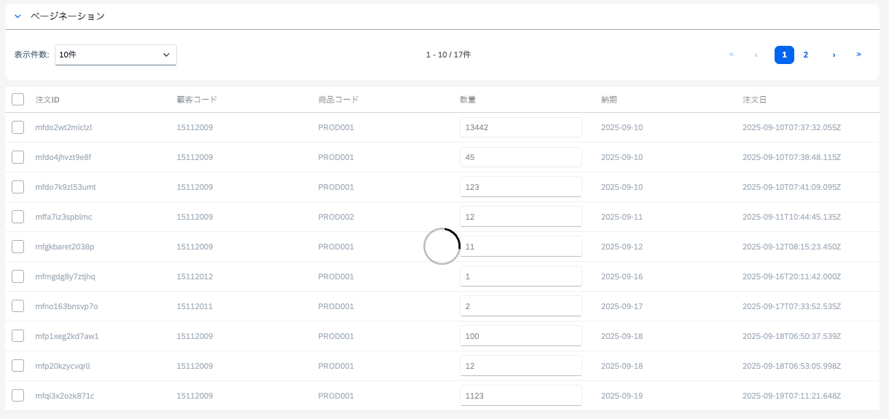
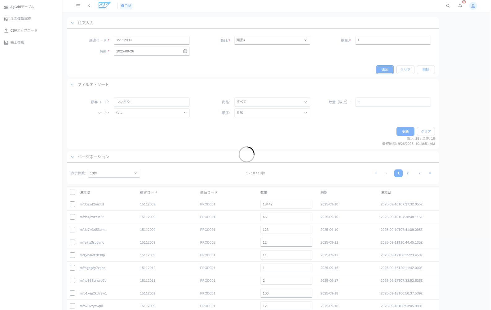

# Day13 エラーハンドリング

## 目標
- エラーハンドリングの重要性を理解する
- Amplifyのエラーハンドリングのベストプラクティスを学ぶ
- ローディングの実装

## ローディング状態の管理
ローディングコンポーネントをインストール
```
npm install vue-loading-overlay@^6.0 
```

## Orders2Page.vueの更新
- 既存の`Orders2Page.vue`にローディングコンポーネントを追加します。
- ローディング状態を管理するために、`formStore`の`isLoading`状態を使用します。
- ローディングコンポーネントをテーブルに重ねて表示します。
```
<div class="vl-parent" style="max-width: 1500px;">
    <loading :active="formStore.isLoading" :is-full-page="false"></loading>
    <ui5-table>
        ...
    </ui5-table>
</div>
<script setup lang="ts">
import Loading from 'vue-loading-overlay';
import 'vue-loading-overlay/dist/css/index.css';

...
</script>
```
`addOrder`、`updateOrder`、`deleteOrders`関数で、処理の開始時に`formStore.isLoading = true`、終了時に`formStore.isLoading = false`を設定します。

以下のように、オーダーを追加、更新、削除するとき、テーブルの上にローディングスピナーが表示されます。


## 画面全体のローディング - オプショナル
`App.vue`にすでにローディングコンポーネントが追加されています、`global-store`の`isLoading`を使用して、アプリ全体のローディング状態を管理します。

ページごとに`loading`コンポーネントを追加する代わりに、ローディングコンポーネントが画面全体に表示されます。どのページにいても、`globalStore.isLoading`を`true`に設定すると、画面全体にローディングスピナーが表示されます。



## エラーハンドリングとは？

エラーハンドリングとは、プログラムで発生するエラーを適切に処理することです。
初心者にとって重要なポイントを理解しましょう。

### なぜエラーハンドリングが必要？

1. **ユーザー体験の向上**
   - エラーが起きても画面が真っ白にならない
   - 分かりやすいメッセージでユーザーに状況を伝える

2. **アプリケーションの安定性**
   - 1つのエラーでアプリ全体が止まることを防ぐ
   - 予期しない動作を減らす

## エラーハンドリングの基本パターン

### 1. try-catch文の使い方

```
// 基本的な形
try {
  // エラーが起きる可能性のあるコード
  const result = await someAsyncFunction();
} catch (error) {
  // エラーが起きた時の処理
  console.error('エラーが発生しました:', error);
}
```
## エラーハンドリングのベストプラクティス

### 1. 適切なエラーメッセージ

```
// 悪い例
catch (error) {
  setError(error.message); // 技術的すぎるメッセージ
}

// 良い例
catch (error) {
  console.error('技術的な詳細:', error); // 開発者用
  setError('保存に失敗しました。もう一度お試しください。'); // ユーザー用
}
```

### 2. ローディング状態の管理

```
const [isLoading, setIsLoading] = useState(false);

const handleAction = async () => {
  setIsLoading(true);
  try {
    await someAsyncOperation();
  } catch (error) {
    handleError(error);
  } finally {
    setIsLoading(false); // 必ず実行される
  }
};
```

### 3. エラーの分類

```
const handleError = (error) => {
  if (error.name === 'NetworkError') {
    setError('インターネット接続を確認してください');
  } else if (error.name === 'ValidationError') {
    setError('入力内容を確認してください');
  } else {
    setError('予期しないエラーが発生しました');
  }
};
```

## 初心者向けのチェックリスト

- [ ] エラーが起きても画面が真っ白にならない
- [ ] ユーザーに分かりやすいメッセージを表示する
- [ ] コンソールに技術的な詳細を記録する
- [ ] エラー後も操作を続けられるようにする

## まとめ

エラーハンドリングは以下の3つのステップで考えましょう：

1. **予測する** - どこでエラーが起きるか考える
2. **キャッチする** - try-catchでエラーを捕まえる
3. **対処する** - ユーザーに適切に伝える

最初は完璧を目指さず、基本的なtry-catchから始めて、徐々に詳細な処理を追加していきましょう。

## 実践的なエラーハンドリング

ここでは、Day11・Day12で作成したコードを例に、実際のアプリケーションでよくあるエラーハンドリングパターンを学びます。

### 1. バリデーション（入力検証）エラー

**なぜ必要？**
ユーザーが間違った値を入力した時に、事前にエラーを見つけて分かりやすく教えることができます。
悪意のある入力も防げます。例えば、数量が負の数や文字列だった場合に負の金額になってしまうなど。

**基本的なパターン：**
```
const validateForm = () => {
  const errors = [];

  if (!customerCode) errors.push("顧客コードは必須です");
  if (quantity <= 0) errors.push("数量は1以上にしてください");

  return errors;
};
```

**ポイント：**
- エラーは配列に集めて一度に表示
- 分かりやすい日本語メッセージを使用
- 数値は`parseInt()`や`isNaN()`で検証

### 2. ファイル処理のエラー

**よくある問題：**
- ファイル形式が間違っている（.csvでない）
- ファイルサイズが大きすぎる
- アップロード中の通信エラー

**対処方法：**
```
// アップロード前の検証
if (!file.name.endsWith('.csv')) {
  showError('CSVファイルを選択してください');
  return; // ここで処理を止める
}

try {
  await uploadFile();
} catch (error) {
  // エラーの内容に応じて分かりやすいメッセージに変換
  if (error.name === 'NetworkError') {
    showError('ネットワーク接続を確認してください');
  } else {
    showError('アップロードに失敗しました');
  }
}
```

**ポイント：**
- 事前検証で防げるエラーは早めに防ぐ
- ネットワークエラーなど、エラーの種類別に対応
- 技術的なエラーメッセージをユーザー向けに翻訳

### 3. データベース操作のエラー

**よくある問題：**
- データが見つからない
- 権限がない
- 数値の変換エラー

**対処方法：**
```
const updateOrder = async (orderId, orderData) => {
  // 1. 入力チェック（事前に防ぐ）
  if (!orderId) {
    return { success: false, message: "注文IDが無効です" };
  }

  try {
    const result = await client.mutations.updateOrder(orderData);
    return { success: true, message: "更新しました" };
  } catch (error) {
    // 2. エラー内容を分析して適切なメッセージを返す
    if (error.message.includes('Not Found')) {
      return { success: false, message: "注文が見つかりません" };
    }
    return { success: false, message: "更新に失敗しました" };
  }
};
```

**ポイント：**
- 戻り値で成功・失敗を明確にする
- コンソールには技術詳細、ユーザーには分かりやすいメッセージ
- 部分的な失敗も考慮（10件中8件成功など）

### 4. 非同期処理の進捗とエラー

**問題：**
時間のかかる処理（CSVアップロードなど）で、途中でエラーが起きた時の対応

**対処方法：**
```
// 状態を細かく管理
switch (job.status) {
  case 'PROCESSING':
    showStatus(`処理中: ${progress}%`);
    break;
  case 'COMPLETED':
    showStatus('完了しました');
    break;
  case 'FAILED':
    showError(`エラー: ${job.errorMessage}`);
    stopPolling(); // ポーリングを停止
    break;
}
```

**ポイント：**
- 処理状況をリアルタイムで表示
- エラー時は無限ループを防ぐため処理を停止
- ユーザーが処理状況を把握できるようにする

### 5. 一括処理のエラー

**問題：**
複数のデータを処理する時、一部が失敗した場合の対応

**考え方：**
```
// 悪い例：1つ失敗したら全部止める
// 良い例：成功したものは処理を続け、結果をまとめて報告

let successCount = 0;
let failCount = 0;

for (const item of items) {
  try {
    await processItem(item);
    successCount++;
  } catch (error) {
    failCount++;
    // ログは残すが処理は続行
    console.error(`Item ${item.id} failed:`, error);
  }
}

// 結果をまとめて表示
showResult(`${successCount}件成功、${failCount}件失敗`);
```

**ポイント：**
- 部分的な成功も価値がある
- 詳細なエラー情報はコンソールに記録
- ユーザーには処理結果のサマリーを表示

## エラーハンドリングの考え方

### レベル1：エラーを隠さない
```
// 悪い例
try {
  await riskyOperation();
} catch (error) {
  // エラーを無視（最悪）
}

// 良い例
try {
  await riskyOperation();
} catch (error) {
  console.error('詳細:', error);
  showError('操作に失敗しました');
}
```

### レベル2：エラーの種類を区別
```
if (error.name === 'NetworkError') {
  showError('通信エラーです');
} else if (error.message.includes('404')) {
  showError('データが見つかりません');
} else {
  showError('予期しないエラーです');
}
```

### レベル3：ユーザーが次にできることを示す
```
if (error.name === 'NetworkError') {
  showError('通信エラーです。接続を確認してから再試行してください');
  showRetryButton();
}
```

### ハンズオン: エラーハンドリング実践
これまでの内容を踏まえ:
1. ここまでのコードに追加したエラーハンドリングをレビューしましょう。
2. Day11・Day12で作成したコードにエラーハンドリングを追加してみましょう。

## カリキュラムで使用されているエラーハンドリングコード例

ここでは、これまでのカリキュラムで実装したエラーハンドリングのコード例を分類して紹介します。実際のハンズオンでは、これらの例を参考にして自分のコードを改善してみましょう。

### 1. データ同期エラーの処理

**docs/application/day11-application-implementation-1.md:193-198**
```
// データ同期時のエラーハンドリング
} catch (error) {
    console.error("Sync error:", error);
    return { success: false, message: "同期中にエラーが発生しました" };
} finally {
    this.isLoading = false; // 必ずローディング状態をリセット
}
```

**ポイント：**
- `finally`ブロックでローディング状態を確実にリセット
- コンソールに技術的詳細、ユーザーには分かりやすいメッセージ

### 2. データベース操作エラー

**注文更新時のエラー処理（day11-application-implementation-1.md:277-280）**
```
} catch (error) {
    console.error("Update order error:", error);
    return { success: false, message: "更新中にエラーが発生しました" };
}
```

**注文追加時のエラー処理（day11-application-implementation-1.md:318-320）**
```
} catch (error) {
    console.error("Add order error:", error);
    return { success: false, message: "追加中にエラーが発生しました" };
}
```

**注文削除時のエラー処理（day11-application-implementation-1.md:345-347）**
```
} catch (error) {
    console.error("Delete orders error:", error);
    return { success: false, message: "削除中にエラーが発生しました" };
}
```

**ポイント：**
- 操作の種類ごとに適切なエラーメッセージを設定
- 戻り値で成功・失敗を明確に示す

### 3. バリデーション（入力検証）エラー

#### 3.1 バリデーション関数の実装

**完全なvalidateForm関数（day11-application-implementation-1.md:215-235）**
```
validateForm() {
    const errors = [];

    if (this.customer_code === null || this.customer_code.trim() === "") {
        errors.push("顧客コードは必須です");
    }

    if (this.product_code === null || (this.product_code in productPrices) === false) {
        errors.push("商品を選択してください");
    }

    if (this.quantity === null || parseInt(this.quantity) <= 0) {
        errors.push("数量は1以上の数値を入力してください");
    }

    if (this.delivery_date == null || this.delivery_date.trim() === "") {
        errors.push("納期は必須です");
    }

    return errors;
}
```

**段階的なvalidateForm関数（day05-ui5-components-2.md:639-665）**
```
validateForm() {
    const errors = [];

    // 必須項目チェック
    if (this.customer_code.trim() === "") {
        errors.push("顧客コードは必須です");
    }

    // 商品コードの選択チェック
    if (this.product_code === null || (this.product_code in productPrices) === false) {
        errors.push("商品を選択してください");
    }

    // 数量の値チェック
    if (this.quantity.trim() === "" || parseInt(this.quantity) <= 0) {
        errors.push("数量は1以上の数値を入力してください");
    }

    // 納期の必須チェック
    if (this.delivery_date === null || this.delivery_date.trim() === "") {
        errors.push("納期は必須です");
    }

    return errors;
}
```

#### 3.2 バリデーションエラーの処理

**day11-application-implementation-1.md:285-290**
```
// フォームバリデーション結果の処理
const validationErrors = this.validateForm();

if (validationErrors.length > 0) {
    const errorMessage = validationErrors.join('\n');
    return { success: false, message: errorMessage };
}
```

**day05-ui5-components-2.md:241-247**
```
// UI5コンポーネントでのバリデーション処理
const validationErrors = this.validateForm();

if (validationErrors.length > 0) {
    const errorMessage = validationErrors.join('\n');
    return errorMessage;
}
```

**ポイント：**
- **段階的チェック**：必須項目 → 形式チェック → ビジネスルールチェック
- **分かりやすいメッセージ**：技術的な内容ではなく、ユーザーが理解できる言葉
- **複数エラーの処理**：`join('\n')`で読みやすいメッセージにフォーマット
- **早期リターン**：バリデーションエラーがあれば処理を続行しない
- **型変換の考慮**：`parseInt()`や`trim()`で安全に値をチェック

### 4. ファイル処理エラー

**空ファイルチェック（day12-application-implementation-2.md:528）**
```
if (!csvContent) throw new Error('Empty CSV file');
```

**ファイル処理の包括的エラーハンドリング（day12-application-implementation-2.md:601-616）**
```
} catch (error) {
    console.error(`Error processing ${key}:`, error);

    // ジョブをFAILEDに更新
    await dynamoClient.send(new PutItemCommand({
        TableName: process.env.PROCESSING_JOB_TABLE!,
        Item: {
            id: { S: jobId },
            fileName: { S: key },
            status: { S: 'FAILED' },
            errorMessage: { S: error instanceof Error ? error.message : String(error) },
            endTime: { S: new Date().toISOString() },
            updatedAt: { S: new Date().toISOString() },
            __typename: { S: 'ProcessingJob' }
        }
    }));
}
```

**ポイント：**
- エラー情報をデータベースに永続化
- `instanceof Error`でエラーオブジェクトの型チェック
- 処理状態を適切に更新

### 5. ポーリング処理でのエラー

**day12-application-implementation-2.md:1111**
```
} catch (error) {
    console.error('Polling error:', error);
}
```

**進捗監視でのエラー処理**
```
case 'FAILED':
    showError(`エラー: ${job.errorMessage}`);
    stopPolling(); // 無限ループを防ぐ
    break;
```

**ポイント：**
- 長時間実行される処理では無限ループを防ぐ
- エラー時は処理を適切に停止

### 6. 一括処理での部分的失敗への対応

**day13-error-handling.md:236-247で紹介した例**
```
let successCount = 0;
let failCount = 0;

for (const item of items) {
    try {
        await processItem(item);
        successCount++;
    } catch (error) {
        failCount++;
        // 個別のエラーはログに記録するが処理は続行
        console.error(`Item ${item.id} failed:`, error);
    }
}

// 処理結果をまとめて報告
showResult(`${successCount}件成功、${failCount}件失敗`);
```

**ポイント：**
- 1つの失敗で全体を止めない
- 成功・失敗の件数を集計して報告
- 部分的な成功も価値があることを伝える


### 改善のヒント
1. **段階的に改善**：完璧を目指さず、まずは基本的なtry-catchから始める
2. **ユーザー視点**：技術的なエラーメッセージをユーザー向けに翻訳する
3. **状態管理**：エラー後もアプリケーションが正常に動作するよう状態を適切に管理する
4. **ログ記録**：デバッグ時に役立つよう、詳細な情報をコンソールに記録する

