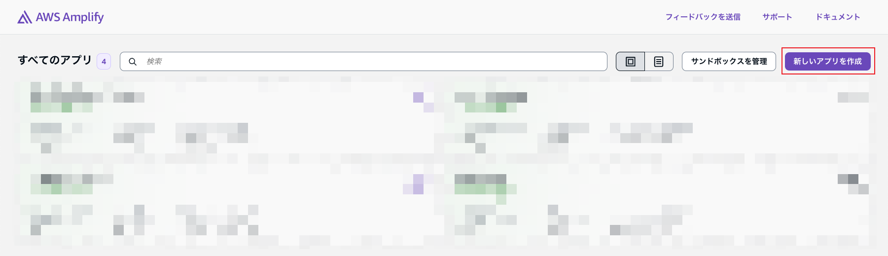
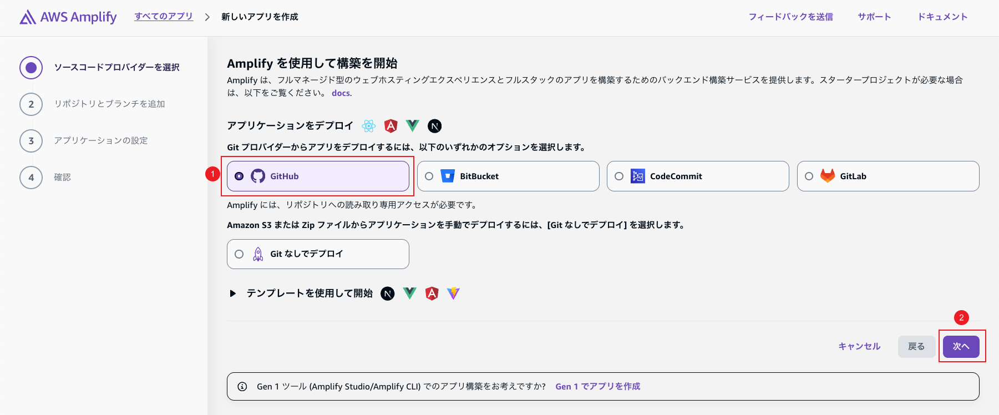
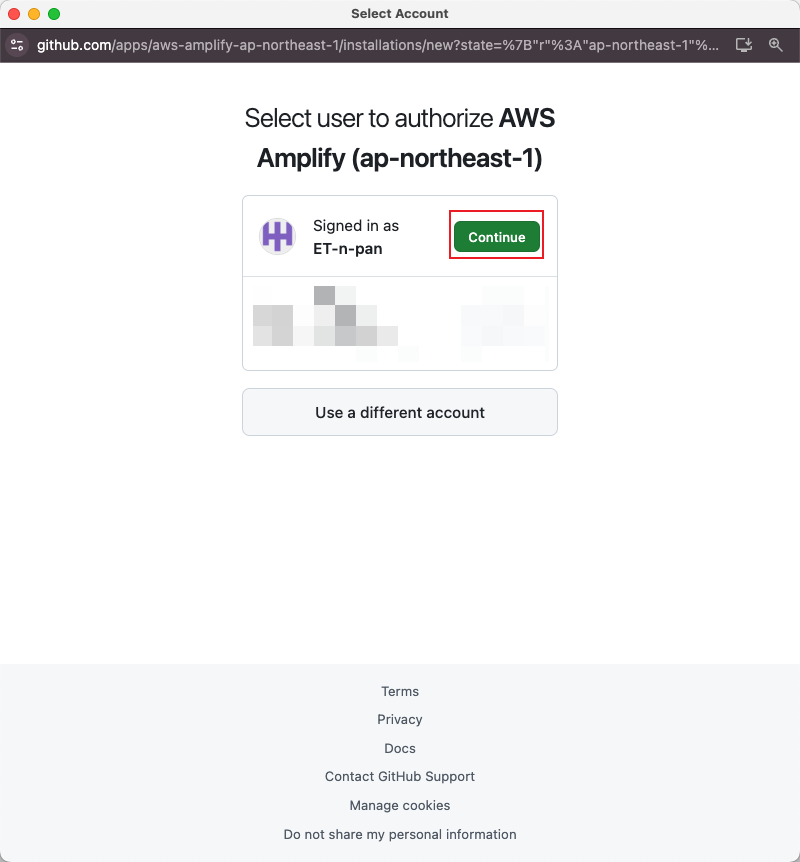
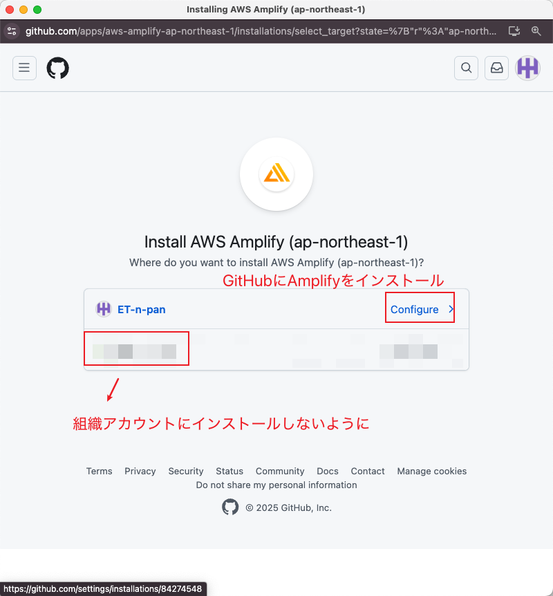
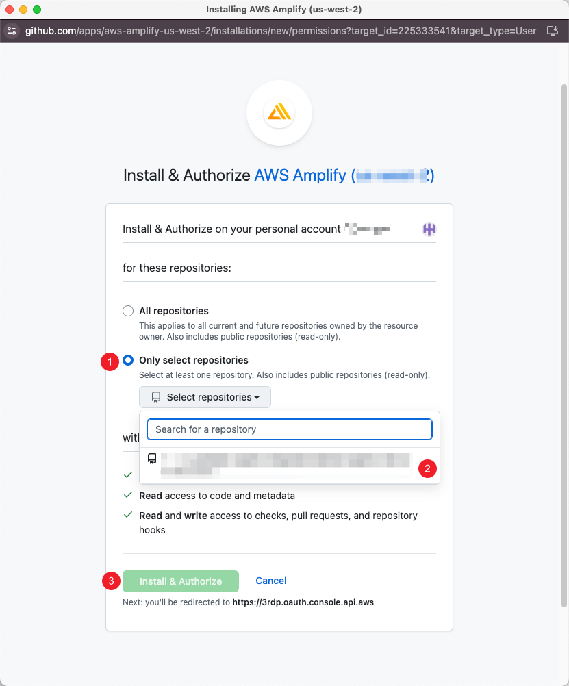
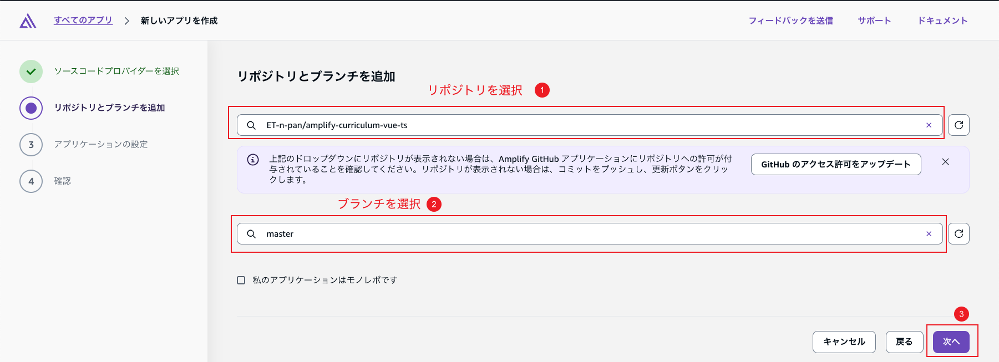
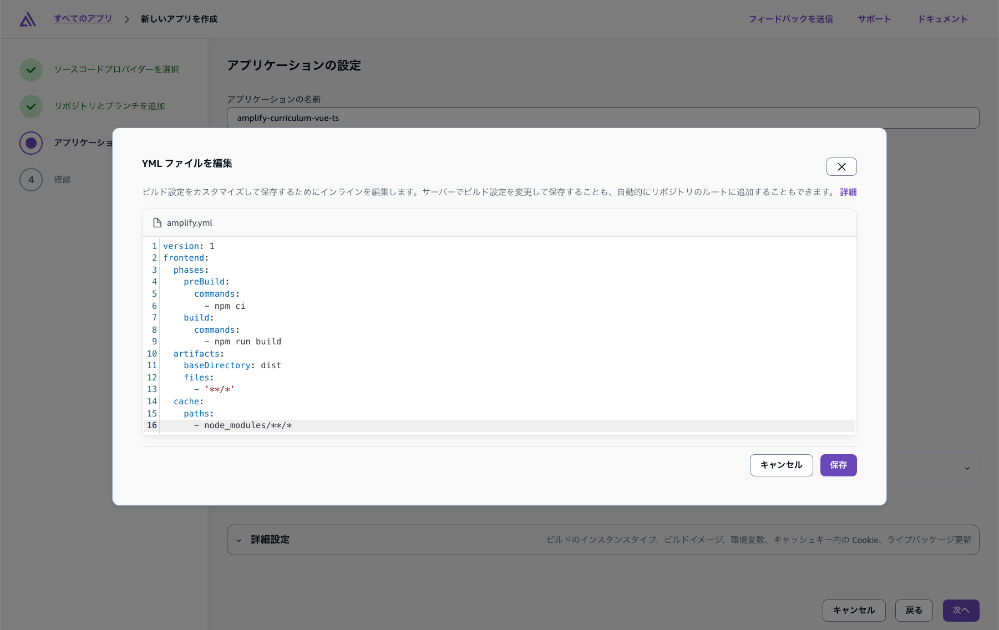
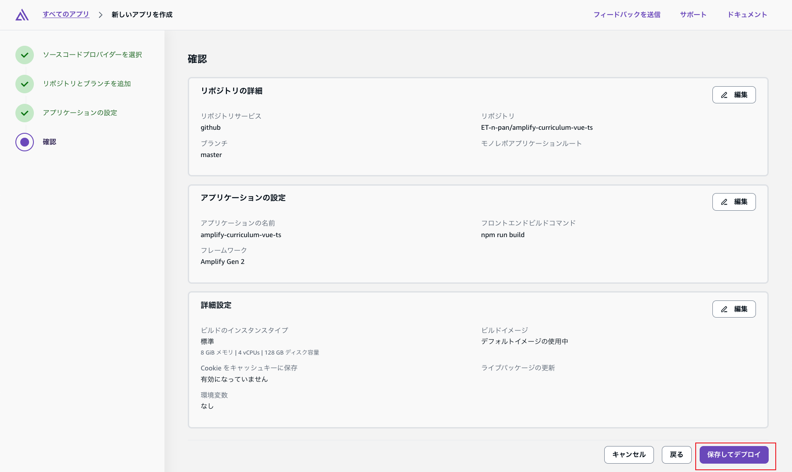
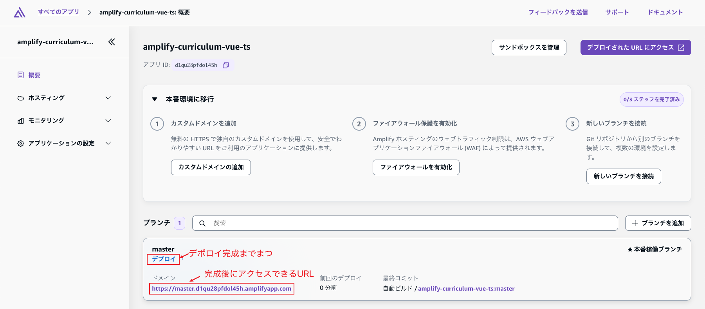
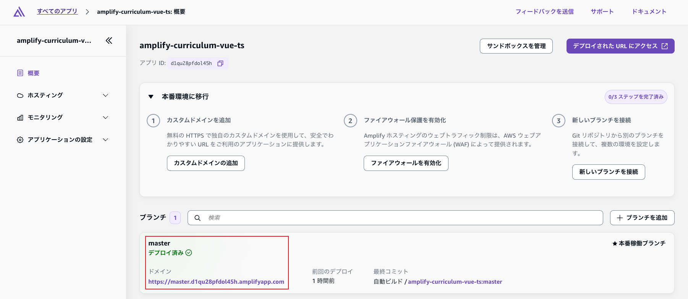

# Day 15: 最終レビューとGitデプロイ

## ゴール
!!! success "Day 15 Goals"
    - 15日間の学習内容の総復習
    - GitHubを使ったコード管理とAWS Amplifyへのデプロイ
    - 最終プロジェクトの完成と振り返り
    - 現システムの制限事項と今後の学習方向性の理解


## 15日間の学習内容の総復習
この15日間のトレーニングプログラムでは、以下の主要なトピックと技術を学びました：
### 主要機能

1. **認証システム**
      - ユーザー登録・ログイン
      - セキュアなセッション管理
      - 多言語対応（日本語）

2. **注文管理機能**
      - 注文の作成、更新、削除
      - リアルタイムデータ同期
      - フィルタリング・ソート機能
      - ページネーション

3. **データ可視化**
      - インタラクティブなテーブル表示
      - 動的グラフとチャート
      - 売上分析レポート

4. **ファイル処理**
      - CSV一括アップロード
      - 非同期バッチ処理
      - 処理状況のリアルタイム追跡

5. **エラーハンドリング**
      - 包括的なエラー処理
      - ユーザーフレンドリーなメッセージ
      - 復旧機能

## 習得したスキルセット
このカリキュラムを通じて、以下のスキルを習得しました：

### フロントエンド開発
- **Vue.js 3 & Composition API**: モダンなVueアプリケーション開発
- **TypeScript**: 型安全性とコード品質の向上
- **コンポーネント設計**: 再利用可能で保守性の高いコンポーネント
- **状態管理**: Piniaを使った効率的な状態管理
- **UI/UXデザイン**: UI5コンポーネントを活用したプロフェッショナルなUI

### バックエンド開発
- **サーバーレスアーキテクチャ**: AWS Lambdaを使った効率的な処理
- **API設計**: RESTful APIとGraphQLの実装
- **データベース設計**: NoSQLデータベースの設計と運用
- **非同期処理**: SQSとLambdaを使った大容量データ処理

### クラウドサービス
- **AWS Amplify**: フルスタックアプリケーションの開発・デプロイ
- **AWS サービス統合**: S3、Lambda、SQS、DynamoDB、Cognitoの連携


## アプリケーションのAWS Amplifyへのデプロイ
### package.jsonのbuildスクリプトの確認
まず、`package.json`ファイルを開き、`build`スクリプトが正しく設定されていることを確認します。以下のようになっているはずです：
```
"scripts": {
    "dev": "vite",
    "build": "vite build",　// ここを確認、vue-tsc -bを削除、vite buildのみにする
    "preview": "vite preview"
  },
```

### AWS Amplifyコンソールでの設定

#### 1.新しいアプリの作成
AWS Amplifyコンソールにログインし、「新しいアプリを作成」をクリックします。


#### 2.GitHubを選択
リポジトリプロバイダーとして「GitHub」を選択し、次に進みます。


#### 3.リポジトリとブランチの選択
まず、GitHubアカウントをAmplifyに接続します。次に、デプロイしたいリポジトリとブランチを選択します。



ログイン後、リポジトリを選択しますか、全リポジトリのアクセスを許可しますかを選択します。


#### 4.ビルド設定の確認
Amplifyは自動的にビルド設定を検出しますが、「YMLファイルを編集」をクリックして、以下のように`build`コマンドを修正します。
```
version: 1
frontend:
  phases:
    preBuild:
      commands:
        - npm ci
    build:
      commands:
        - npm run build
  artifacts:
    baseDirectory: dist
    files:
      - '**/*'
  cache:
    paths:
      - node_modules/**/*
```



#### 5.デプロイの開始
設定が完了したら、「保存してデプロイ」をクリックします。Amplifyがビルドとデプロイを開始します。

#### 6.デプロイの進行状況の確認
デプロイの進行状況はAmplifyコンソールで確認できます。ビルドが成功すると、「デプロイ済み」と表示されます。

#### 7.アプリケーションのアクセス
デプロイが完了すると、提供されたURLをクリックしてアプリケーションにアクセスできます。従来のローカル環境とは異なり、インターネット上でアプリケーションが利用可能になります。


#### 8. アプリケーションの確認
提供されたURLをクリックして、アプリケーションが正しくデプロイされていることを確認します。すべての機能が期待通りに動作することを確認してください。

#### 9. アプリケーションの更新
アプリケーションに変更を加えた場合、変更をGitHubリポジトリにプッシュするだけで、Amplifyが自動的に再ビルドと再デプロイを行います。これにより、継続的なデリバリーが実現されます。

## 総括

AWS Amplify開発マニュアル15日間トレーニングプログラムを正常に完了し、GitHubとAWS Amplifyを使った実際のデプロイも完了しました。これで、Vue.js 3、AWS Amplify、およびSAP統合を使用したモダンで拡張可能なWebアプリケーションを構築し、本番環境にデプロイするスキルが身につきました。

学習した技術スタックは、現代のエンタープライズアプリケーション開発において非常に価値があり、実際のビジネスプロジェクトで即座に活用できるものです。この基盤を元に、さらなる技術的な探求と実践的なプロジェクトの構築に取り組んでください。

**おつかれさまでした！**