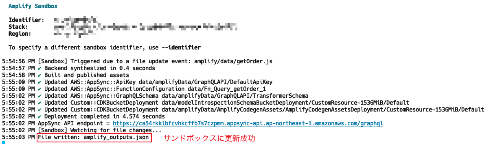
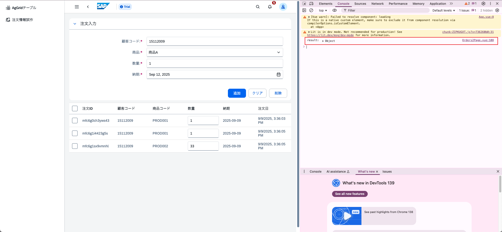
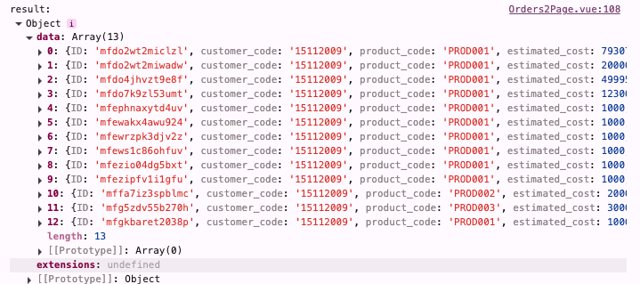
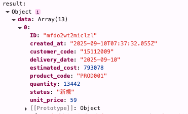
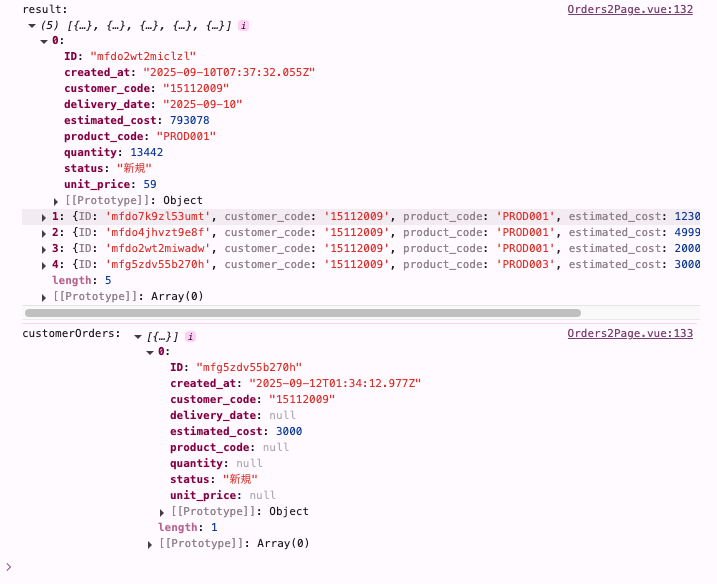
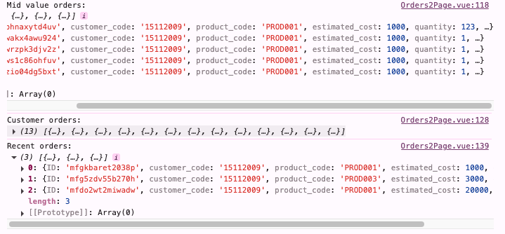

# Day 8: Amplify Dataの基本

## ゴール
!!! success "Day 8 Goals"
    - Amplify Dataのセットアップと理解
    - データモデルの定義
    - クライアント生成
    - 基本的なCRUD操作の実装

## Amplify Dataとは
Amplify DataはAWS AppSyncを基盤とした、リアルタイム対応のGraphQL APIサービスです。

### 主な特徴
- **リアルタイム更新**: WebSocketを使用したリアルタイム通信
- **型安全性**: TypeScriptサポートによる型安全なクライアント
- **認証連携**: Amplify Authとのシームレスな統合
- **スケーラビリティ**: GraphQLクエリを最適化したAPIとクライアント

## プロジェクトフォルダー確認と作成
amplify/フォルダーの下で以下のフォルダーとファイルを作成
```
amplify-vue-ts-project/
├── amplify/
│   ├── auth/
│   ├── data/
│        |── resource.ts          # データモデルとAPIスキーマ
│        |── getOrder.js          # カスタムGETハンドラ
│   ├── backend.ts
│   └── package.json
├── src/
│   └── (your Vue.js app)
└── amplify_outputs.json     
```


## データスキーマの設定
### Step 1: データモデルの定義
`amplify/data/resource.ts`ファイルを作成してスキーマを定義します
```
import { type ClientSchema, a, defineData } from '@aws-amplify/backend';

const schema = a.schema({
  Order: a.customType({
      ID: a.string(),
      customer_code: a.string(),
      product_code: a.string(),
      // TODO: 他のフィールドも追加
    }),

    // GET用のカスタムクエリ
    getOrder: a
      .query()
      .returns(a.ref("Order").array())
      .authorization(allow => [allow.publicApiKey()]) // APIキー認証を許可
      .handler(
        a.handler.custom({
          dataSource: "OdataDataSource",
          entry:"./getOrder.js"
        })
      ),
    
});

export type Schema = ClientSchema<typeof schema>;

export const data = defineData({
  schema,
  authorizationModes: {
    defaultAuthorizationMode: 'apiKey',
  },
});
```

### Step 2: カスタムGETハンドラの実装
`amplify/data/getOrder.js`ファイルを作成して、OData APIからデータを取得するロジックを実装します
```
import { util } from "@aws-appsync/utils";

export function request(ctx) {
  return {
    method: "GET",
    resourcePath: "/odata/v4/order/OrderData",
    params: {
      headers: {
        "Content-Type": "application/json",
      },
    },
  };
}

export function response(ctx) {
  if (ctx.error) {
    return util.error(ctx.error.message, ctx.error.type);
  }
  if (ctx.result.statusCode === 200) {
    const body = JSON.parse(ctx.result.body);
    return body.value;
  } else {
    return util.appendError(ctx.result.body, `${ctx.result.statusCode}`);
  }
  
}
```

### Step 3: `backend.ts`の書き換え
`amplify/backend.ts`を以下のように書き換えます
```
import { defineBackend } from '@aws-amplify/backend';
import { auth } from './auth/resource';
import { data } from './data/resource';


const backend = defineBackend({
  auth,
  data,
});

const odataDataSource = backend.data.addHttpDataSource(
  "OdataDataSource",
  "https://8q5zg2p8tj.us-east-1.awsapprunner.com"
);
```

### Step4: `src/main.ts`の修正
`src/main.ts`で元の`Amplify.configure`を削除し、以下のように修正します
```
Amplify.configure(outputs); // 全ての設定を適用
```


## クライアント連携の実装
`src/pages/Orders2Page.vue`を編集して、Amplify Dataクライアントを使用してデータを取得
```
import { ref, onMounted } from "vue";
import type { Schema } from "@/amplify/data/resource";
import { generateClient } from "aws-amplify/data";

// Amplify Dataクライアントの生成
const client = generateClient<Schema>() 

// Orderデータの状態管理
const orders = ref<Array<Schema['Order']["type"]>>([]);

// コンポーネントマウント時にデータを取得
onMounted(async () => {
  const result = await client.queries.getOrder();
  console.log("result:", result);
});
```

### Step 3: サンドボックスの起動
Day2を参考に、AWS CloudShellでAWS SecretIDとAWS AccessKeyを取得し、ローカルのターミナルで環境変数を設定します。

!!! info "注意"
    - 取得したSecretIDとAccessKeyは60分で期限切れになるので、必要に応じて再取得してください。
    - Amplify Dataのコードを変更した場合、サンドボックスを起動する必要があります。

```
npx ampx sandbox
```
「File written: amplify_outputs.json」が表示されたら、`npm run dev`でフロントエンドを起動し、注文ページにアクセスします。


### ブラウザ開発者ツールでデータが取得できていることを確認
F12キーを押して開発者ツールを開き、コンソールタブで以下のように表示されていれば成功です。


#### 確認ポイント
- `result`にOData APIから取得した注文データが含まれている
    - 


### ハンズオン: schemaにフィールドを追加してデータを表示
`/amplify/data/resource.ts`の`Order`に以下のフィールドを追加し、データベースから全てのフィールドを取得できるようにしましょう。

- created_at
- delivery_date
- estimated_cost
- quantity
- status
- unit_price

成功すると、以下のように全てのフィールドが取得できます。



### クエリオプションの利用
`amplify/data/getOrder.js`の`request`関数を修正して、クエリオプションをサポートしましょう。以下のオプションを追加します。
```
export function request(ctx) {
  const args = ctx.arguments || {};
  const queryParams = {};
  
  // ページネーション
  if (args.top) {
    queryParams["$top"] = args.top;
  }

  // スキップ
  if (args.skip) {
    queryParams["$skip"] = args.skip;
  }

  // フィルタリング
  if (args.filter) {
    queryParams["$filter"] = args.filter;
  }

  // ソート
  if (args.orderby) {
    queryParams["$orderby"] = args.orderby;
  }
  
  //　フィールド選択
  if (args.select) {
    queryParams["$select"] = args.select;
  }

  // フルテキスト検索
  if (args.search) {
    queryParams["$search"] = args.search;
  }
  
  console.log("Query params:", JSON.stringify(queryParams, null, 2));
  return {
    method: "GET",
    resourcePath: "/odata/v4/order/OrderData",
    params: {
      headers: {
        "Content-Type": "application/json",
        "Accept": "application/json",
      },
      query: queryParams,
    },
  };
}
```
### oDataQueryBuilder.tsの作成
`src/utils/odataQueryBuilder.ts`を作成し、ODataクエリパラメータを生成するユーティリティ関数を実装します。
```
export type ODataValue = string | number | boolean | Date;

export interface ODataQueryParams {
  filter?: string;
  orderby?: string;
  top?: number;
  skip?: number;
  select?: string;
  search?: string;
  count?: boolean;
}

export class ODataQueryBuilder {
  
  // Build filter expressions
  static filter = {
    eq: (field: string, value: ODataValue): string => `${field}%20eq%20'${value}'`,
    ne: (field: string, value: ODataValue): string => `${field}%20ne%20'${value}'`,
    gt: (field: string, value: number | string): string => `${field}%20gt%20${value}`,
    ge: (field: string, value: number | string): string => `${field}%20ge%20${value}`,
    lt: (field: string, value: number | string): string => `${field}%20lt%20${value}`,
    le: (field: string, value: number | string): string => `${field}%20le%20${value}`,
    contains: (field: string, value: string): string => `contains(${field},'${value}')`,
    startsWith: (field: string, value: string): string => `startswith(${field},'${value}')`,
    endsWith: (field: string, value: string): string => `endswith(${field},'${value}')`,
    and: (...conditions: string[]): string => conditions.join('%20and%20'),
    or: (...conditions: string[]): string => conditions.join('%20or%20'),
    in: (field: string, values: string[]): string => `${field}%20in%20('${values.join("','")}')`,
  };
  
  // Build orderby expressions  
  static orderBy = {
    asc: (field: string): string => `${field}%20asc`,
    desc: (field: string): string => `${field}%20desc`,
    multiple: (...fields: string[]): string => fields.join(','),
  };
  
  // Build select expressions
  static select = {
    fields: (...fields: string[]): string => fields.join(','),
  };
}

```
### クエリオプションの利用例
`src/pages/Orders2Page.vue`でクエリオプションを使用してデータを取得します。
```
import { ODataQueryBuilder } from "@/utils/ODataQueryBuilder";

// 見積もり金額が2000以上の注文を取得し、金額の降順で上位10件を取得
const getHighValueOrders = async () => {
  const result = await client.queries.getOrder({
    filter: ODataQueryBuilder.filter.gt('estimated_cost', 2000),
    orderby: ODataQueryBuilder.orderBy.desc('estimated_cost'),
    top: 10
  });
  return result.data;
};

// 顧客コードが'15112009'で商品コードが'PROD003'の最新の注文を取得
const getCustomerNewOrders = async (customerId: string) => {
  const result = await client.queries.getOrder({
    filter: ODataQueryBuilder.filter.and(
      ODataQueryBuilder.filter.eq('customer_code', customerId),
      ODataQueryBuilder.filter.eq('product_code', 'PROD003')
    ),
    orderby: ODataQueryBuilder.orderBy.desc('created_at'),
    select: ODataQueryBuilder.select.fields('ID', 'customer_code', 'estimated_cost', 'created_at', 'status')
  });
  return result.data;
};

onMounted(async () => {
  const result = await getHighValueOrders();
  const customerOrders = await getCustomerNewOrders('15112009');
  console.log("result:", result);
  console.log("customerOrders:", customerOrders);
});
```
#### 確認ポイント
- クエリオプションを使用してデータが正しく取得できている


### ハンズオン 2: クエリオプションを使ってデータ取得
1. 見積もり金額が1000以上、3000以下の注文を取得し、金額の昇順で上位5件を取得してみましょう。
2. 顧客コードが'15112009'の注文を取得し、注文ID、顧客コード、数量、作成日のみ表示してみましょう。
3. 作成日が2025年9月11日以降の注文を取得し、作成日の降順で上位3件を取得してみましょう。


<details>
<summary>解答例</summary>
```
// 1. 見積もり金額が1000以上、3000以下の注文を取得し、金額の昇順で上位5件を取得
const getMidValueOrders = async () => {
   const result = await client.queries.getOrder({
       filter: ODataQueryBuilder.filter.and(
          ODataQueryBuilder.filter.ge('estimated_cost', 1000),
          ODataQueryBuilder.filter.le('estimated_cost', 3000)
       ),
       orderby: ODataQueryBuilder.orderBy.asc('estimated_cost'),
       top: 5
    });
   console.log("Mid value orders:", result.data);
   return result.data;
};

// 2. 顧客コードが'15112009'の注文を取得し、注文ID、顧客コード、数量、作成日のみ表示
const getCustomerOrders = async (customerId: string) => {
   const result = await client.queries.getOrder({  
       filter: ODataQueryBuilder.filter.eq('customer_code', customerId),
       select: ODataQueryBuilder.select.fields('ID', 'customer_code', 'quantity', 'created_at')
    });
   console.log("Customer orders:", result.data);
   return result.data;
};

// 3. 作成日が2025年9月11日以降の注文を取得し、作成日の降順で上位3件を取得
const getRecentOrders = async () => {
   const result = await client.queries.getOrder({
         filter: ODataQueryBuilder.filter.ge('created_at', '2025-09-11T00:00:00Z'),
         orderby: ODataQueryBuilder.orderBy.desc('created_at'),
         top: 3
    });
   console.log("Recent orders:", result.data);
   return result.data;
};
```
#### 確認ポイント
- データを分析して、条件に合った注文が取得できていること


## トラブルシューティング
1. **サンドボックス認証エラー**
   ```
   Error: Unable to load AWS credentials from any provider
   ```
   - AWS CLIで`aws sts get-caller-identity`を実行して、認証情報が正しいことを確認
   - `aws configure list`でリージョンが`ap-northeast-1`に設定されていることを確認
   - `SxC-AssumeRole-for-SIC-to-Use-AWS-CLI`ロールが存在することを確認

2. **モジュールエラー**
   ```
   Cannot find module '../amplify_outputs.json'
   ```
   - `npx ampx sandbox`でサンドボックスが起動していることを確認
   - `amplify_outputs.json`が生成されていることを確認


## 参考資料
- [Amplify Data 公式ドキュメント](https://docs.amplify.aws/vue/build-a-backend/data/)
- [GraphQL API クエリ](https://docs.amplify.aws/vue/build-a-backend/data/query-data/)
- [リアルタイム購読](https://docs.amplify.aws/vue/build-a-backend/data/subscribe-data/)