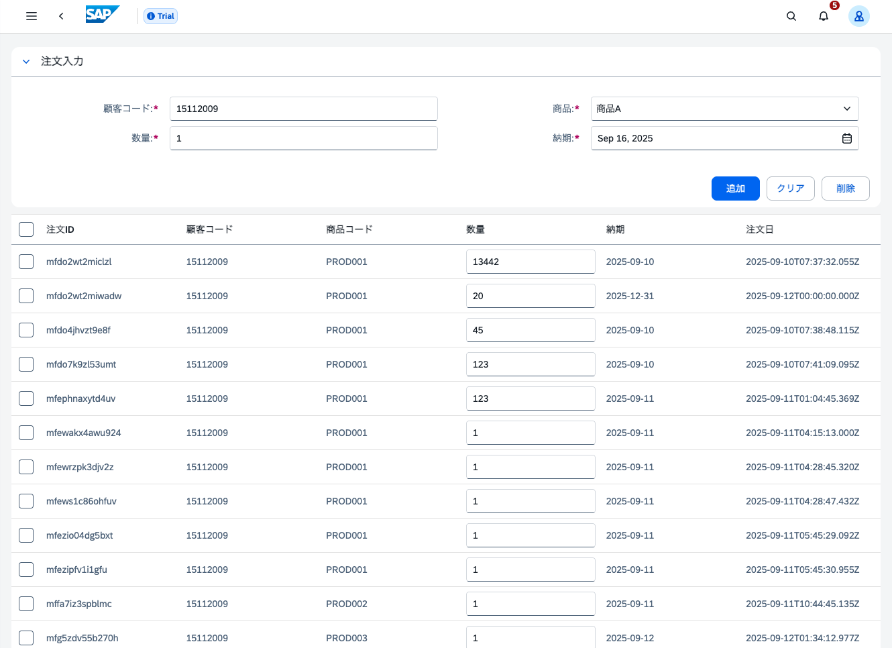
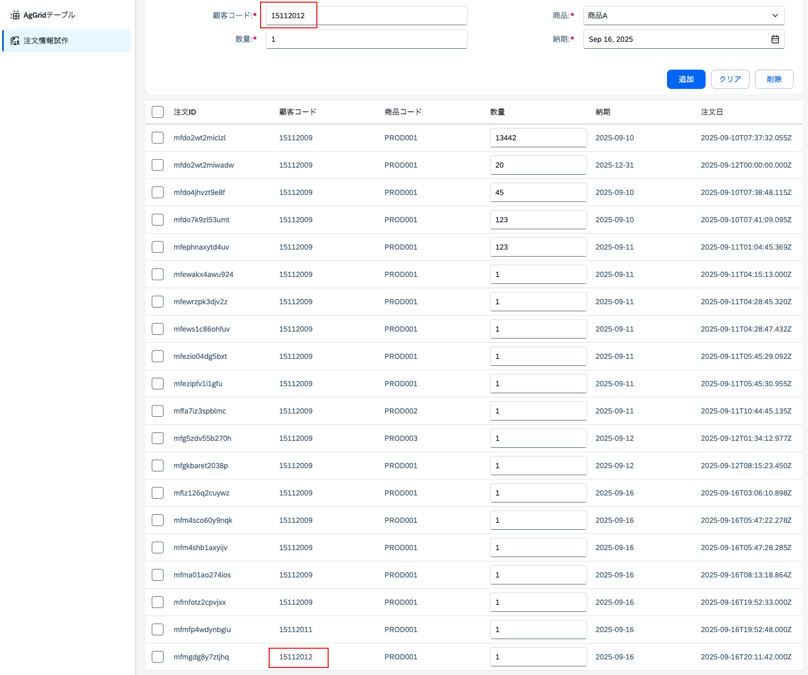

# Day 9: バックエンド連携① - データベース連携とCRUD機能の追加
CRUDとは、Create（作成）、Read（読み取り）、Update（更新）、Delete（削除）の頭文字を取ったもので、データベース操作の基本的な機能を指します。
## ゴール
!!! success "Day 9 Goals"
    - Amplify DataにCreateとRead機能を追加
    - フロントエンドデータソースをAmplify Dataに変更


## Step 1: form-store.tsの修正
`/src/stores/form-store.ts`を修正し、Day8で作成したAmplify Dataを利用するように変更します。
```
// 既存のインポートをAmplify Dataクライアントに変更
// 追加
import type { Schema } from "@/amplify/data/resource";
import { generateClient } from "aws-amplify/data";

const client = generateClient<Schema>();

// 適切な場所に追加
setOrders(orders: any) {
  this.orders = []; // 既存の注文をクリア
  this.orders = orders;
  localStorage.setItem('orders', JSON.stringify(this.orders));
},
async fetchOrders() {
  const result = await client.queries.getOrders();
  if (result.data) {
    this.setOrders(result.data.items);
    console.log("Orders fetched:", result.data.items);
  }else{
    console.error("Failed to fetch orders");
  }
},
```

## Step 2: Orders2Page.vueの修正
`/src/pages/Orders2Page.vue`を修正し、Day8で作成したAmplify Dataを利用するように変更します。
```
// 既存のインポートをAmplify Dataクライアントに変更
const fetchOrders = async () => {
	try {
		const result = await client.queries.getOrder();
    // 取得したデータをストアにセット
		if (result.data) {
			formStore.setOrders(result.data);
		}
	} catch (error) {
		console.error("Error fetching orders:", error);
		showToast("注文の取得中にエラーが発生しました。");
	}
};
```


Day8で追加した`onMounted`において`fetchOrders`を呼び出します。
```
onMounted(async () => {
  // 非同期処理のためawaitを使用
  await fetchOrders();
});
```

###　オーダーページ更新の確認

注文の追加、更新、削除が正常に動作しますが、ページをリロードすると追加した注文が消えてしまうことを確認してください。

## ハンズオン 1: Amplify DataのCRUD機能の実装
`amplify/data/resource.ts`を修正し、`createOrder`関数を追加します。
関数のレスポンスを処理するファイル`createOrder.js`を`amplify/data/`に作成します。

### ヒント
- `createOrder`関数は新しい注文を作成し、作成した注文を返します。
- オーダーページからは`client.mutations`を使用してGraphQLミューテーションを呼び出します。
- 詳細は[Amplify Dataのドキュメント](https://docs.amplify.aws/vue/build-a-backend/data/custom-business-logic/connect-http-datasource/#step-3---define-custom-queries-and-mutations)を参照してください


<details>
<summary>解答例</summary>
- `createOrder.js`
```
import { util } from "@aws-appsync/utils";

export function request(ctx) {
  return {
    method: "POST",
    resourcePath: "/odata/v4/order/OrderData",
    params: {
      headers: {
        "Content-Type": "application/json",
      },
      body: ctx.arguments,
    },
  };
}

export function response(ctx) {
  if (ctx.error) {
    return util.error(ctx.error.message, ctx.error.type);
  }

  if (ctx.result.statusCode == 201) {
    return JSON.parse(ctx.result.body);
  } else {
    return util.appendError(ctx.result.body, "ctx.result.statusCode");
  }
}

```

- `resource.ts`へ`createOrder`を追加

```
getOrder: a
  .query()
///中略///
  ),

createOrder: a
  .mutation()
  .arguments({
    ID: a.string(),
    customer_code: a.string(),
    product_code: a.string(),
    estimated_cost: a.float(),
    quantity: a.integer(),
    unit_price: a.float(),
    delivery_date: a.string(),
    status: a.string(),
    created_at: a.string()
  })
  .returns(a.ref("Order"))
  .authorization(allow => [allow.publicApiKey()]) // APIキー認証を許可
  .handler(
    a.handler.custom({
      dataSource: "OdataDataSource",
      entry:"./createOrder.js"
    })
  ),
///以下省略///
```

- 'Orders2Page.vue'の`addOrder`関数を修正
```
// 注文追加関数
async function addOrder() {
	const {success, message, order} = formStore.addOrder();
	if (success === true && order !== undefined) {
		// DBに追加
		await client.mutations.createOrder(order)
			.then(() => {
				showToast("注文が追加されました。");
				fetchOrders(); // 注文一覧を再取得して更新
			})
	} else {
		showToast(message);
		return;
		
	}
}
```
</details>
&nbsp;


## 確認ポイント
- 注文の追加が正常に動作し、追加した注文がリストに表示されること
- ページをリロードしても追加した注文が保持される


## トラブルシューティング


## 参考資料
- [Amplify HTTPデータソース](https://docs.amplify.aws/react/build-a-backend/data/custom-business-logic/connect-http-datasource/)
- [AWS AppSync リゾルバー](https://docs.aws.amazon.com/appsync/latest/devguide/resolver-context-reference.html)
- [Amplify Functions](https://docs.amplify.aws/react/build-a-backend/functions/)