# Day 10: バックエンド連携② - CRUD続きとファイルアップロード機能の追加

## ゴール
!!! success "Day 10 Goals"
    - Amplify DataにUpdateとDelete機能を追加
    - フロントエンドデータソースをAmplify Dataに変更
    - GitHubを使ったソースコード管理

## ハンズオン 1: Amplify DataのCRUD機能の実装続き

### Step 1: `amplify/data/resource.ts`の修正続き
`/src/amplify/data/resource.ts`を修正し、`updateOrder`、`deleteOrder`関数を追加します。  
関数のレスポンスを処理するファイル`updateOrder.js`、`deleteOrder.js`を`amplify/data/`に作成します。

### Step 2: `/src/stores/form-store.ts`の修正続き
`/src/stores/form-store.ts`を修正し、Step1で作成したAmplify DataのCRUD関数を利用するように変更します。

### Step 3: 動作確認

#### 確認ポイント
- AgGridテーブルページで数量と単価を編集し、リフレッシュしても変更が保持されていること
    - 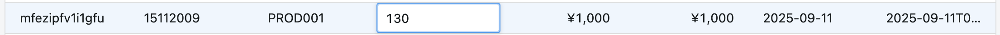
    - 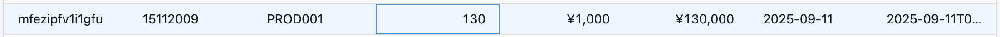
- Orders2Pageで行を削除し、リフレッシュしても削除が保持されていること
- Orders2Pageで数量を編集し、リフレッシュしても変更が保持されていること
    - 

### ヒント
- `/src/stores/form-store.ts`の`updateOrder`、`deleteOrder`、`updateOrderQuantity`を修正し、データベースと同期するようにします。
- データベース同期前にローカルストアを更新し、UIの即時反映を実現します。
- データベース関連関数をasync/awaitで非同期処理として実装します。
- エラーハンドリングを追加し、失敗時にコンソールにエラーメッセージを表示します。

<details>
<summary>解答例</summary>
Step 1: `amplify/data/resource.ts`の修正続き
```
updateOrder: a
    .mutation()
    .arguments({
    ID: a.string().required(),
    customer_code: a.string(),
    product_code: a.string(),
    estimated_cost: a.float(),
    quantity: a.integer(),
    unit_price: a.float(),
    delivery_date: a.string(),
    status: a.string(),
    created_at: a.string()
    })
    .returns(a.ref("Order"))
    .authorization(allow => [allow.publicApiKey()])
    .handler(
    a.handler.custom({
        dataSource: "OdataDataSource",
        entry:"./updateOrder.js"
    })
    ),
      
deleteOrder: a
    .mutation()
    .arguments({
    ID: a.string().required(),
    })
    .returns(a.boolean())
    .authorization(allow => [allow.publicApiKey()])
    .handler(
    a.handler.custom({
        dataSource: "OdataDataSource",
        entry:"./deleteOrder.js"
    })
),
```

Step1: `amplify/data/updateOrder.js`作成
```
import { util } from "@aws-appsync/utils";

export function request(ctx) {
  return {
    method: "PUT",
    resourcePath: "/odata/v4/order/OrderData",
    params: {
      headers: {
        "Content-Type": "application/json",
      },
      body: ctx.arguments,
    },
  };
}

export function response(ctx) {
  if (ctx.error) {
    return util.error(ctx.error.message, ctx.error.type);
  }

  if (ctx.result.statusCode == 200) {
    return JSON.parse(ctx.result.body);
  } else {
    return util.appendError(ctx.result.body, "ctx.result.statusCode");
  }
}
```

Step1: `amplify/data/deleteOrder.js`　作成
```
import { util } from "@aws-appsync/utils";

export function request(ctx) {
  return {
    method: "DELETE",
    resourcePath: "/odata/v4/order/OrderData(ID='" + ctx.arguments.ID +"')",
    params: {
      headers: {
        "Content-Type": "application/json",
      },
    },
  };
}

export function response(ctx) {
  if (ctx.result.statusCode == 204) {
    return true;
  } else {
    return false;
  }
}
```

Step 2: '/src/stores/form-store.ts'の修正続き
```
// 注文更新関数: AgGrid用
async updateOrder(orderId: any, updatedData: any) {
    const orderIndex = this.orders.findIndex((o: { ID: any; }) => o.ID === orderId);
    if (orderIndex !== -1) {
        this.orders[orderIndex] = { ...this.orders[orderIndex], ...updatedData };
        localStorage.setItem('orders', JSON.stringify(this.orders));
    }

    // DB更新
    await client.mutations.updateOrder(this.orders[orderIndex])
    .then((result: { data: any; }) => {
        if (result.data) {
            console.log("Order updated:", result.data);
        }
        else{
            console.error("Failed to update order ID:", orderId);
            this.fetchOrders(); // 再度注文を取得して同期
        }
    });

},

// 注文数量更新: Orders2Page.vueの数量編集用
async updateOrderQuantity(orderId: any, newQuantity: any) {
    const order = this.orders.find((o: { ID: any; }) => o.ID === orderId);
    console.log(order);
    if (order) {
        order.quantity = newQuantity;
        localStorage.setItem('orders', JSON.stringify(this.orders));
    }


    // DB更新
    await client.mutations.updateOrder(order)
    .then((result: { data: any; }) => {
        if (result.data) {
            console.log("Order updated:", result.data);
        }
        else{
            console.error("Failed to update order ID:", orderId);
            this.fetchOrders(); // 再度注文を取得して同期
        }
    });
},

// 注文削除関数
// 選択した注文を削除
async deleteOrder(selectionElement: { selected: string; } | null, messageElement: { open: boolean; innerText: string; } | null) {
    if (selectionElement == null) {
        if (messageElement != null) {
            messageElement.open = true;
            messageElement.innerText = "選択機能が見つかりません。";
        }
        return;
    }
    const selectedRows = selectionElement.selected.split(" ");
    console.log("Selected rows to delete:", selectedRows);
    if (selectedRows.length === 0 || (selectedRows.length === 1 && selectedRows[0] === '')) {
        if (messageElement != null) {
            messageElement.open = true;
            messageElement.innerText = "削除する注文を選択してください。";
        }
        return;
    }
    this.orders = this.orders.filter((order: { ID: any; }) => !selectedRows.includes(order.ID));
    localStorage.setItem('orders', JSON.stringify(this.orders));
    selectionElement.selected = '';


    // 削除リクエストを送信
    for (let orderId of selectedRows) {
        console.log("Deleting order ID:", orderId);
        try {
            const result = await client.mutations.deleteOrder({ ID: orderId });
            if (result.data) {
                console.log("Order deleted:", result.data);
            }else{
                console.error("Failed to delete order ID:", orderId);
                this.fetchOrders(); // 再度注文を取得して同期
            }
        } catch (error) {
            console.error("Error deleting order ID:", orderId, error);
            this.fetchOrders(); // 再度注文を取得して同期
        }
    }
    if (messageElement != null) {
        messageElement.open = true;
        messageElement.innerText = `${selectedRows.length}件の注文を削除しました。`;
    }
    return;
}
```
</details>
&nbsp;

### チャレンジ問題

- データ更新時にローカル、DBはどんな順番で更新していますか？また、その理由は？
    - <details>
        <summary>解答例</summary>
        - ローカルを先に更新し、DBを後で更新しています。理由は、ローカルを先に更新することでUIの即時反映を実現し、ユーザー体験を向上させるためです。DB更新が失敗した場合は、再度注文を取得してローカルとDBの同期を取るようにしています。
        - またの名前を「楽観的更新」と言います。
        </details>

    - 他の方法でローカルとDBの同期を取る方法はありますか？
        - <details>
            <summary>解答例</summary>
            - 例えば、DB更新が成功した後にローカルを更新する方法もあります。この方法では、DBの状態が常に正確に反映されるため、データの整合性が保たれます。ただし、UIの即時反映が遅れる可能性があります。またの名前を「悲観的更新」と言います。
            - もう一つの方法として、WebSocketやサーバーからのプッシュ通知を利用して、DBの変更をリアルタイムでローカルに反映させる方法もあります。この方法では、DBの状態が変更されるたびにローカルが自動的に更新されるため、常に最新のデータを保持できます。ただし、実装が複雑になります。
            </details>
        - ローカルとDBの同期を取る際に考慮すべき点は何ですか？
            - <details>
                <summary>解答例</summary>
                - データの整合性、ユーザー体験、エラーハンドリング、パフォーマンス、競合状態の管理などを考慮する必要があります。
                </details>
&nbsp;


## GitHubを使ったソースコード管理
Githubのウェブサイトでリポジトリを作成するか、GitHub CLIを使ってローカルから直接リポジトリを作成することができます。
### Step 1: GitHubリポジトリの作成

#### GitHubウェブサイトでリポジトリを作成
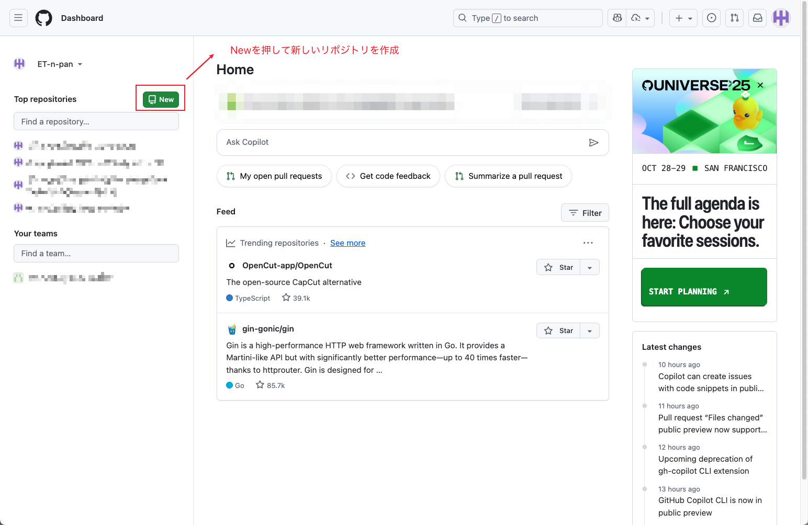
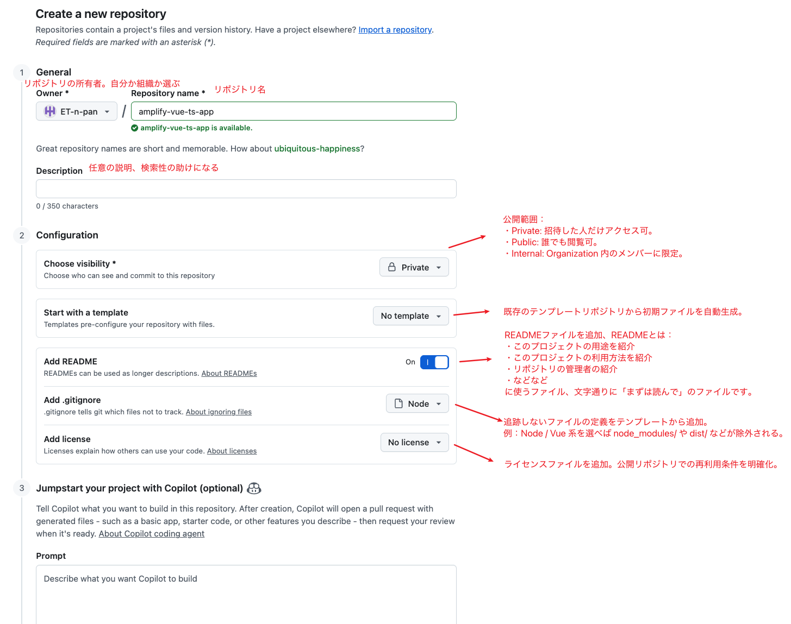
推奨設定:
- Privateリポジトリ
- READEMEを追加
- .gitignoreをNodeで追加
- ライセンスはなしで


#### GitHub CLIでリポジトリを作成
まずはターミナルでGitHub CLIを認証します。(ブラウザ連携)
```
gh auth login

# 以下の質問に答える
# ? What account do you want to log into? → GitHub.com
# ? What is your preferred protocol for Git operations? → HTTPS
# ? Authenticate Git with your GitHub credentials? → Yes
# ? How would you like to authenticate GitHub CLI? → Login with a web browser
# 表示されたコードをブラウザで入力し、認証を完了させる
```
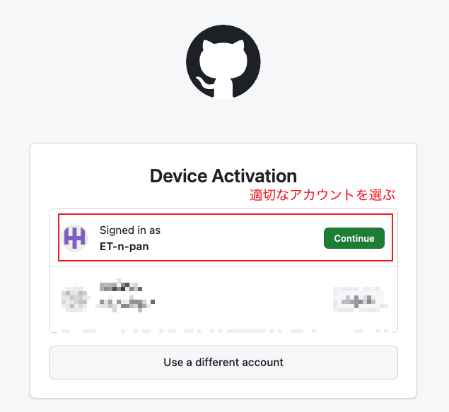
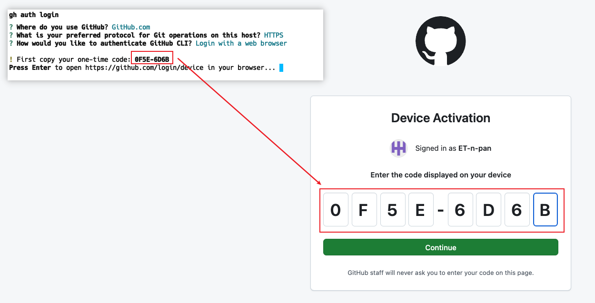
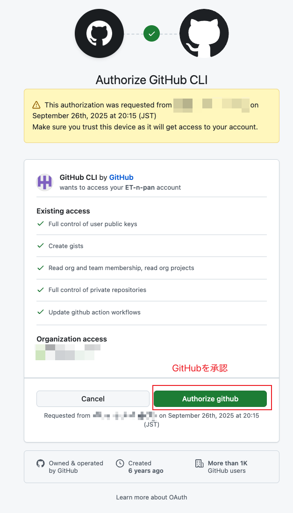

次に、プロジェクトフォルダーで以下のコマンドを実行し、ローカルリポジトリを作成し、GitHubにプッシュします。
```
git init
git switch -c main
git config user.name "githubのユーザー名に置き換えてください"
git config user.email "githubのメールアドレスに置き換えてください"
gh repo create amplify-vue-ts-app --private --source=. --remote=origin --description="Amplify Vue3 + TypeScript Sample App"
# 対話が出る場合は「Push an existing local repository to GitHub? → Yes」
```
オプションの説明:
- `--private`: プライベートリポジトリを作成
- `--source=.`: カレントディレクトリをリポジトリとして使用
- `--remote=origin`: リモートURL名を`origin`に設定
- `--description="..."`: リポジトリの説明を設定
以下の手順でGitHub上にリポジトリが作成されることを確認できます。
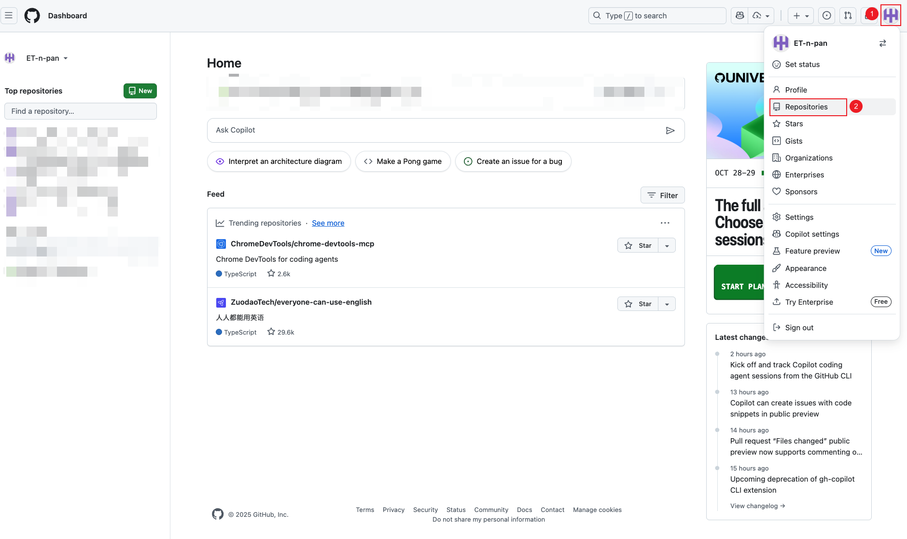
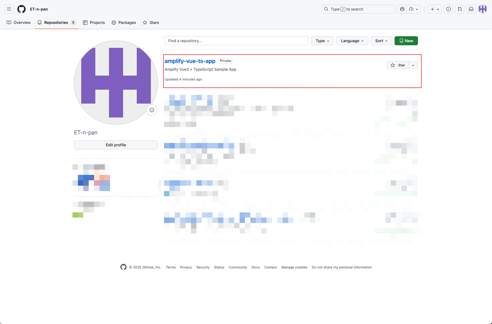

### Step 2: ソースコードのコミットとプッシュ
以下のコマンドでソースコードをコミットし、GitHubにプッシュ
```
git add .
git commit -m "最初のコミット"
git push origin main
```
リポジトリの内容がGitHubに反映されていることを確認します。
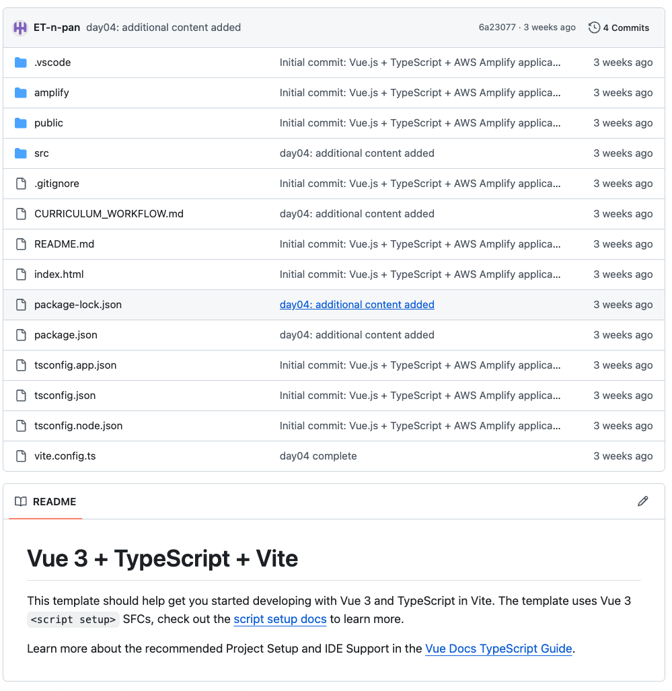

### gitの基本コマンド
- `git status`: 変更されたファイルの状態を確認
- `git add <ファイル名>`: 変更をステージングエリアに追加、すべての変更を追加する場合は`git add .`
- `git commit -m "メッセージ"`: ステージングエリアの変更をコミット
- `git push origin <ブランチ名>`: ローカルのコミットをリモートリポジトリにプッシュ
- `git pull origin <ブランチ名>`: リモートリポジトリの変更をローカルに取得
- `git clone <リポジトリURL>`: リモートリポジトリをローカルにクローン
- `git branch`: ブランチの一覧を表示
- `git checkout <ブランチ名>`: 指定したブランチに切り替え
- `git merge <ブランチ名>`: 指定したブランチを現在のブランチにマージ
- `git log`: コミット履歴を表示

###  一般的なGitのワークフロー

#### 1. 変更の確認
```
git status
git diff
```

#### 2. リモートリポジトリの変更を取得
```
git fetch origin # リモートの変更を取得
git pull origin <ブランチ名> # 取得した変更をローカルにマージ、または
git pull --rebase origin <ブランチ名> # 取得した変更をローカルにリベース
```

#### 2. 変更のステージング
```
git add <ファイル名>  # 特定のファイルをステージング
git add .            # すべての変更をステージング
git add -p          # インタラクティブに変更を選択してステージング
```

#### 3. 変更のコミット
```
git commit -m "変更内容の説明"
git commit --amend  # 直前のコミットを修正
```

#### 4. リモートリポジトリへのプッシュ
```
git push --set-upstream origin <ブランチ名> # 初回のみ必要
git push origin <ブランチ名> # 以降はこれでOK
```

#### 使い分け
**リモートリポジトリとの同期**
- `git fetch`: リモートの変更を取得するだけで、ローカルには影響しない
- `git pull`: リモートの変更を取得し、ローカルにマージまたはリベースする

**ブランチの統合**
- `git merge`: 他のブランチの変更を現在のブランチに統合する
- `git rebase`: 他のブランチの変更を現在のブランチの先頭に移動させる、履歴が直線的になる

##### 下の履歴図を見てください。
- `git merge`は、分岐した履歴をそのまま保持しますので、ローカルの変更とリモートの変更がどのように統合されたかが分かりやすいですが、履歴が複雑になることがあります。
- `git rebase`は、分岐した履歴を直線的にしますので、履歴がシンプルになりますが、履歴の一部を書き換えるため、共有されたブランチで使用する際には注意が必要です。
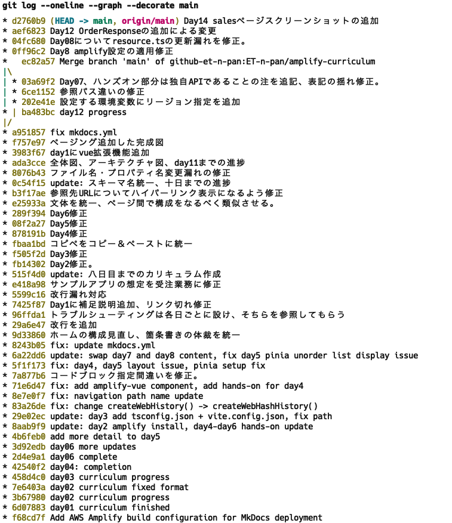

### pull requestの作成とマージ

#### ブランチの作成
まずは新しいブランチを作成し、切り替えます。
```
git checkout -b test-branch
```
コードを修正し、コミットとプッシュを行います。
```
git add .
git commit -m "test-branchでの変更"
git push --set-upstream origin test-branch
```

#### プールリクエストの作成
GitHubのウェブサイトで、`Pull requests`タブをクリックし、`New pull request`ボタンをクリックします。  
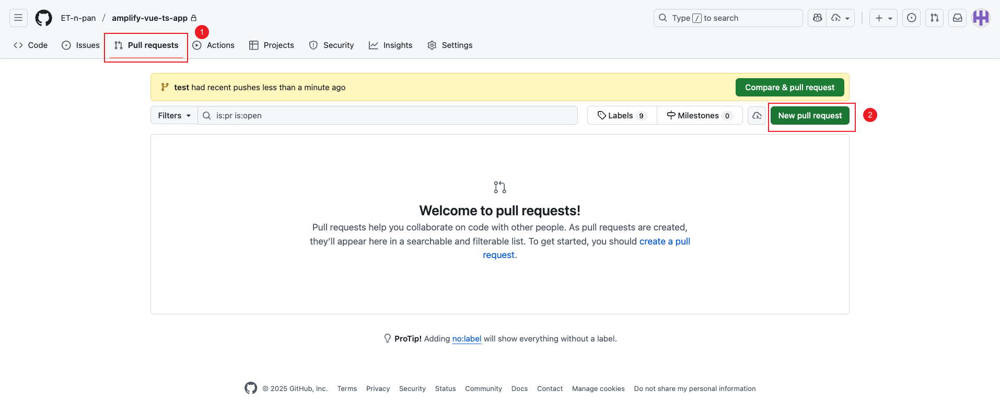  
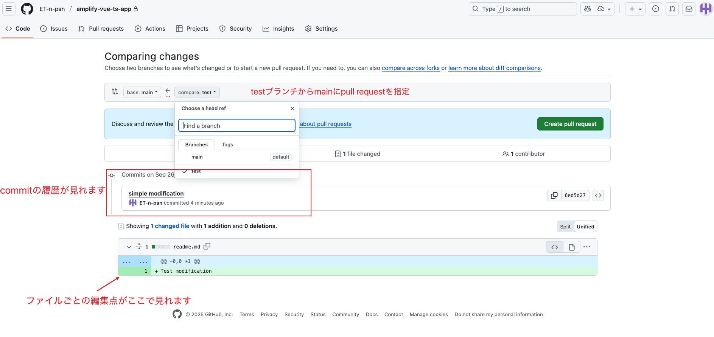

#### プルリクエスト画面
`Compare & pull request`ボタンをクリックし、プルリクエストのタイトルと説明を入力し、`Create pull request`ボタンをクリックします。
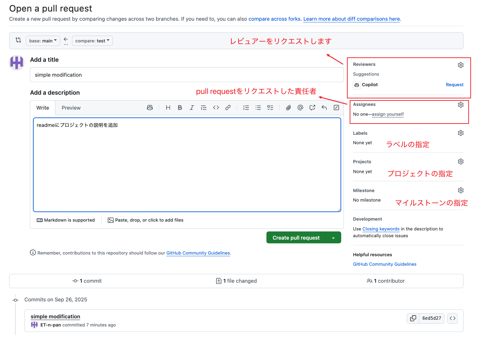
プルリクエストが作成され、レビューとマージが可能になります。

#### 衝突の解決
または衝突がある場合は、`Resolve conflicts`ボタンをクリックし、衝突を解決します。
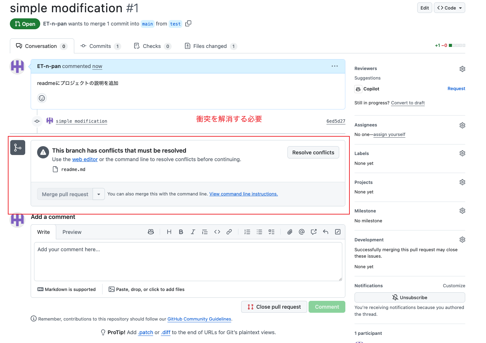
衝突を解決したら、`Mark as resolved`ボタンをクリックし、`Commit merge`ボタンをクリックします。
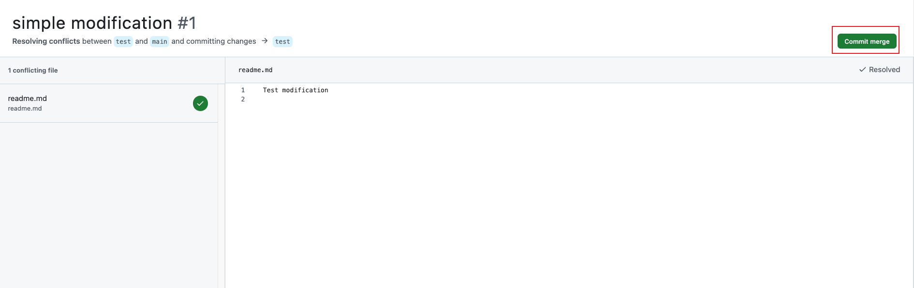
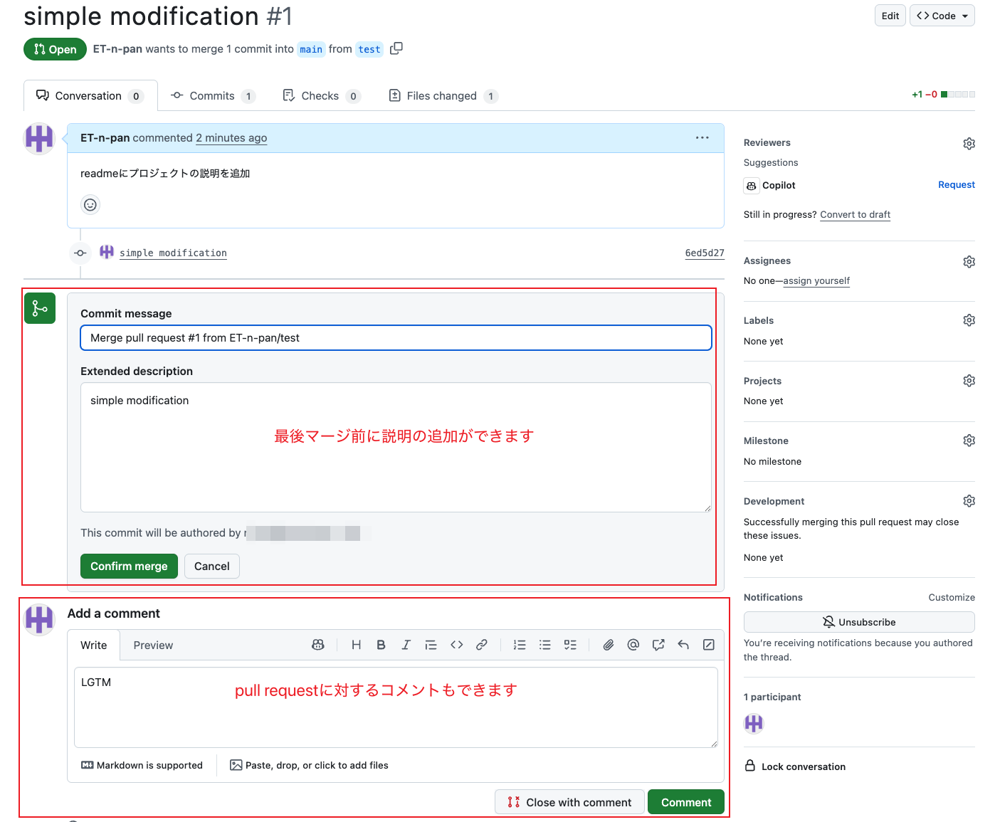

#### マージ成功
最後に、`Merge pull request`ボタンをクリックします。
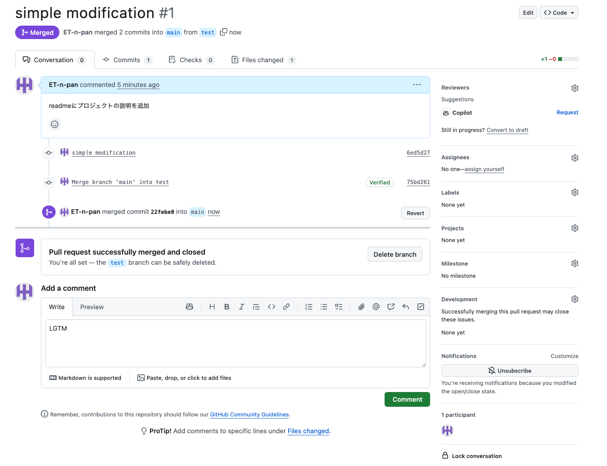

Mainで変更が反映されていることを確認します。
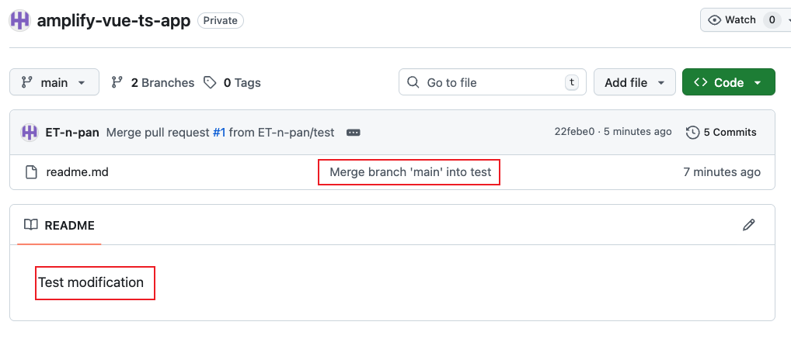


