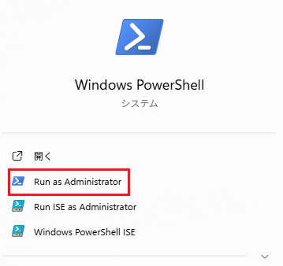
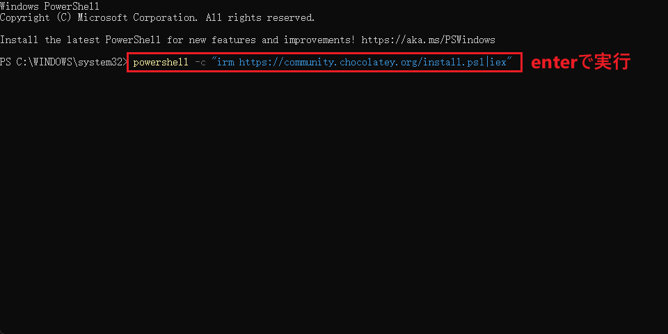
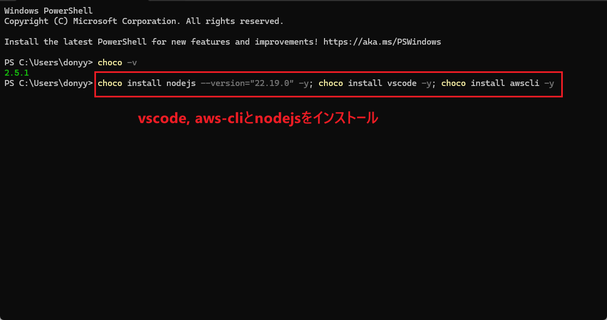
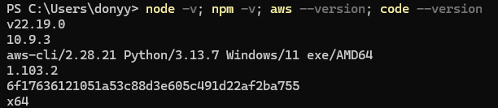
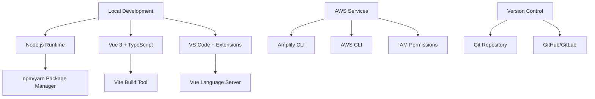

# Day 1: キックオフ & セットアップ

## ゴール
- 必要なツールのインストール
- Vue3.js + TypeScript開発環境のセットアップ
- プロジェクトフォルダー構成

## Training Program Overview


## Environment Setup
### Powershellを管理者として実行


### Powershellにコマンドを実行

```
# Chocolateyをダウンロードしてインストールする：
powershell -c "irm https://community.chocolatey.org/install.ps1|iex"

# Powershellを再起動、管理者として実行

# Chocolateyのバージョンを確認する,"v2.5.1"が表示される：
choco -v 
```

https://docs.aws.amazon.com/cli/latest/userguide/getting-started-install.html

### 必要なツールをインストール

```
# ツールインストール
choco install nodejs --version="22.19.0" -y; choco install vscode -y; choco install awscli -y

# Verify installations
node -v; npm -v; aws --version; code --version
# バージョンを確認
```


### Prerequisites Verification

Before we begin, ensure your environment meets all requirements:

1. **System Check**: Run verification script from prerequisites
2. **Tool Versions**: Confirm all tools are at required versions
3. **AWS Access**: Test AWS CLI connectivity
4. **Permissions Validation**: Verify AWS service permissions

### Development Environment Architecture


## Vue 3 + TypeScript Project Setup


### Step 1: Create New Vue Project

We'll use Vite for optimal development experience with Vue 3:

```bash
# Create new Vue project with TypeScript
npm create vue@latest amplify-training-project

# Navigate to project directory
cd amplify-training-project

# Install dependencies
npm install
```


When prompted, select the following options:

- TypeScript: Yes
- Router: Yes
- Pinia (state management): Yes
- ESLint: Yes
- Prettier: Yes
- Testing: No (we'll add later)
- End-to-End Testing: No (optional for this training)

### Step 2: Analyze Project Structure

After creation, your project structure should look like this:

```
amplify-training-project/
├── public/              # Static assets
├── src/
│   ├── assets/          # Project assets
│   ├── components/      # Vue components
│   ├── router/          # Vue Router config
│   ├── stores/          # Pinia stores
│   ├── views/           # Page components
│   ├── App.vue          # Root component
│   └── main.ts          # Application entry point
├── index.html           # HTML template
├── package.json         # Dependencies
├── tsconfig.json        # TypeScript config
└── vite.config.ts       # Vite configuration
```


### Step 3: Optimize TypeScript Configuration

Let's enhance the TypeScript configuration for better development experience:

```typescript title="tsconfig.json"
{
  "compilerOptions": {
    "target": "ES2020",
    "useDefineForClassFields": true,
    "lib": ["ES2020", "DOM", "DOM.Iterable"],
    "module": "ESNext",
    "skipLibCheck": true,
    
    /* Bundler mode */
    "moduleResolution": "bundler",
    "allowImportingTsExtensions": true,
    "resolveJsonModule": true,
    "isolatedModules": true,
    "noEmit": true,
    "jsx": "preserve",
    
    /* Linting */
    "strict": true,
    "noUnusedLocals": true,
    "noUnusedParameters": true,
    "noFallthroughCasesInSwitch": true,
    
    /* Path mapping for clean imports */
    "baseUrl": ".",
    "paths": {
      "@/*": ["./src/*"],
      "@/components/*": ["./src/components/*"],
      "@/views/*": ["./src/views/*"],
      "@/stores/*": ["./src/stores/*"]
    }
  },
  "include": ["src/**/*.ts", "src/**/*.d.ts", "src/**/*.tsx", "src/**/*.vue"],
  "references": [{ "path": "./tsconfig.node.json" }]
}
```

### Step 4: Enhanced Vite Configuration

Update the Vite config for better development experience:

```typescript title="vite.config.ts"
import { defineConfig } from 'vite'
import vue from '@vitejs/plugin-vue'
import { fileURLToPath, URL } from 'node:url'

export default defineConfig({
  plugins: [vue()],
  resolve: {
    alias: {
      '@': fileURLToPath(new URL('./src', import.meta.url))
    }
  },
  server: {
    host: true,
    port: 3000,
    open: true
  },
  build: {
    sourcemap: true,
    rollupOptions: {
      output: {
        manualChunks: {
          vendor: ['vue', 'vue-router', 'pinia']
        }
      }
    }
  }
})
```

## Development Tools Configuration


### VS Code Workspace Settings

Create a `.vscode/settings.json` file in your project root:

```json title=".vscode/settings.json"
{
  "typescript.suggest.autoImports": true,
  "typescript.updateImportsOnFileMove.enabled": "always",
  "editor.formatOnSave": true,
  "editor.defaultFormatter": "esbenp.prettier-vscode",
  "editor.codeActionsOnSave": {
    "source.fixAll.eslint": true
  },
  "files.associations": {
    "*.vue": "vue"
  },
  "emmet.includeLanguages": {
    "vue-html": "html"
  }
}
```

### Project-Specific Extensions

Create a `.vscode/extensions.json` file:

```json title=".vscode/extensions.json"
{
  "recommendations": [
    "vue.volar",
    "vue.vscode-typescript-vue-plugin",
    "esbenp.prettier-vscode",
    "dbaeumer.vscode-eslint",
    "bradlc.vscode-tailwindcss"
  ]
}
```

## First Run and Testing


### Step 1: Start Development Server

```bash
# Start the development server
npm run dev

# Should open browser automatically to http://localhost:3000
```


### Step 2: Verify All Features Work

Test the following functionality:

1. **Hot Module Replacement**: Make changes to `src/App.vue` and see instant updates
2. **TypeScript**: Add type annotations and verify IntelliSense works
3. **Router**: Navigate between Home and About pages
4. **State Management**: Open browser devtools and find Pinia store

### Step 3: Code Quality Tools


Verify linting and formatting work:

```bash
# Run ESLint
npm run lint

# Format code with Prettier
npm run format
```

## Git Repository Setup


### Initialize Git Repository

```bash
# Initialize git repository
git init

# Add all files
git add .

# Create initial commit
git commit -m "Initial commit: Vue 3 + TypeScript project setup"

# Add remote repository (optional)
git remote add origin your-repository-url
git push -u origin main
```

### Git Configuration for the Project

Create a `.gitignore` file (should already exist):

```gitignore title=".gitignore"
# Dependencies
node_modules/

# Production builds
dist/
dist-ssr/

# Environment files
.env.local
.env.*.local

# IDE
.vscode/*
!.vscode/settings.json
!.vscode/extensions.json
.idea/

# OS
.DS_Store
Thumbs.db

# Amplify (we'll add this later)
amplify/
```

## Day 1 Completion Checklist


Ensure you have completed all of these items:

### ✅ Environment Setup
- [ ] All prerequisite software installed and configured
- [ ] Development environment verification script passes
- [ ] VS Code with recommended extensions installed
- [ ] AWS CLI and Amplify CLI properly configured

### ✅ Project Setup
- [ ] Vue 3 + TypeScript project created successfully
- [ ] Development server starts and runs on http://localhost:3000
- [ ] Hot module replacement working
- [ ] TypeScript IntelliSense functioning in VS Code
- [ ] ESLint and Prettier configured and working

### ✅ Project Structure
- [ ] Understanding of project folder structure
- [ ] Ability to navigate between components and views
- [ ] Basic understanding of Vue 3 Composition API
- [ ] Router configuration working

### ✅ Development Workflow
- [ ] Git repository initialized and first commit made
- [ ] Code quality tools (ESLint/Prettier) working
- [ ] Development server auto-reload functioning
- [ ] VS Code workspace properly configured

## Troubleshooting Common Issues

### Node.js Version Issues

If you encounter version conflicts:

```bash
# Check current Node version
node --version

# Use nvm to switch versions (if available)
nvm use 18
nvm alias default 18
```

### Port Conflicts

If port 3000 is occupied:

```bash
# Start on different port
npm run dev -- --port 3001

# Or update vite.config.ts with different default port
```

### TypeScript Errors in VS Code

1. Restart TypeScript server: `Cmd/Ctrl + Shift + P` → "TypeScript: Restart TS Server"
2. Ensure Vue Language Features (Volar) is installed and enabled
3. Check that TypeScript Vue Plugin (Volar) is also installed

### Build Errors

```bash
# Clear node_modules and reinstall
rm -rf node_modules package-lock.json
npm install

# Clear Vite cache
npx vite --clearCache
```

## Next Steps

You're now ready to proceed to [Day 2: Amplify Gen2 Basics](day02-amplify-gen2-basics.md) where we'll:

- Initialize AWS Amplify in your Vue project
- Understand Amplify Gen2 architecture
- Set up your first backend resources
- Deploy to the Amplify sandbox environment

---

**🎉 Congratulations on completing Day 1!** You now have a solid foundation with Vue 3, TypeScript, and a properly configured development environment.
