# Day 1: キックオフ & セットアップ

## ゴール
!!! success "Day 1 Goals"
    - 必要なツールのインストール
    - Vue3.js + TypeScript開発環境のセットアップ
    - プロジェクトフォルダー構成


## 環境セットアップ

### オプション１：インストーラーで環境構築
#### Visual Studio Codeインストールページ
ソースコードを記述するためのエディタである、Visual Studio Codeをインストールします。  
（以下、vscodeと省略する場合があります）  
https://code.visualstudio.com/
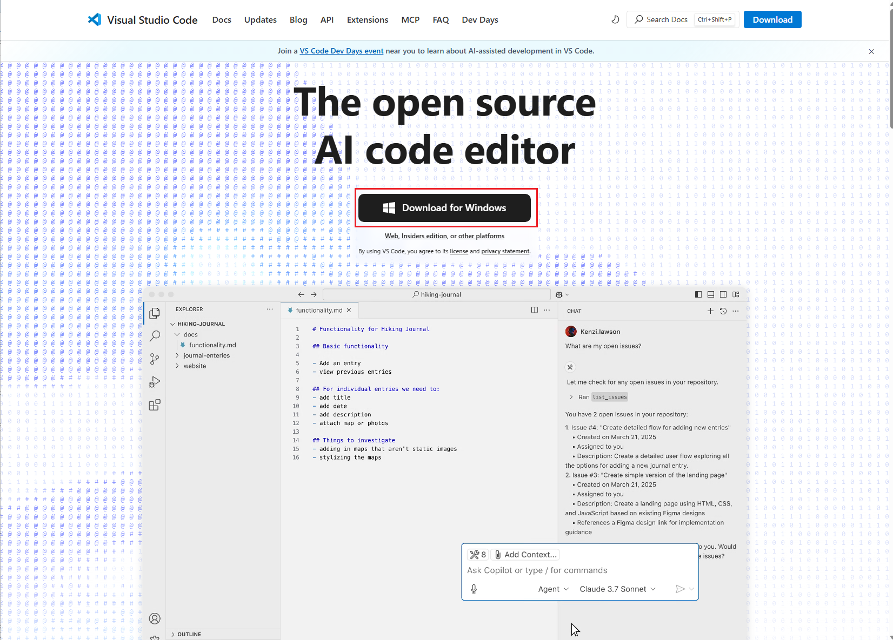

#### AWSコマンドラインインターフェースインストールページ
AWS のサービスを管理するための統合ツールである、AWSコマンドラインインターフェース(AWS CLI)をインストールします。  
https://docs.aws.amazon.com/cli/latest/userguide/getting-started-install.html
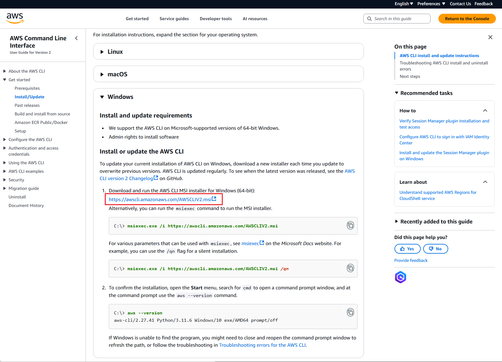

#### Node.jsインストールページ
JavaScript実行環境となるNode.jsをインストールします。  
https://nodejs.org/ja/download
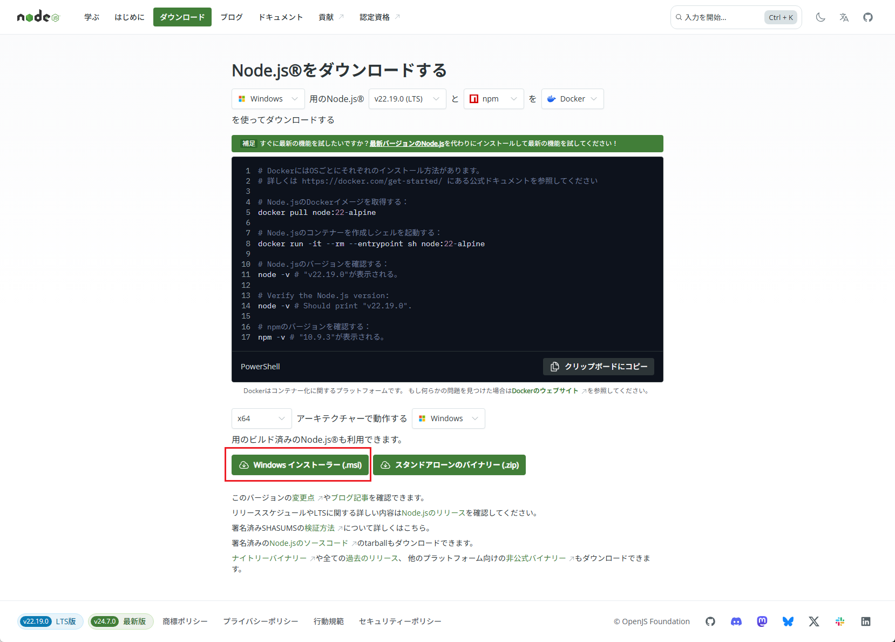

#### Gitインストールページ
ソースコードなどのバージョン管理ツールであるGitをインストールします。  
https://git-scm.com/downloads/win
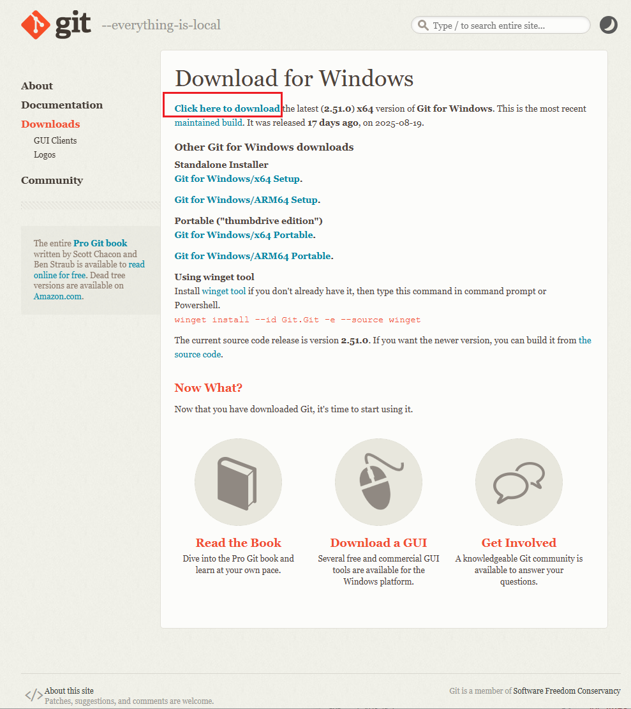

### オプション２：コマンドラインで環境構築
#### Powershellを管理者として実行
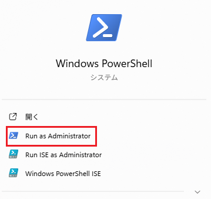

#### Powershellにコマンドを実行
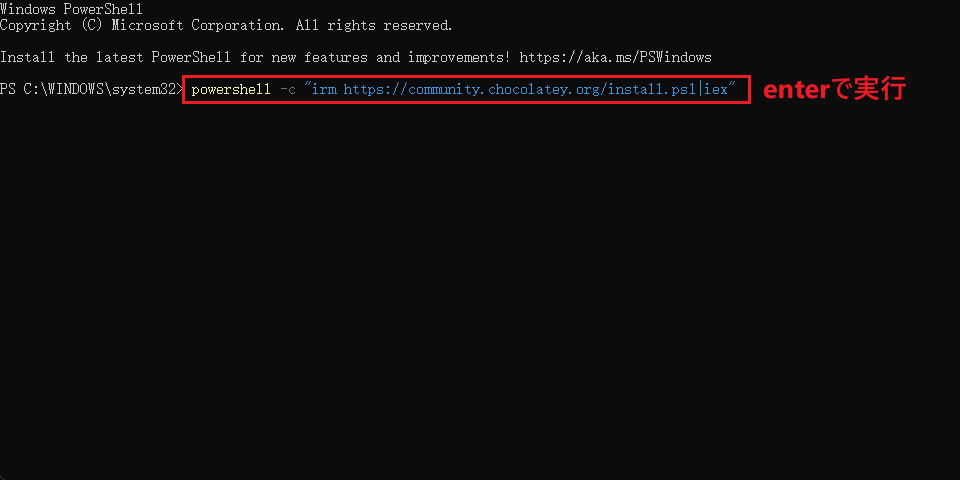
```
# Chocolateyをダウンロードしてインストールする：
powershell -c "irm https://community.chocolatey.org/install.ps1|iex"

# Powershellを再起動、管理者として実行

# Chocolateyのバージョンを確認する,"v2.5.1"が表示される：
choco -v 
```

https://docs.aws.amazon.com/cli/latest/userguide/getting-started-install.html

#### 必要なツールをインストール
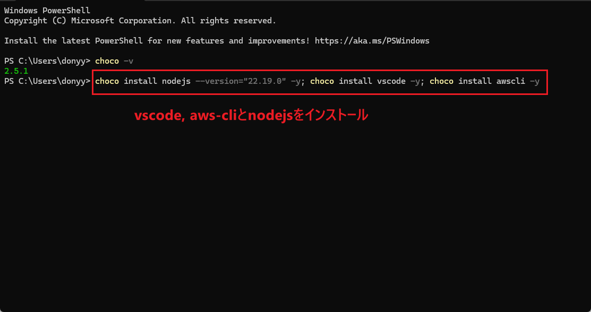
```
# ツールインストール
choco install nodejs --version="22.19.0" -y; choco install vscode -y; choco install awscli -y

# Verify installations
node -v; npm -v; aws --version; code --version
# バージョンを確認
```
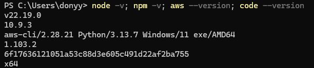

---

## Vue3 + TypeScriptプロジェクト設定

```bash
# Vue3+Typescriptプロジェクトを作成
npm create vite@latest amplify-vue-ts-app
```
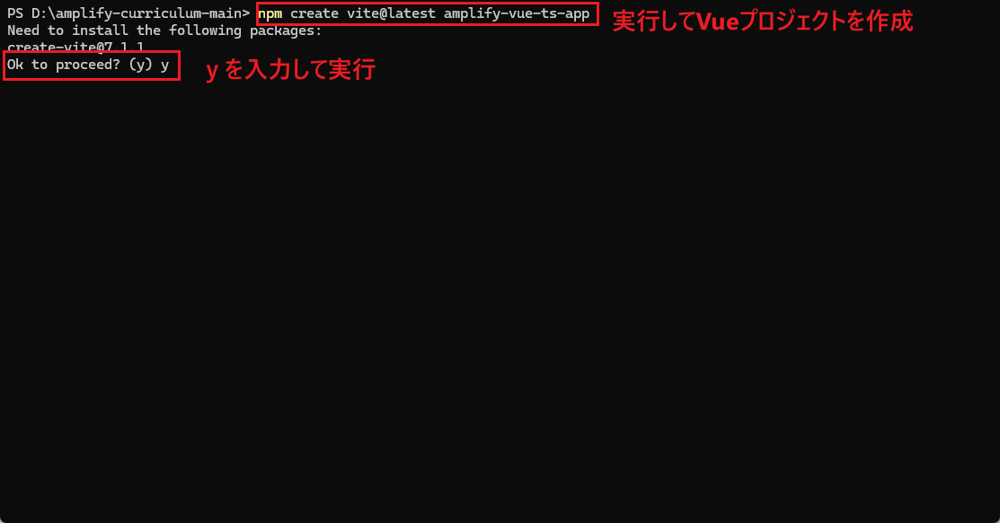
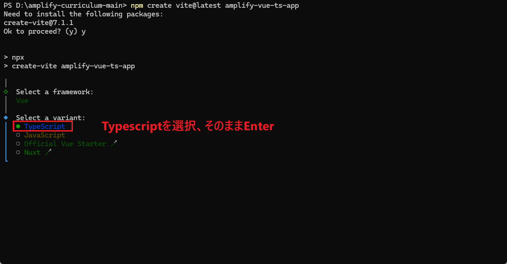

```
# プロジェクトフォルダーに入る
cd amplify-vue-ts-app
# プロジェクトが必要なモジュールをインストール
npm install
```
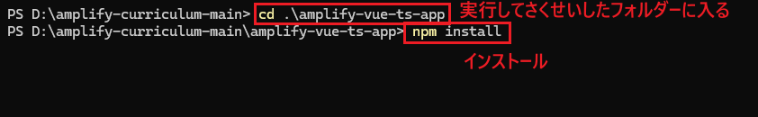

```
# ローカルでプロジェクトを起動
npm run dev

# ページの表示を確認したら、ctrl+cでプロジェクトを終了
```

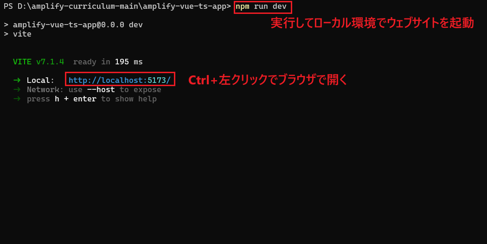
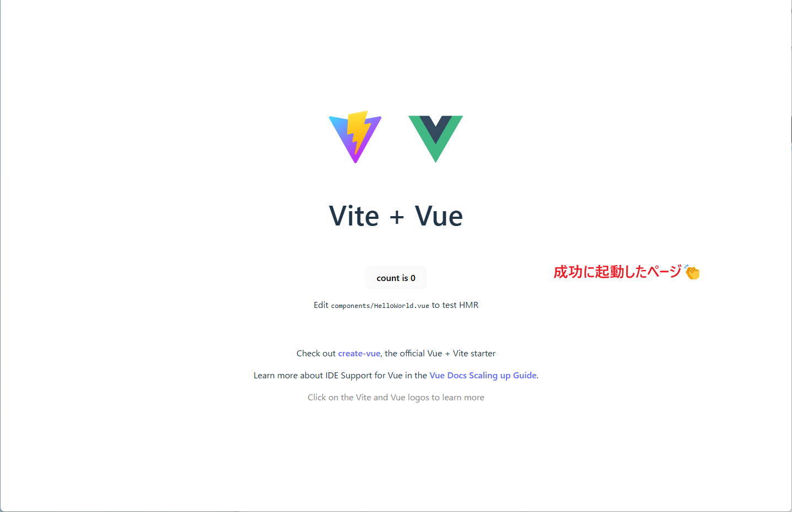

## トラブルシューティング

### Node.js バージョンコンフリクト
```bash
# 現在のノードバージョンを確認
node --version

# nvmで他のバージョンを使用
nvm use 18
nvm alias default 18
```

### ポートコンフリクト

ポート 5173 が既に使われている場合:
```bash
# 他のポートを使って起動
npm run dev --port 5174

# または vite.config.ts を更新して、デフォルトポートを変更
```

### ビルドエラー

```bash
# node_modulesフォルダーを削除して再インストール
rm -rf node_modules package-lock.json
npm install

# キャッシュクリア
npx vite --clearCache
```