# Day 2: Amplify Gen2基礎

## ゴール
!!! success "Day 2 Goals"
    - Amplify Gen2のインストール
    - Amplifyサンドボックスの起動
    - フロントエンドの起動と確認
    - プロジェクト構成の理解

## Amplifyインストール
### vscodeでプロジェクトフォルダーを開く
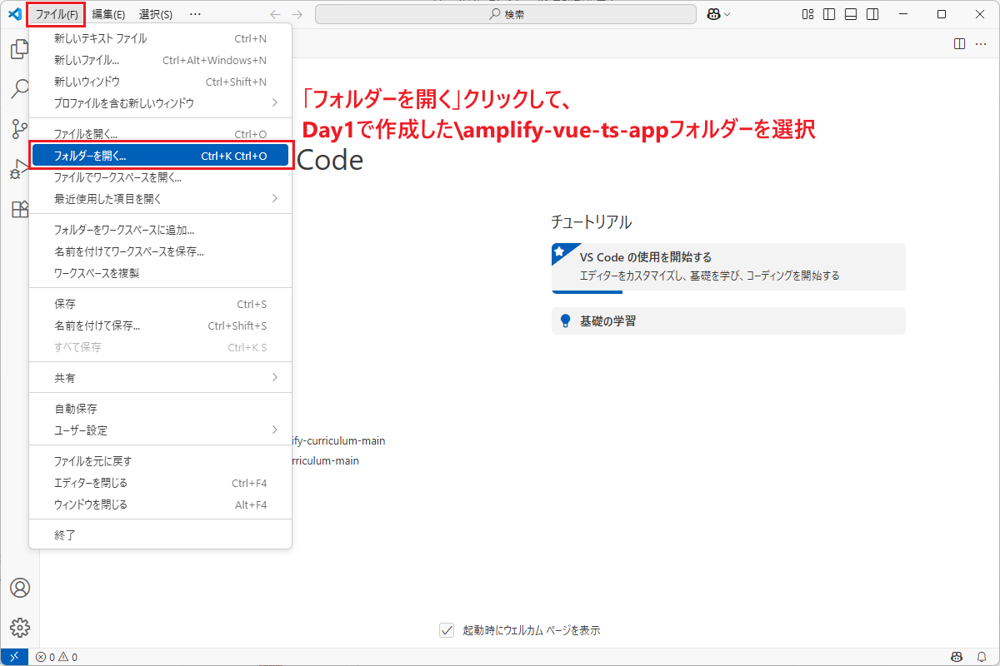
### セキュリティ確認
「作成者を信頼します」を選択します。
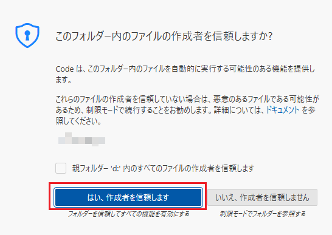
### ターミナルオープン
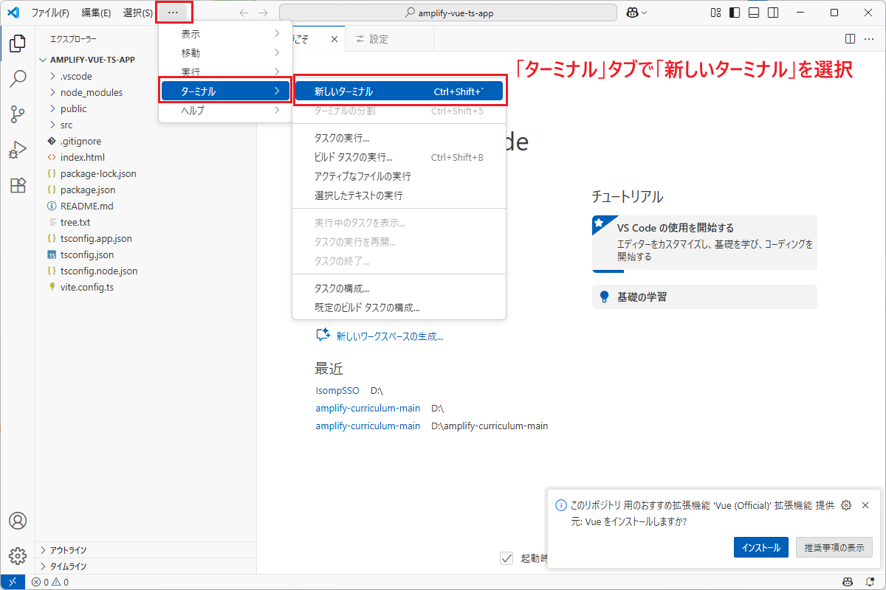

!!! warning "ターミナルの種類"
    本学習ではコマンドプロンプトではなくPowerShellを使用してください。

### Amplify環境構築
ターミナルに以下のコマンドをコピー&ペーストして実行します。  
amplifyのインストール、ui-vueとamplifyの初期化のコマンドです。
```
npm install aws-amplify
npm add @aws-amplify/ui-vue
npm create amplify@latest
```

### 一時的な資格情報の取得
AWSマネージメントコンソールにログインして、CloudShellを起動します。
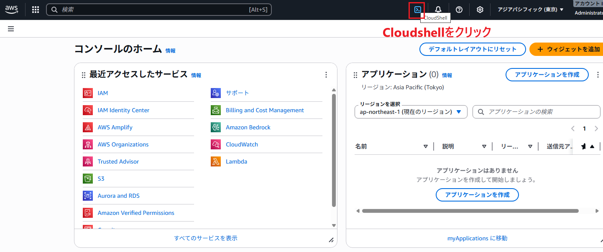

CloudShellに以下のコマンドをコピー&ペーストして実行します。
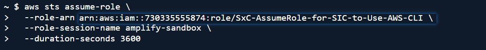
```
aws sts assume-role \
  --role-arn arn:aws:iam::{accountIDを入れる}:role/SxC-AssumeRole-for-SIC-to-Use-AWS-CLI \
  --role-session-name amplify-sandbox \
  --duration-seconds 3600 
```

### 資格情報の保存
表示されたAccessKeyId、SecretAccessKeyとSessionTokenを控えておきます。
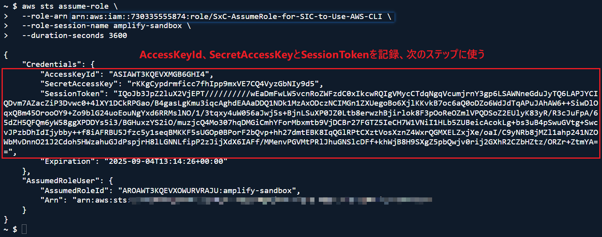

### ローカル環境への資格情報設定
取得した資格情報をローカル環境へ設定します。  
以下のコマンドの設定値を自分のAccessKeyId、SecretAccessKeyとSessionTokenに変更し、vscodeのターミナルで実行してください。  

```
$env:AWS_ACCESS_KEY_ID="先ほど生成したAccessKeyIdに変更"
$env:AWS_SECRET_ACCESS_KEY="先ほど生成したSecretAccessKeyに変更"
$env:AWS_SESSION_TOKEN="先ほど生成したSessionToken変更"
```

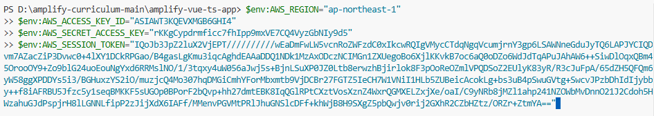

!!! warning "AccessKeyIdなどの設定について"
    AccessKeyId、SecretAccessKey、および、SessionTokenを環境変数に設定しています。  
    これらはターミナル終了時に消去され、また、別のターミナルを起動した場合には引き継がれません。  
    新たなターミナルでサンドボックスを起動する場合は、これらを再度設定してください。  
    なお、SessionTokenには有効期限があり、本手順通り実施した場合は1時間（3600秒）となっています。  
    有効期限を経過した場合は、CloudShellで再度コマンドを実行して取得し直してください。

### サンドボックスの作成
以下のコマンドを実行してサンドボックスを作成します。
```
npx ampx sandbox
```
コマンド実行後、Amplifyコンソール画面でサンドボックスを確認します。
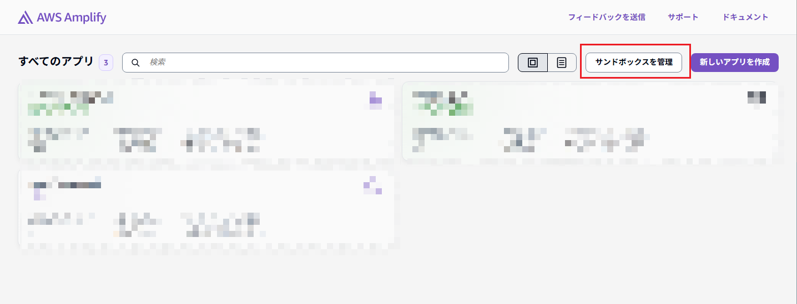

サンドボックスが正常にデプロイ済みであることを確認してください。
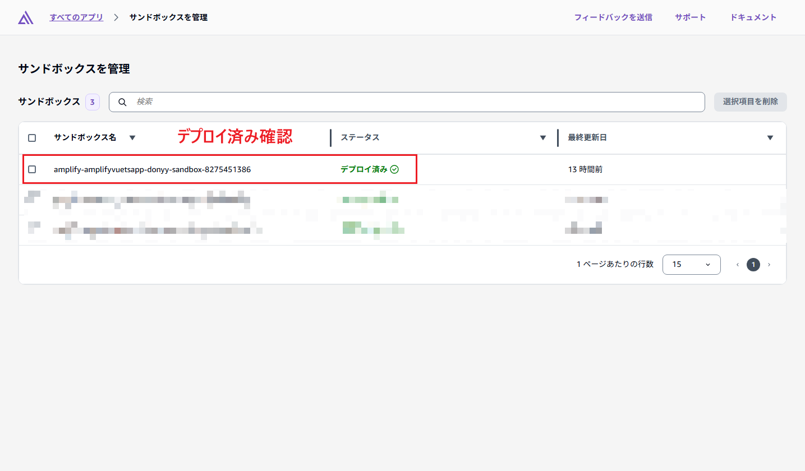

### フロントエンドの起動確認
新しいターミナルを起動して、プロジェクトを起動してください。
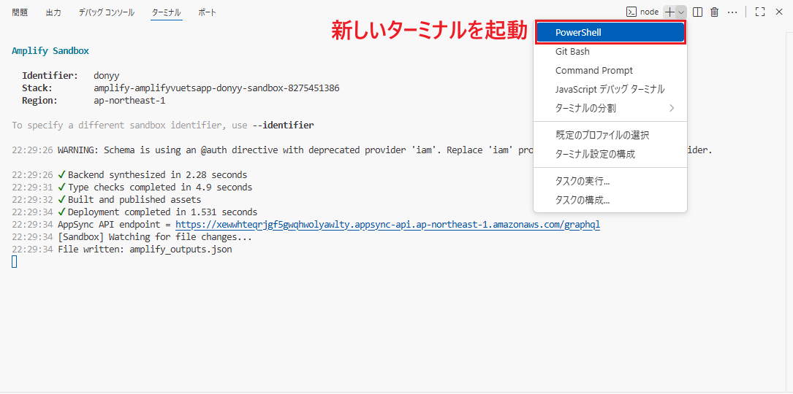
フロントエンドは未編集であるため、デフォルトのページのままとなります。
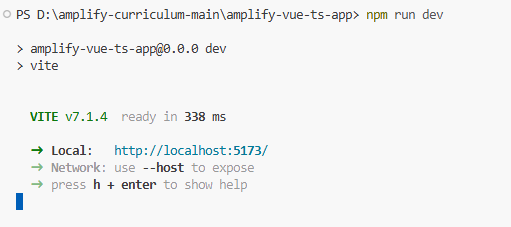


### 確認完了後
確認完了後はそれぞれのターミナルでctrl+cを押下し、起動中のプロセスを終了してください。

---

### 現在のプロジェクト構成

```
amplify-vue-ts-project/
├── amplify/
│   ├── auth/                    # 認証用設定
│   ├── data/                    # データモデルとAPIスキーマ
│   ├── backend.ts               # バックエンド設定ファイル
│   └── package.json             # バックエンド依存
├── src/
│   └── (your Vue.js app)        # Vueフォルダー
└── amplify_outputs.json         # Amplify生成した設定ファイル
```

---

## トラブルシューティング

### Amplify CLI バージョンエラー

```bash
# Amplify Cli更新
npm install -g @aws-amplify/cli@latest

# キャッシュクリア
npm cache clean --force
```

### AWS 権限エラー

権限エラーが発生:

1. ターミナルで`aws sts get-caller-identity` アクセス権を確認
2. リージョンの設定を確認`aws configure list`
3. `SxC-AssumeRole-for-SIC-to-Use-AWS-CLI`ロールの存在を確認

