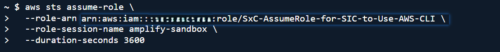
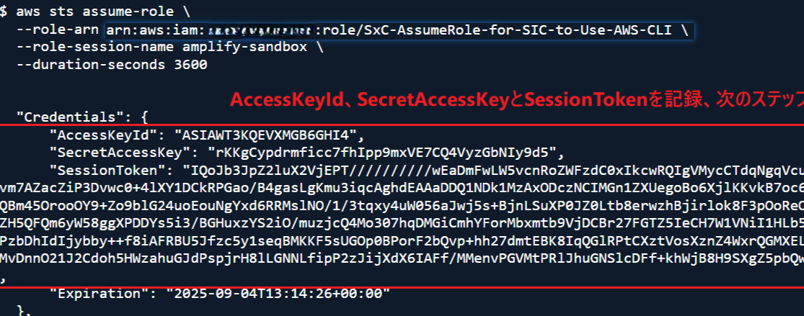

# Day 2: Amplify Gen2基礎

## ゴール
- VueプロジェクトでAmplifyを初期化する
- Amplify CLIとSandboxの起動
- Amplifyバックエンドをデプロイ

## Amplifyインストール
### vscodeでプロジェクトフォルダーを開く

### 作成者を信頼

### ターミナルオープン


### AWSホームページでCloudShellを選択


### 以下のコマンドをコピペして実行

```
aws sts assume-role \
  --role-arn arn:aws:iam::{accountIDを入れる}:role/SxC-AssumeRole-for-SIC-to-Use-AWS-CLI \
  --role-session-name amplify-sandbox \
  --duration-seconds 3600 
```

### AccessKeyId、SecretAccessKeyとSessionTokenを保存


### vscodeターミナルで以下のコマンドを自分のAccessKeyId、SecretAccessKeyとSessionTokenに変更
```
$env:AWS_ACCESS_KEY_ID="先ほど生成したAccessKeyIdに変更"
$env:AWS_SECRET_ACCESS_KEY="先ほど生成したSecretAccessKeyに変更"
$env:AWS_SESSION_TOKEN="先ほど生成したSessionToken変更"
```

### ターミナルにコピペして実行


### サンドボックスを起動
```
npx ampx sandbox
```

### 新しいターミナルを起動して、プロジェクトを起動


### フロントエンド起動
フロントエンドは未編集なのでデフォルトのページのままで正解


### 現在プロジェクト構成

```
amplify-training-project/
├── amplify/
│   ├── auth/                    # 認証用設定
│   ├── data/                    # データモデルとAPIスキーマ
│   ├── functions/               # Lambda 関数
│   ├── storage/                 # ストレージ 設定
│   ├── backend.ts               # バックエンド設定ファイル
│   └── package.json             # バックエンド依存
├── src/
│   └── (your Vue.js app)        # Vueフォルダー
└── amplify_outputs.json         # Amplify生成した設定ファイル
```


### サンドボックスとは
サンドボックスフルスタックのテスティングや開発ローカルで作動する環境

- **Runs locally** ローカル環境でAWSサービスを利用
- **Isolates development** 本番環境と分離
- **Hot reloads** リアルタイムでバックエンドの編集
- **Auto-cleanup** 不要のリソースを自動整理

## トラブルシューティング

### Amplify CLI バージョンエラー

```bash
# Amplify Cli更新
npm install -g @aws-amplify/cli@latest

# キャッシュクリア
npm cache clean --force
```

### AWS 権限エラー

権限エラーが発生:

1. ターミナルで`aws sts get-caller-identity` アクセス権を確認
2. リージョンの設定を確認`aws configure list`
3. `SxC-AssumeRole-for-SIC-to-Use-AWS-CLI`ロールの存在を確認

