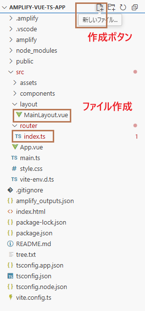
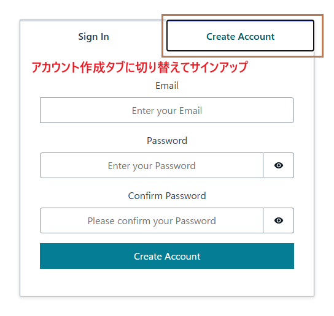
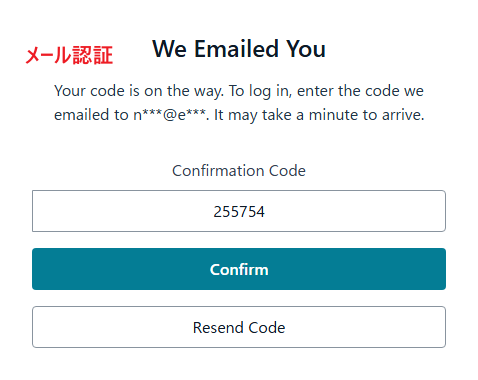
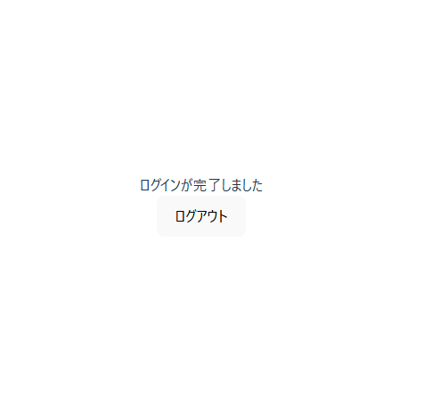

# Day 3: Authentication (Cognito)


## ゴール
- フロントエンドにログイン機能を実装する
- Vue Routerを使用したページ遷移の実装
- デフォルト（ホーム）ページの設定
- Amazon Cognitoユーザープールでのユーザー管理

## ルーターコンポーネントのインストール
プロジェクトフォルダーを開き、
```
npm install vue-router
```
warningメッセージは想定内

```
#このままフロントエンドを起動
npm run dev
```

## プロジェクトフォルダー確認と作成
src/　フォルダーの下でlayout/と
```
amplify-vue-ts-project/
├── amplify/
│   ├── auth/                # 認証用設定
│   ├── data/                # データモデルとAPIスキーマ
│   ├── functions/           # Lambda 関数
│   ├── storage/             # ストレージ 設定
│   ├── backend.ts           # バックエンド設定ファイル
│   └── package.json         # バックエンド依存
├── src/
│   ├── asset/               # 静的ファイル（画像、アイコン、フォント等）
│   ├── components/          # 再利用可能なVueコンポーネント（ボタン、フォーム等）
│   ├── layout/              # →フォルダーを作成。ページレイアウトコンポーネント（ヘッダー、フッター、サイドバー）
│   ├── router/              # →フォルダーを作成。ルーティング設定（ページ遷移、認証ガード）
│   ├── App.vue              # アプリケーションのルートコンポーネント
│   ├── main.ts              # アプリケーションエントリーポイント（Vue初期化）
│   ├── style.css            # グローバルスタイル（共通CSS）
│   └── (...)
└── amplify_outputs.json     # Amplify生成した設定ファイル（APIエンドポイント、認証情報）
```

## ルーター、レイアウトファイル作成


作成後に以下のコードをファイルに貼り付ける
```
# layout/MainLayout.vue
<template>
    <!-- Authenticator: AWS Amplify UI コンポーネント - 自動でログイン画面とメイン画面を切り替え -->
    <authenticator>
        <template v-slot="{signOut}">
            <div>ログインが完了しました</div>
            <!-- signOut: ログアウト処理を実行する関数 -->
            <button @click="signOut">ログアウト</button>
        </template>
    </authenticator>
</template>

<script setup lang="ts">
import { Authenticator } from "@aws-amplify/ui-vue";
import "@aws-amplify/ui-vue/styles.css";
</script>
```

```
# router/index.ts
import { createRouter, createWebHistory, type RouteRecordRaw } from 'vue-router'

const routes: RouteRecordRaw[] = [
    {
        path: '/', // ルートパス：ホームページ
        name: 'Home', // ルート名
        component: () => import("../layout/MainLayout.vue"), 
    }
    // 他のルートをここに追加できます
];

const router = createRouter({
    history: createWebHistory(), // HTML5の履歴モードを使用
    routes, // ルート定義を設定
});

export default router; // ルーターをエクスポート
```


## main.tsファイル更新
```
import { createApp } from 'vue'
import './style.css'
import App from './App.vue'
import router from "./router/index.ts"; 
import { Amplify } from "aws-amplify";
import { parseAmplifyConfig } from "aws-amplify/utils";
import outputs from "../amplify_outputs.json";

// Amplify設定: AWSサービスとの接続情報を設定
const amplifyConfig = parseAmplifyConfig(outputs);
Amplify.configure({
  Auth: amplifyConfig.Auth, // Cognito認証設定のみ適用
});

// Vueアプリケーション作成
const app = createApp(App);

// グローバルプロパティ: アプリ全体でCognitoクライアントIDにアクセス可能
app.config.globalProperties.$clientId = amplifyConfig.Auth?.Cognito.userPoolClientId;

// ルーター設定: ページ遷移機能を追加
app.use(router);

// DOM要素にマウント: アプリケーションを画面に表示
app.mount('#app');
```

## App.vueファイル更新
```
<template>
  <!-- router-view: 現在のURLに対応するコンポーネントを表示するエリア -->
  <!-- "/" → MainLayout.vueが表示される -->
  <router-view />
</template>

<script setup lang="ts">
// 現在は空ですが、アプリ全体で共通の処理がある場合はここに記述
// 例: グローバルな状態管理、エラーハンドリング、テーマ設定など
</script>
```

## フロントエンドが正常にログインページに変更の確認




