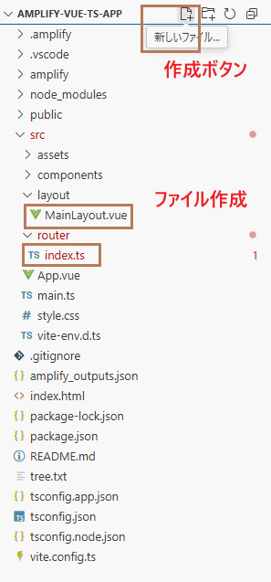
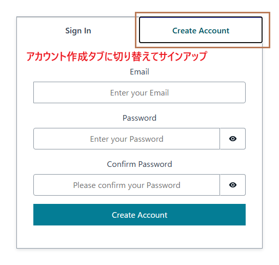
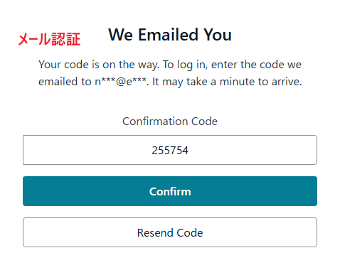
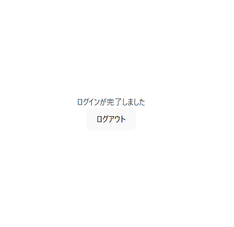

# Day 3: Authentication (Cognito)


## ゴール
!!! success "Day 3 Goals"
    - フロントエンドにログイン機能を実装する
    - Vue Routerを使用したページ遷移の実装
    - デフォルト（ホーム）ページの設定
    - Amazon Cognitoユーザープールでのユーザー管理

## ルーターコンポーネントのインストール
ターミナルでプロジェクトフォルダーを開き、以下のコマンドを実行します。
```
npm install vue-router
```
依存関係に関するwarningメッセージが出力されますが、想定内のものであるため、そのまま先に進めてください。

```
#このままフロントエンドを起動
npm run dev
```

## プロジェクトフォルダー確認と作成
src/フォルダーの下にlayout/とrouter/を作成します。
```
amplify-vue-ts-project/
├── amplify/
│   ├── auth/                # 認証用設定
│   ├── data/                # データモデルとAPIスキーマ
│   ├── backend.ts           # バックエンド設定ファイル
│   └── package.json         # バックエンド依存
├── src/
│   ├── asset/               # 静的ファイル（画像、アイコン、フォント等）
│   ├── components/          # 再利用可能なVueコンポーネント（ボタン、フォーム等）
│   ├── layout/              # →フォルダーを作成。ページレイアウトコンポーネント
│   ├── router/              # →フォルダーを作成。ルーティング設定（ページ遷移、認証ガード）
│   ├── App.vue              # アプリケーションのルートコンポーネント
│   ├── main.ts              # アプリケーションエントリーポイント（Vue初期化）
│   ├── style.css            # グローバルスタイル（共通CSS）
│   └── (...)
└── amplify_outputs.json     # Amplify生成した設定ファイル（APIエンドポイント、認証情報）
```
## tsconfig.json更新
プロジェクトルート（amplify-vue-ts-appディレクトリ直下）にあるtsconfig.jsonを以下のように更新します。

```
{
  "files": [],
  "references": [
    { "path": "./tsconfig.app.json" },
    { "path": "./tsconfig.node.json" }
  ],
    "compilerOptions": {
    "allowJs": true,
    "baseUrl": ".",
    "paths": {
      "@/*": ["src/*"],
      "@components/*": ["src/components/*"],
      "@stores/*": ["src/stores/*"]
    }
  }
}
```

## vite.config.ts更新
プロジェクトルートのvite.config.tsを以下のコードに更新します。
```
// vite.config.ts
import { defineConfig } from 'vite'
import vue from '@vitejs/plugin-vue'

export default defineConfig({
  plugins: [
    vue({
      template: {
        compilerOptions: {
          isCustomElement: (tag) => tag.startsWith('ui5-')
        }
      }
    })
  ],
  resolve: {
    alias: {
      '@': '/src'
    }
  }
})
```

## ルーター、レイアウトファイル作成


ファイル作成後、各ファイルに以下のコードを貼り付けてください。
```
<!-- layout/MainLayout.vue -->
<template>
    <!-- Authenticator: AWS Amplify UI コンポーネント - 自動でログイン画面とメイン画面を切り替え -->
    <authenticator>
        <template v-slot="{signOut}">
            <div>ログインが完了しました</div>
            <!-- signOut: ログアウト処理を実行する関数 -->
            <button @click="signOut">ログアウト</button>
        </template>
    </authenticator>
</template>

<script setup>
import { Authenticator } from "@aws-amplify/ui-vue";
import "@aws-amplify/ui-vue/styles.css";
</script>
```

```
// router/index.ts
import { createRouter, createWebHashHistory, type RouteRecordRaw } from 'vue-router'

const routes: RouteRecordRaw[] = [
    {
        path: '/', // ルートパス：ホームページ
        name: 'Home', // ルート名
        component: () => import("@/layout/MainLayout.vue"), 
    }
    // 他のルートをここに追加できます
];

const router = createRouter({
    history: createWebHashHistory(), // ハッシュモードの履歴管理
    routes, // ルート定義を設定
});

export default router; // ルーターをエクスポート
```


## main.tsファイル更新
```
import { createApp } from 'vue'
// TODO: style.cssをインポート

import App from './App.vue'
import router from "./router/index.ts"; 
import { Amplify } from "aws-amplify";
import { parseAmplifyConfig } from "aws-amplify/utils";
import outputs from "@/amplify_outputs.json";

// Amplify設定: AWSサービスとの接続情報を設定
const amplifyConfig = parseAmplifyConfig(outputs);
Amplify.configure({
  Auth: amplifyConfig.Auth, // Cognito認証設定のみ適用
});

// Vueアプリケーション作成
const app = createApp(App);

// グローバルプロパティ: アプリ全体でCognitoクライアントIDにアクセス可能
app.config.globalProperties.$clientId = amplifyConfig.Auth?.Cognito.userPoolClientId;

// ルーター設定: ページ遷移機能を追加
app.use(router);

// DOM要素にマウント: アプリケーションを画面に表示
app.mount('#app');
```

### ハンズオン 1: Style.cssインポート
style.cssをインポートしましょう。
#### ヒント
- `import`を使用
- `./style.css`を指定

<details>
<summary>解答例</summary>
```
import { createApp } from 'vue'
import './style.css' // 追加
import App from './App.vue'
```
</details>
&nbsp;


## App.vueファイル更新
```
<template>
  <!-- router-view: 現在のURLに対応するコンポーネントを表示するエリア -->
  <!-- "/" → MainLayout.vueが表示される -->
  <router-view />
</template>

<script setup lang="ts">
// 現在は空ですが、アプリ全体で共通の処理がある場合はここに記述
// 例: グローバルな状態管理、エラーハンドリング、テーマ設定など
</script>
```

## フロントエンドの変更とサインアップの確認
以下のように、フロントエンドがログインページに変更されていること、およびサインアップが可能なことを確認します。  





