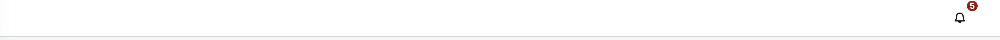
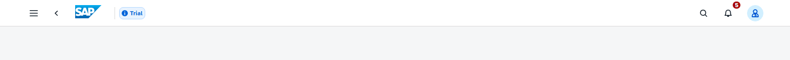
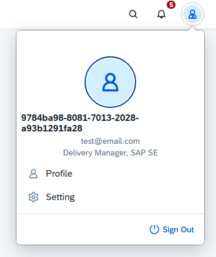
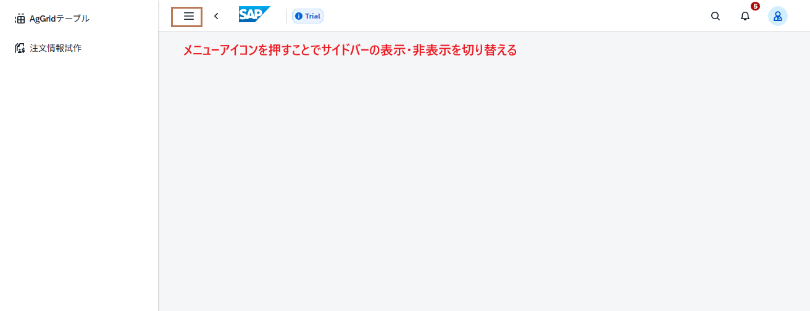

# Day 4: UI5 Web Components I
---

## ゴール

!!! success "Day 4 Goals"
    - UI5 Web Componentsのインストールと設定
    - ナビゲーションバーの実装
    - サイドバーの実装
    - ユーザーメニューの実装


## UI5 Web Componentsのインストール
プロジェクトフォルダーを開き、以下のコマンドをVScodeターミナルにコピー&ペーストして実行します。
```
npm install pinia@latest
npm install -D sass-embedded
npm install @ui5/webcomponents@latest
npm install @ui5/webcomponents-fiori@latest
npm install @ui5/webcomponents-icons@latest
npm install @ui5/webcomponents-theming@latest
```

## プロジェクトの起動確認
```
npm run dev
```

## プロジェクトフォルダー確認と作成
src/フォルダーの下で以下のフォルダーとファイルを作成
```
amplify-vue-ts-project/
├── amplify/
│   ├── auth/                
│   ├── data/                
│   ├── backend.ts           
│   └── package.json         
├── src/
│   ├── asset/               
│   ├── components/
│   ├── layout/
│   ├── router/
│   ├── pages/                  # -> フォルダーを作成。アプリの各ページコンポーネント
│       └── Orders2Page.vue     # -> ファイルを作成。注文管理ページ
│   ├── stores/                 # -> フォルダーを作成。Piniaストア（状態管理）
│       ├── form-store.ts       # -> ファイルを作成。フォームデータ管理用のPiniaストア
│       └── global-store.ts     # -> ファイルを作成。グローバル状態管理用のPiniaストア
│   ├── composables/            # -> フォルダーを作成。再利用可能なロジック
│       └── useToast.ts         # -> ファイルを作成。トースト通知用のComposable
│   ├── lib/                    # -> フォルダーを作成。ユーティリティ関数、APIクライアント
│       └── UI5FormComp.ts      # -> ファイルを作成。UI5フォーム関連のユーティリティ
│   ├── App.vue              
│   ├── main.ts              
│   ├── style.scss              # style.css → style.scssに変更、中身を空にする。グローバルスタイル（共通CSS）
│   └── (...)
└── amplify_outputs.json
```


## Step 1: UI5FormComp.js更新
src/lib/UI5FormComp.jsを以下のコードに更新
```
// src/lib/UI5FormComp.js
import "@ui5/webcomponents/dist/Avatar.js";
import "@ui5/webcomponents/dist/Input.js";
import "@ui5/webcomponents/dist/Button.js";
import "@ui5/webcomponents/dist/Text.js";
import "@ui5/webcomponents/dist/Tag.js";
import "@ui5/webcomponents/dist/Switch.js";
import "@ui5/webcomponents/dist/Label.js";
import "@ui5/webcomponents/dist/ToggleButton.js";
import "@ui5/webcomponents/dist/Menu.js";
import "@ui5/webcomponents/dist/MenuItem.js";


import "@ui5/webcomponents-fiori/dist/ShellBar.js";
import "@ui5/webcomponents-fiori/dist/ShellBarItem.js";
import "@ui5/webcomponents-fiori/dist/ShellBarSpacer.js";
import "@ui5/webcomponents-fiori/dist/ShellBarSearch.js";
import "@ui5/webcomponents-fiori/dist/ShellBarBranding.js";
import "@ui5/webcomponents-fiori/dist/UserMenu.js";
import "@ui5/webcomponents-fiori/dist/UserMenuAccount.js";
import "@ui5/webcomponents-fiori/dist/UserMenuItem.js";
import "@ui5/webcomponents-fiori/dist/SideNavigation.js";
import "@ui5/webcomponents-fiori/dist/NavigationLayout.js";

import "@ui5/webcomponents-icons/dist/menu2.js";
import "@ui5/webcomponents-icons/dist/nav-back.js";
import "@ui5/webcomponents-icons/dist/sys-help.js";
import "@ui5/webcomponents-icons/dist/customer.js";
import "@ui5/webcomponents-icons/dist/da.js";
```

## Step 2: router/index.ts更新
ルーター設定ファイルを以下のコードに更新

注文ページとSAPアップロードページのルートを追加
```
# src/router/index.ts
// Vue Router: ページ遷移を管理するライブラリのインポート
import { createRouter, createWebHashHistory, type RouteRecordRaw } from "vue-router";

// TypeScript: ルート設定の型定義
const routes: RouteRecordRaw[] = [
  {
    path: "/",                                           // ルートパス: ホームページのURL
    name: "home",                                        // ルート名: プログラムでナビゲーション時に使用
    component: () => import("@/layout/MainLayout.vue"), // 遅延読み込み: 必要時にコンポーネントを読み込み
  },
  {
    path: "/ui5-order",                                    // 注文ページのパス
    component: () => import("@/layout/MainLayout.vue"), // 親レイアウト: 共通のヘッダー・フッターを表示
    children: [                                          // 子ルート: 親レイアウト内に表示されるページ
      {
        path: "",                                        // 空パス: /ui5-order にアクセス時に表示される子コンポーネント
        name: "ui5-order",                                 // ルート名: プログラムでナビゲーション時に使用
        component: () => import("@/pages/Orders2Page.vue"), // 実際の注文ページコンポーネント
      },
    ],
  }
  // TODO: AgGridテーブルページのルートを追加
];

// ルーター作成: 上記のルート設定でルーターインスタンスを作成
const router = createRouter({
  history: createWebHashHistory(), // ハッシュモード: URL に # が付く (例: domain.com/#/orders2)
  routes, // ルート設定を適用
});

export default router; // 他のファイルで使用できるようにエクスポート
``` 

## Step 3: MainLayout.vueにヘッダー追加
Mainlayout.vueファイルを以下のコードに更新
```
# src/layout/MainLayout.vue
<template>
  <authenticator>
    <template v-slot="{ user, signOut }">
        <!-- UI5のシェルバーを追加 -->

        <!-- UI5のナビゲーションレイアウトを追加 -->
        <ui5-navigation-layout ref="layoutRef">
            <!-- シェルバーの設定: 通知数、通知表示、プロフィールクリックイベント -->
            <ui5-shellbar notifications-count="5" show-notifications @ui5-profile-click="">

                // TODO: ユーザーメニューコンポーネントをここに追加

            </ui5-shellbar>

          <!-- mainコンテンツエリア -->
          <main style="padding: 20px;">
            <router-view />
          </main>
        </ui5-navigation-layout>
    </template>
    </authenticator>
</template>

<script setup lang="ts">
import "@/lib/UI5FormComp.js";
import { Authenticator } from "@aws-amplify/ui-vue";
import { I18n } from "aws-amplify/utils";
import {translations} from "@aws-amplify/ui";
import '@aws-amplify/ui-vue/styles.css';

// 多言語対応設定
I18n.putVocabularies(translations);
// 日本語に設定
I18n.setLanguage("ja");
// デフォルトアバター画像URL
const defaultAvatar = "https://ui5.sap.com/resources/sap/m/themes/base/img/Person.png";
</script>
```
### ログイン後に以下のようなナビゲーションバーが表示される
通知アイコンが表示されるが、クリックしてもまだ何も起こらない


## ハンズオン 1: ナビゲーションバーの完成

以下の3つのコンポーネントを追加して、ナビゲーションバーを完成させましょう

- ユーザーメニューアイコン
- サイドバーメニューコンポーネント
- サーチバーコンポーネント
- SAPロゴコンポーネント
- トライアルタグ

### 完成図：


### ヒント
- それぞれのコンポーネントは`<ui5-shellbar>`の中に追加
- 公式ドキュメントを参考に実装
    - [ShellBar](https://ui5.github.io/webcomponents/components/fiori/ShellBar/)
    - [ShellBarSearch](https://ui5.github.io/webcomponents/components/fiori/ShellBarSearch/)
    - [ShellBarBranding](https://ui5.github.io/webcomponents/components/fiori/ShellBarBranding/)

<details>
<summary>解答例</summary>
```
<!-- シェルバーの設定: 通知数、通知表示、プロフィールクリックイベント -->
<ui5-shellbar notifications-count="5" show-notifications @ui5-profile-click="onProfileClick">
    
    <!-- メニューボタン -->
    <ui5-button icon="menu2" slot="startButton" @click="toggleSidebar"></ui5-button>
    
    <!-- 戻るボタン -->
    <ui5-button icon="nav-back" slot="startButton" ></ui5-button>
    
    <!-- ブランドロゴとタイトル -->
    <ui5-shellbar-branding slot="branding">
        
    </ui5-shellbar-branding>
    
    <!-- トライアルタグ -->
    <ui5-tag color-scheme="7" slot="content" design="Information">Trial</ui5-tag>
    
    <!-- 検索フィールド -->
    <ui5-input placeholder="Instructions" slot="searchField"></ui5-input>
    
    <!-- ユーザーアバター -->
    <ui5-avatar slot="profile">
        
    </ui5-avatar>
</ui5-shellbar>
```
</details>
&nbsp;

---

## Step 4: user-menuコンポーネントを追加
`<ui5-navigation-layout>`の中に`<ui5-user-menu>`コンポーネントを追加して、ユーザーアカウントメニューを実装

```
# src/layout/MainLayout.vue
<!-- ユーザーメニュー、サインアウトイベント -->
<ui5-user-menu ref="userMenuRef" @sign-out-click="signOut">
    <!-- ユーザーアカウント情報 -->
    <ui5-user-menu-account
        slot="accounts"
        :avatar-src="defaultAvatar"
        :title-text="user.username"
        subtitle-text="test@email.com"
        description="Delivery Manager, SAP SE"
        selected
    ></ui5-user-menu-account>
    <!-- ユーザーメニューアイテム -->
    <ui5-user-menu-item icon="person-placeholder" text="Profile" data-id="setting" @click="profile"></ui5-user-menu-item>
    <ui5-user-menu-item icon="action-settings" text="Setting" data-id="setting"></ui5-user-menu-item>
</ui5-user-menu>
```

`<script setup>`の中に以下のコードを追加
```
import { ref } from "vue";
import { useRouter } from "vue-router";


const layoutRef = ref(null);
const userMenuRef = ref(null);
const currentTheme = ref("sap_horizon");
const router = useRouter();

// プロフィールクリックイベントハンドラ
const onProfileClick = (event) => {
    const target = event.detail.targetRef;
    // if文でuserMenuRefが存在するか確認し、存在する場合はopenerを設定してメニューを開く
    if (userMenuRef.value) {
        userMenuRef.value.opener = target;
        userMenuRef.value.open = true;
    }
};

// プロフィールページへ遷移する関数
const profile = () => {
  router.push({ name: "Profile" });
};
```
### ユーザーアイコンをクリックすると以下のようなメニューが表示される



## Step 5: sidebarコンポーネントの追加
`<ui5-navigation-layout>`の中に`<ui5-side-navigation>`コンポーネントを追加して、サイドナビゲーションを実装
```
<!-- src/layout/MainLayout.vue -->
<!-- sidebar -->
<ui5-side-navigation slot="sideContent" @selection-change="changeMenu">
  <ui5-side-navigation-item v-for="item in navItems" :key="item.path" :text="item.label" :icon="item.icon" :data-route="item.path" />
</ui5-side-navigation>
```
`<script setup>`の中に以下のコードを追加
```
import { setTheme } from "@ui5/webcomponents-base/dist/config/Theme.js";
import NavigationLayoutMode from "@ui5/webcomponents-fiori/dist/types/NavigationLayoutMode.js";


// ナビゲーションアイテム
const navItems = [
  { path: "/aggrid", label: "AgGridテーブル", icon: "table-chart" },
  { path: "/ui5-order", label: "注文情報試作", icon: "my-sales-order" },
];
// サイドバーの表示・非表示を切り替える関数
const toggleSidebar = () => {
  if (layoutRef.value) {
    layoutRef.value.mode = layoutRef.value.isSideCollapsed() ? NavigationLayoutMode.Expanded : NavigationLayoutMode.Collapsed;
  }
};
// メニュー選択変更イベントハンドラ
const changeMenu = (event) => {
  const selectedItem = event.detail.item;
  const route = selectedItem.getAttribute("data-route");
  if (route) {
    router.push(route);
  }
};

```

### メニューボタンをクリックすると以下のようにサイドバーが表示される



## トラブルシューティング

### 画面が真っ白になる場合
Viteのキャッシュが原因の可能性があります。以下のコマンドを実行してキャッシュをクリアし、再度プロジェクトを起動してください。
```
rm -rf node_modules/.vite
npm run dev
```

### UI5コンポーネントが表示されない場合
`vite.config.ts`の設定が正しいか確認してください。特に`isCustomElement`の部分がUI5コンポーネントを認識するように設定されているか確認してください。

### UI5スタイルが適用されない場合
`@ui5/webcomponents-theming`が正しくインストールされているか確認し、`UI5FormComp.js`で必要なコンポーネントがインポートされているか確認してください。

