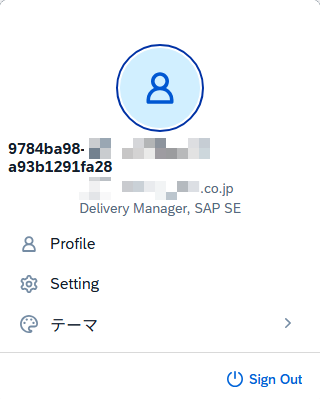
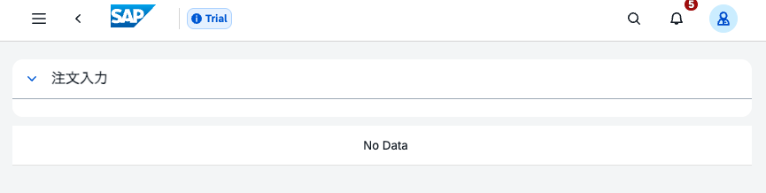
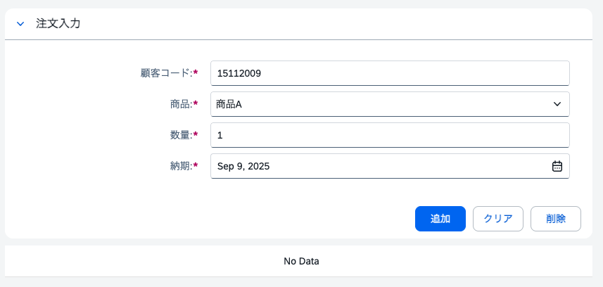
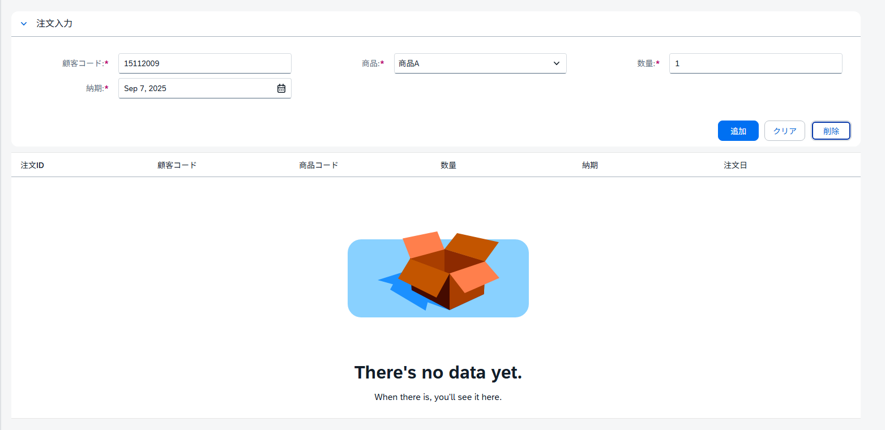
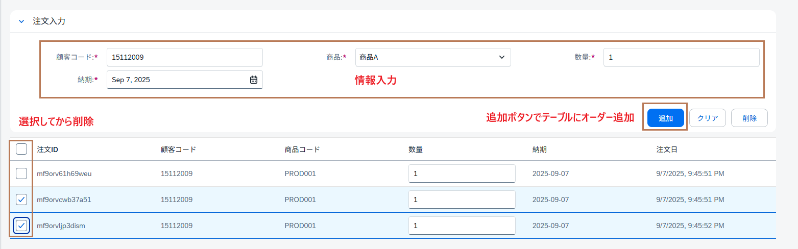

# Day 5: UI5 Web Components II
---

## ゴール

!!! success "Day 5 Goals"
    - UI5 Web Componentsを使用して、より複雑なUIを構築する
    - state management（Pinia）を使用して、ユーザー情報とアプリの状態を管理する
    - 入力データの一覧表示
    - データの永続化（localStorage、ブラウザを閉じてもデータが残る）
    - 入力検証によるエラー防止

```
[Cognito認証] → [Global Store (ユーザー情報)]
                         ↓
[注文フォーム] → [Form Store (注文データ)] → [localStorage]
                         ↓
                   [UI5テーブル表示]
```

## 前提知識キャッチアップ
### Piniaストアとは
アプリケーション全体でデータを共有する仕組みです。
- グローバルストア: ユーザー情報やアプリの状態を管理
- フォームストア: 注文入力フォームの状態とロジックを管理
公式ドキュメント: https://pinia.vuejs.org/introduction.html

### localStorageとは
ブラウザにデータを保存する仕組みです。ページをリロードしてもデータが保持されます。


## プロジェクト起動
```
npm run dev
```

## Step1: Global-storeファイル更新
### ユーザー情報管理の実装
`src/stores/global-store.ts`を以下のコードで置き換える

```
<!-- src/stores/global-store.ts -->
import { defineStore } from "pinia";

export const useGlobalStore = defineStore("global", {
  state: () => ({
    // ユーザー情報 (Cognitoから)
    username: "",
    email: "",
    avatar: "",
    idToken: "",
    
    // アプリの状態
    isLoading: false,
  }),

  getters: {
    isLoggedIn: (state) => !!state.username,
  },
  actions: {
    setUser(user: any, clientId:any) {
      this.username = user.userId || "";
      this.email = user.signInDetails.loginId || "";
      this.avatar = "https://ui5.sap.com/resources/sap/m/themes/base/img/Person.png";

      // IDトークンを取得
      this.idToken = localStorage.getItem(`CognitoIdentityServiceProvider.${clientId}.${this.username}.idToken`) || "";
    },
    
    showLoading() {
      this.isLoading = true;
    },
    
    hideLoading() {
      this.isLoading = false;
    }
  }
});
```
### 重要ポイント
- `setUser`アクションでCognitoから取得したユーザー情報を保存
- `idToken`も保存（後でAPIリクエストに使用）

## Step 2: MainLayout.vue更新
### テンプレートの修正
`src/layouts/MainLayout.vue`の`<authenticator>`タグ内を修正

**修正箇所**
```
<authenticator>
  <template v-slot="{ user, signOut }">
    <!-- この下に追加 -->
```
**以下のコードを追加**
```
{{ setUserData(user) }}
```

### ユーザーメニューの更新
`<ui5-user-menu-account>`タグを以下のコードで置き換え

```
<ui5-user-menu-account
    slot="accounts"
    :avatar-src="globalStore.avatar || defaultAvatar"
    :title-text="globalStore.username || 'User Name'"
    :subtitle-text="globalStore.email || 'Email Address'"
    description="Delivery Manager, SAP SE"
    selected
></ui5-user-menu-account>
```

---

### スクリプト部分の修正


`<script setup>`の下に以下のコードを追加/変更
```
import { ref } from "vue";　ーー＞　 import { ref, getCurrentInstance } from "vue"; 
import { useGlobalStore } from "@/stores/global-store"; 

// グローバルストアのインスタンスを取得
const globalStore = useGlobalStore();

// instanceを取得して、clientIdを取得
// instanceはVueの内部APIで、現在のコンポーネントインスタンスにアクセスするために使用されます。
const instance = getCurrentInstance();
const clientId = instance?.appContext.config.globalProperties.$clientId;
const setUserData = async (user) => {
  if (user) {
    await globalStore.setUser(user, clientId);
  }
};
```


### 動作確認
ユーザープロフィールが正しく表示されることを確認


## Step 3: フォームストアの作成
### `src/stores/form-store.ts`を作成し、以下のコードを追加
```
// stores/form-store.ts
import { defineStore } from "pinia";


// 商品ごとの単価を定義
const productPrices = {
	PROD001: 1000,
	PROD002: 2000,
	PROD003: 3000,
};

// 商品コードに基づいて単価を設定
function updateUnitPrice(productCode) {
	return productPrices[productCode] || 0;
}

export const useFormStore = defineStore("form", {
	state: () => ({
		// フォームデータ初期化
		customerCode: "15112009",
		productCode: "PROD001",
		quantity: "1",
		unitPrice: updateUnitPrice("PROD001").toString(),
		deliveryDate: new Date().toISOString().split('T')[0],

		// 注文リストをlocalStorageから取得
		orders: JSON.parse(localStorage.getItem('orders') || '[]'),

		// ページネーション
		page: 1,
	}),
  
  // アクション定義
	actions: {
		// フォームリセット
		reset() {
			// TODO: フォームの初期値にリセット
			this.deliveryDate = new Date().toISOString().split('T')[0];
		},
    
    // フォームバリデーション
    validateForm() {
		const errors = [];
		
		if (!this.customerCode.trim()) {
			errors.push("顧客コードは必須です");
		}
		
		// TODO: 商品コードのバリデーションを追加
		
		if (!this.quantity || parseInt(this.quantity) <= 0) {
			errors.push("数量は1以上の数値を入力してください");
		}

		// TODO: 納期のバリデーションを追加
		
		return errors;
    },
    
	// 注文数量更新
	updateOrderQuantity(orderId, newQuantity) {
		const order = this.orders.find(o => o.id === orderId);
		if (order) {
			order.quantity = newQuantity;
			localStorage.setItem('orders', JSON.stringify(this.orders));
		}
	},
	// 注文情報更新
	updateOrder(orderId, updatedData) {
		const orderIndex = this.orders.findIndex(o => o.id === orderId);
		if (orderIndex !== -1) {
			this.orders[orderIndex] = { ...this.orders[orderIndex], ...updatedData };
			localStorage.setItem('orders', JSON.stringify(this.orders));
		}
	},

    // 注文追加
    addOrder() {
		const validationErrors = this.validateForm();
		
		if (validationErrors.length > 0) {
			// エラーメッセージ表示
			const errorMessage = validationErrors.join('\n');
			return errorMessage;
		}
		
		// 新しい注文オブジェクトを作成
		// 数量と単価を数値に変換
		const quantityNum = parseInt(this.quantity);
		const unitPriceNum = updateUnitPrice(this.productCode);
		
		
		// 新規注文オブジェクトの作成
		const newOrder = {
			id: Date.now().toString(36) + Math.random().toString(36).substring(2, 8),
			customerCode: this.customerCode,
			productCode: null, // TODO: ここを設定してください
			quantity: null, // TODO: ここを設定してください
			unitPrice: updateUnitPrice(this.productCode),
			estimatedCost: null, // TODO: ここを計算してください
			deliveryDate: this.deliveryDate,
			status: "新規",
			createdAt: new Date().toLocaleString(),
		};
		// 注文リストに追加
		this.orders.push(newOrder);

		// localStorageに保存
		localStorage.setItem('orders', JSON.stringify(this.orders));
		
		// フォームをリセット
		this.reset();
		return true;
    },
    
	// 全注文クリア
    clearAllOrders() {
		this.orders = [];
		localStorage.removeItem('orders');
    },

	// 選択した注文を削除
    deleteOrder(selectionElement, messageElement) {
        if (!selectionElement) {
			if (messageElement) {
				messageElement.open = true;
				messageElement.innerText = "選択機能が見つかりません。";
			}
			return;
		}
		const selectedRows = selectionElement.selected.split(' ');

		if (selectedRows.length === 0 || (selectedRows.length === 1 && selectedRows[0] === '')) {
			if (messageElement) {
				messageElement.open = true;
				messageElement.innerText = "削除する注文を選択してください。";
			}
			return;
		}

		// 選択された注文を削除
		this.orders = this.orders.filter(order => !selectedRows.includes(order.id));

		// TODO: localStorageに保存
		
		// TODO: 選択状態をクリア

		if (messageElement) {
			messageElement.open = true;
			messageElement.innerText = `${selectedRows.length}件の注文を削除しました。`;
		}
    }
  }
});
```


## Step 4: 注文管理ページの実装
Orders2Page.vueを以下の構造で実装
```
<template>
  <div class="mx-5 my-5">
    <!-- 1. 注文入力フォーム -->
    <div id="container" style="max-width: 1500px; margin-bottom: 10px">
      <ui5-panel header-text="注文入力">
        <!-- フォーム内容 -->
      </ui5-panel>
    </div>
    
    <!-- 2. エラーメッセージ用トースト -->
    <ui5-toast id="message" ref="messageRef"></ui5-toast>
    
    <!-- 3. 注文一覧テーブル -->
    <ui5-table>
      <!-- テーブル内容 -->
    </ui5-table>
  </div>
</template>

<script setup >
	import { useFormStore } from "../stores/form-store";
import "@ui5/webcomponents/dist/Panel.js";
import "@ui5/webcomponents/dist/Form.js";
import "@ui5/webcomponents/dist/FormGroup.js";
import "@ui5/webcomponents/dist/FormItem.js";
import "@ui5/webcomponents/dist/Bar.js";
import "@ui5/webcomponents/dist/Table.js";
import "@ui5/webcomponents/dist/TableRow.js";
import "@ui5/webcomponents/dist/TableCell.js";
import "@ui5/webcomponents/dist/Label.js";
import "@ui5/webcomponents/dist/Toast.js";
import "@ui5/webcomponents/dist/TableHeaderRow.js";
import "@ui5/webcomponents/dist/TableHeaderCell.js";
import "@ui5/webcomponents/dist/TableSelection.js";
import "@ui5/webcomponents-fiori/dist/IllustratedMessage.js";
import "@ui5/webcomponents-fiori/dist/illustrations/NoData.js";
import "@ui5/webcomponents/dist/Input.js";
import "@ui5/webcomponents/dist/ComboBox.js";
import "@ui5/webcomponents/dist/ComboBoxItem.js";
import "@ui5/webcomponents/dist/DatePicker.js";
import "@ui5/webcomponents/dist/TextArea.js";
import { ref } from "vue";

const messageRef = ref(null);
const selectionRef = ref(null);
const formStore = useFormStore();

// トースト表示関数
const showToast = (msg) => {
	if (messageRef.value) {
		messageRef.value.innerText = msg;
		messageRef.value.open = true;
	}
}

// 注文追加関数
const addOrder = () => {
	const {success, errorMessage} = formStore.addOrder();
	if (!success){
		showToast(errorMessage);
	}else{
		showToast("注文が追加されました。");
	}
}

// 注文削除関数
const deleteOrder = () => {
	formStore.deleteOrder(selectionRef.value, messageRef.value);
}
</script>
```
#### 動作確認


## Hands-on 2: フォームの実装
### 注文入力フォームの実装
`<ui5-panel>`内に以下のコードを追加
```
<ui5-form>
	<ui5-form-item>
		<ui5-label slot="labelContent" required>顧客コード:</ui5-label>
		<ui5-input v-model="formStore.customerCode"></ui5-input>
	</ui5-form-item>

	<ui5-form-item>
		<!-- TODO: ここに商品コードのラベルを追加 -->
		<ui5-select v-model="formStore.productCode">
			<ui5-option value="">選択してください</ui5-option>
			<ui5-option value="PROD001">商品A</ui5-option>
			<ui5-option value="PROD002">商品B</ui5-option>
			<ui5-option value="PROD003">商品C</ui5-option>
		</ui5-select>
	</ui5-form-item>

	
	<ui5-form-item>
		<!-- TODO: ここに数量のフォームアイテムを追加 -->
	</ui5-form-item>

	<ui5-form-item>
		<!-- TODO: ここに納期のラベルを追加 -->
		<ui5-date-picker v-model="formStore.deliveryDate"></ui5-date-picker>
	</ui5-form-item>

	<div style="margin-top: 20px; display: flex; gap: 10px; justify-content: flex-end;">
			<!-- TODO: ここに追加ボタン -->
			<ui5-button @click="formStore.reset()" style="min-width: 70px;">クリア</ui5-button>
			<ui5-button @click="deleteOrder()" style="min-width: 70px;">削除</ui5-button>
	</div>
</ui5-form>
```
### ヒント
- 商品コードのラベルは`<ui5-label>`を使用
- 数量のフォームアイテムは`<ui5-input>`を使用し、`type="Number"`を設定
- 納期のラベルも`<ui5-label>`を使用
- `required`属性をラベルに追加して、必須フィールドを示す
- `<ui5-button>`を使用して「追加」ボタンを作成

<details>
<summary>解答例</summary>
```
<ui5-form>
	<ui5-form-item>
		<ui5-label slot="labelContent" required>顧客コード:</ui5-label>
		<ui5-input v-model="formStore.customerCode"></ui5-input>
	</ui5-form-item>

	<ui5-form-item>
		<ui5-label slot="labelContent" required>商品:</ui5-label>
		<ui5-select v-model="formStore.productCode">
			<ui5-option value="">選択してください</ui5-option>
			<ui5-option value="PROD001">商品A</ui5-option>
			<ui5-option value="PROD002">商品B</ui5-option>
			<ui5-option value="PROD003">商品C</ui5-option>
		</ui5-select>
	</ui5-form-item>

	<ui5-form-item>
		<ui5-label slot="labelContent" required>数量:</ui5-label>
		<ui5-input v-model="formStore.quantity" type="Number"></ui5-input>
	</ui5-form-item>

	<ui5-form-item>
		<ui5-label slot="labelContent" required>納期:</ui5-label>
		<ui5-date-picker v-model="formStore.deliveryDate"></ui5-date-picker>
	</ui5-form-item>

</ui5-form>

<!-- アクションボタン -->
<div style="margin-top: 20px; display: flex; gap: 10px; justify-content: flex-end;">
	<ui5-button design="Emphasized" @click="addOrder()" style="min-width: 70px;">追加</ui5-button>
	<ui5-button @click="formStore.reset()" style="min-width: 70px;">クリア</ui5-button>
	<ui5-button @click="deleteOrder()" style="min-width: 70px;">削除</ui5-button>
</div>
```
</details>
&nbsp;
### 動作確認


---

## Step 5: 注文一覧テーブルの実装
ボタンの下に以下のコードを追加
```
<!-- エラーメッセージ表示用トースト -->
<ui5-toast id="message" ref="messageRef"></ui5-toast>
<!-- オーダー一覧テーブル -->
<ui5-table accessible-name-ref="title" id="table" style="max-width: 1500px;">
	<!-- 選択機能の追加 -->
	<ui5-table-selection id="selection" slot="features" ref="selectionRef"></ui5-table-selection>
	<ui5-table-header-row slot="headerRow" sticky>
		<ui5-table-header-cell>注文ID</ui5-table-header-cell>
		<ui5-table-header-cell>顧客コード</ui5-table-header-cell>
		<ui5-table-header-cell>商品コード</ui5-table-header-cell>
		<ui5-table-header-cell>数量</ui5-table-header-cell>
		<ui5-table-header-cell>納期</ui5-table-header-cell>
		<ui5-table-header-cell>注文日</ui5-table-header-cell>
	</ui5-table-header-row>
	<!-- データがない場合のメッセージ -->
	<ui5-illustrated-message slot="noData" name="NoData"></ui5-illustrated-message>

	<!-- オーダー一覧 -->
	<ui5-table-row v-for="order in formStore.orders" :row-key="order.id" :key="order.id">
		<ui5-table-cell><ui5-label>{{ order.id }}</ui5-label></ui5-table-cell>
		<ui5-table-cell><ui5-label>{{ order.customerCode }}</ui5-label></ui5-table-cell>
		<ui5-table-cell><ui5-label>{{ order.productCode }}</ui5-label></ui5-table-cell>
		<ui5-table-cell><ui5-input :value="order.quantity" @input="formStore.updateOrderQuantity(order.id, $event.target.value)"></ui5-input></ui5-table-cell>
		<ui5-table-cell><ui5-label>{{ order.deliveryDate }}</ui5-label></ui5-table-cell>
		<ui5-table-cell><ui5-label>{{ order.createdAt }}</ui5-label></ui5-table-cell>
	</ui5-table-row>

</ui5-table>
```


## Hands-on 2: 注文追加と削除機能の実装
`formStore`でTODOとなっている部分を実装しましょう。
### 注文追加の実装

- `addOrder()`アクションの以下のTODOを実装しましょう。

    - 新規注文オブジェクトの作成

- `deleteOrder()`アクションの以下のTODOを実装しましょう。

    - localStorageに保存
    - 選択状態をクリア

- `validateForm()`アクションの以下のTODOを実装しましょう。

    - 商品コードのバリデーションを追加
    - 納期のバリデーションを追加

- `reset()`アクションの以下のTODOを実装しましょう。

    - フォームの初期値にリセット


#### ヒント

- `addOrder`アクションの新規注文オブジェクトの作成

    - `productCode`と`quantity`はそれぞれ`this.productCode`、`this.quantity`を設定
    - `estimatedCost`は`quantityNum * unitPriceNum`で計算

- `deleteOrder`アクションのlocalStorage保存と選択状態クリア

    - `localStorage.setItem('orders', JSON.stringify(this.orders));`で保存
    - selectionElement.selected を空文字に設定してクリア
  
- `validateForm`アクションのバリデーション追加

- `reset`アクションのフォームリセット

    - `customerCode`、`productCode`、`quantity`を初期値に設定


<details>
<summary>解答例</summary>
`addOrder`
```
// 注文追加
    addOrder() {
		const validationErrors = this.validateForm();
		
		if (validationErrors.length > 0) {
			// エラーメッセージ表示
			const errorMessage = validationErrors.join('\n');
			return { success: false, message: errorMessage };
		}
		
		// 新しい注文オブジェクトを作成
		const newOrder = {
			id: Date.now().toString(36) + Math.random().toString(36).substring(2, 8),
			customerCode: this.customerCode,
			productCode: this.productCode,
			quantity: this.quantity,
			unitPrice: updateUnitPrice(this.productCode),
			estimatedCost: (parseInt(this.quantity) * parseInt(updateUnitPrice(this.productCode))),
			deliveryDate: this.deliveryDate,
			status: "新規",
			createdAt: new Date().toLocaleString(),
		};
		// 注文リストに追加
		this.orders.push(newOrder);
		// localStorageに保存
		localStorage.setItem('orders', JSON.stringify(this.orders));
		
		// フォームをリセット
		this.reset();
		return { success: true, message: "注文が追加されました。"};
    },
```
`deleteOrder`
```
// 選択した注文を削除
    deleteOrder(selectionElement, messageElement) {
        if (!selectionElement) {
			if (messageElement) {
				messageElement.open = true;
				messageElement.innerText = "選択機能が見つかりません。";
			}
			return;
		}
		const selectedRows = selectionElement.selected.split(' ');

		if (selectedRows.length === 0 || (selectedRows.length === 1 && selectedRows[0] === '')) {
			if (messageElement) {
				messageElement.open = true;
				messageElement.innerText = "削除する注文を選択してください。";
			}
			return;
		}
		this.orders = this.orders.filter(order => !selectedRows.includes(order.id));
		localStorage.setItem('orders', JSON.stringify(this.orders));
		selectionElement.selected = '';
		if (messageElement) {
			messageElement.open = true;
			messageElement.innerText = `${selectedRows.length}件の注文を削除しました。`;
		}
    }
  }
```
`validateForm`
```
// フォームバリデーション
    validateForm() {
		const errors = [];
		
		if (!this.customerCode.trim()) {
			errors.push("顧客コードは必須です");
		}
		
		if (!this.productCode) {
			errors.push("商品を選択してください");
		}
		
		if (!this.quantity || parseInt(this.quantity) <= 0) {
			errors.push("数量は1以上の数値を入力してください");
		}
		
		if (!this.deliveryDate) {
			errors.push("納期は必須です");
		}
		
		return errors;
    }
```
`reset`
```
// フォームリセット
// 具体的な初期値は要件に応じて調整してください
reset() {
	this.customerCode = "15112009";
	this.quantity = "1";
	this.unitPrice = updateUnitPrice(this.productCode).toString();
	this.deliveryDate = new Date().toISOString().split('T')[0];
},
```
</details>

&nbsp;

---


## UIの確認
### 注文入力フォーム


### 注文追加と削除


