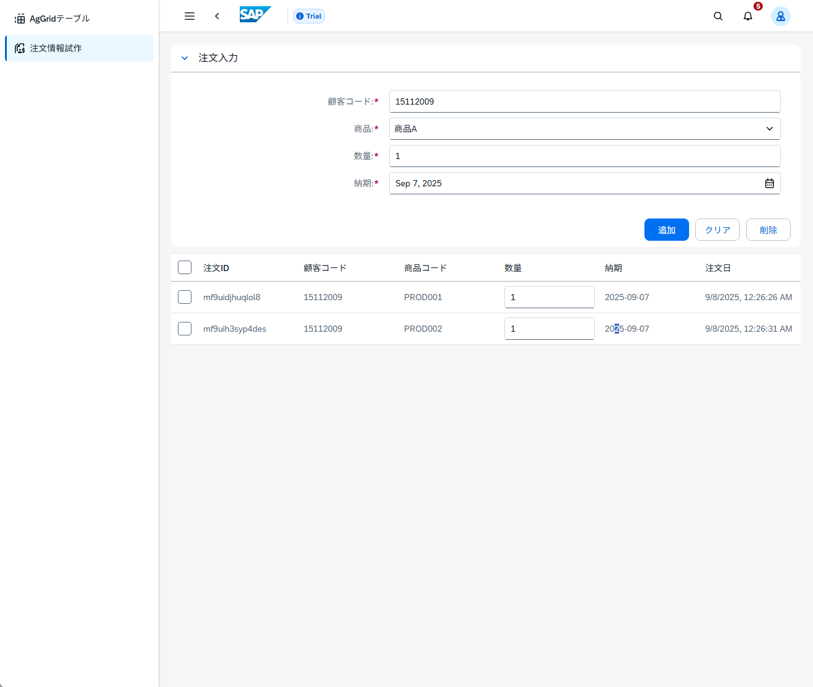
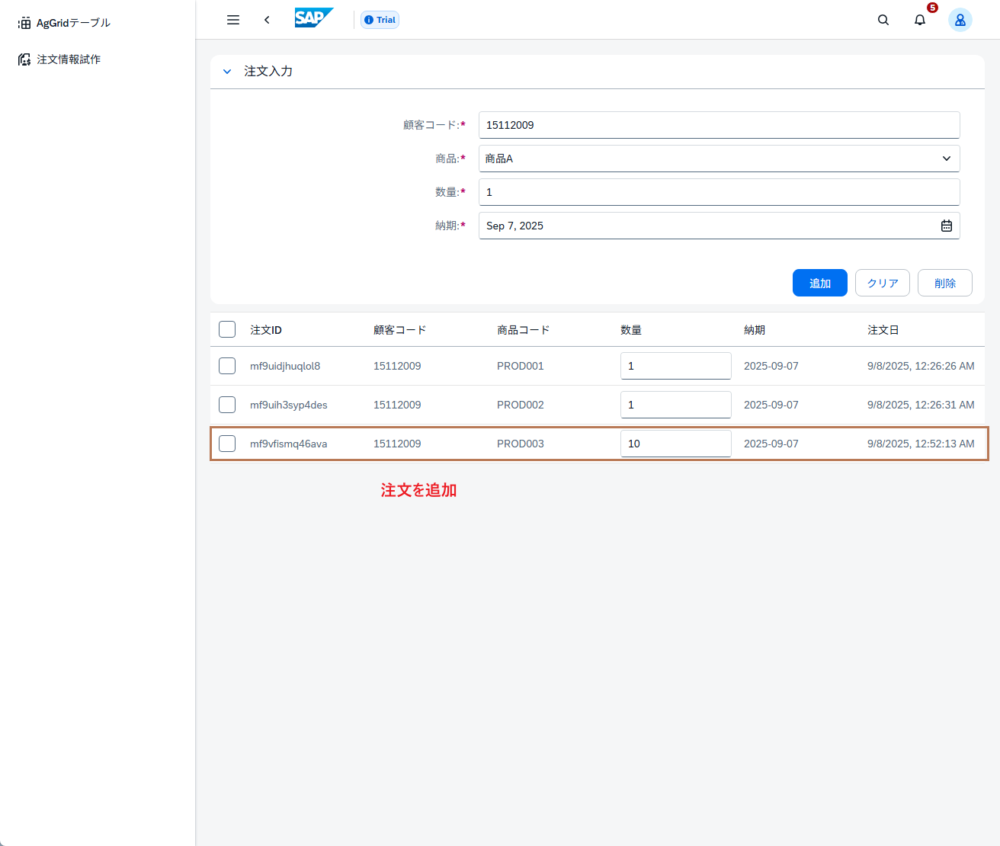
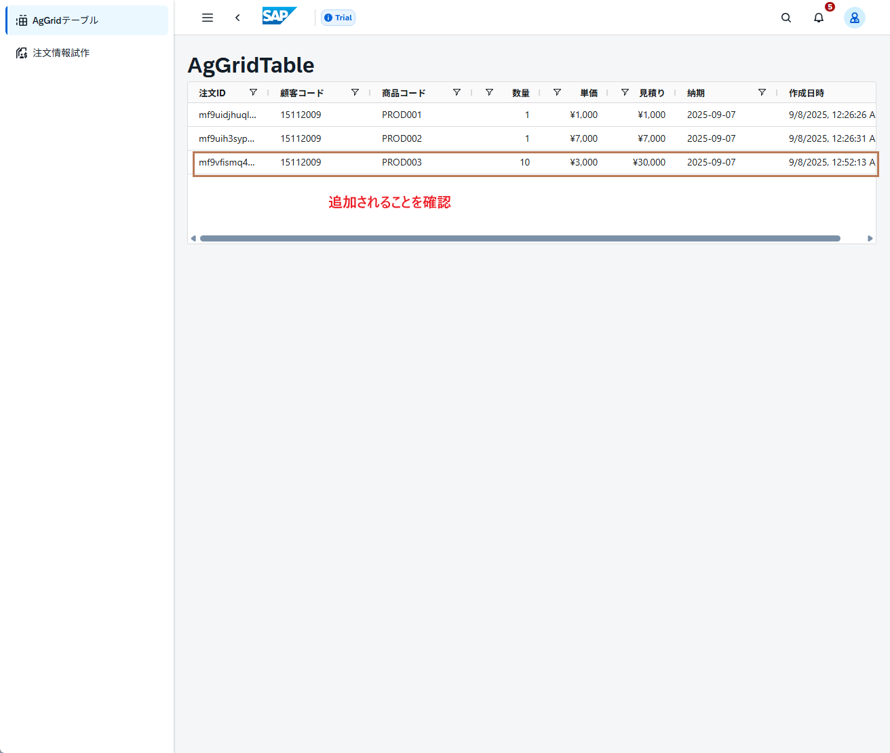

# Day 6: Ag-Grid

## ゴール
!!! success "Day 6 Goals"
- Ag-Gridのインストール
- 基本的なエクセルライクテーブルの実装

## Ag-Gridインストール
### ターミナルで以下のコマンドを実行
```
npm install -D sass-embedded
npm install ag-grid-community@latest ag-grid-vue3@latest
```

## Ag-Gridの実装
### `src/components/base/AgGridTable.vue`を以下のコードに置き換え
```
<template>
  <div class="mt-20 mx-5">
    <ui5-title level="H2" size="H2">AgGridTable</ui5-title>
    <ag-grid-vue
      :columnDefs="columnDefs"
      :headerHeight="30"
      :rowHeight="35"
      :rowData="formStore.orders"
      :defaultColDef="defaultColDef"
      :theme="theme"
      style="height: 240px"
    ></ag-grid-vue>
  </div>
</template>

<script setup>
import { ref } from "vue";
import { AgGridVue } from "ag-grid-vue3";
import { themeAlpine, AllCommunityModule, ModuleRegistry } from "ag-grid-community";
import "@ui5/webcomponents/dist/Title.js";
import { useFormStore } from "../../stores/form-store";

// コミュニティ版のモジュール登録
ModuleRegistry.registerModules([AllCommunityModule]);
const theme = ref(themeAlpine);

// フォームストアの使用
const formStore = useFormStore();

// Emits for parent component
const emit = defineEmits(['selection-changed']);

// デフォルトのカラム定義
const defaultColDef = {
  sortable: true,
  filter: true,
  resizable: true,
  editable: true
};

// 通貨文字列を数値に変換する関数
const parseCurrency = (val) => {
  if (typeof val === "string") {
    return parseFloat(val.replace(/[¥,]/g, "")) || 0;
  }
  return val || 0;
};

// 数値を通貨形式の文字列に変換する関数
const formatCurrency = (val) => {
  const num = parseFloat(val);
  if (isNaN(num)) return "";
  return `¥${num.toLocaleString()}`;
};

const recalculateEstimateCost = (params) => {
  const data = params.data;
  const quantity = parseCurrency(data.quantity);
  const unitPrice = parseCurrency(data.unitPrice);
  data.estimatedCost = quantity * unitPrice;

  // テーブルとストアの両方を更新
  params.api.applyTransaction({ update: [data] });
  formStore.updateOrder(data.id, data);
};

const columnDefs = ref([
  {
    headerName: "注文ID",
    field: "id",
    flex: 1,
    minWidth: 120
  },
  {
    headerName: "顧客コード",
    field: "customerCode",
    flex: 1,
  },
  {
    headerName: "商品コード",
    field: "productCode",
    flex: 1,
  },
  {
    headerName: "数量",
    field: "quantity",
    flex: 1,
    editable: true,
    type: 'numericColumn',
    onCellValueChanged: recalculateEstimateCost,
  },
  {
    headerName: "単価",
    field: "unitPrice",
    flex: 1,
    editable:true,
    type: 'numericColumn',
    valueFormatter: (params) => formatCurrency(params.value),
    valueParser: (params) => parseCurrency(params.newValue),
    onCellValueChanged: recalculateEstimateCost,
  },
  {
    headerName: "見積り",
    field: "estimatedCost",
    flex: 1,
    type: 'numericColumn',
    valueFormatter: (params) => formatCurrency(params.value),
    valueParser: (params) => parseCurrency(params.newValue),
    onCellValueChanged: recalculateEstimateCost,
  },
  {
    headerName: "納期",
    field: "deliveryDate",
    flex: 1,
  },
  {
    headerName: "作成日時",
    field: "createdAt",
    flex: 1,
  }
]);

</script>

```

### `src/pages/AgGridPage`を作成し、以下のコードを追加
```
<template>
  <div class="mx-10 my-10">
    <AgGridTable />
  </div>
</template>

<script setup >
import AgGridTable from "../components/base/AgGridTable.vue";
</script>
```

##　UIの確認

### `npm run dev`でローカルサーバーを起動し、http://localhost:5173/#/plan3 にアクセス


### 数量や単価を変更し、見積りが自動計算されることを確認


### 画面右上のメニューから注文情報試作にアクセスし、注文情報試作画面に遷移できることを確認


### 注文情報で注文を追加し、AgGridテーブルに反映されることを確認

