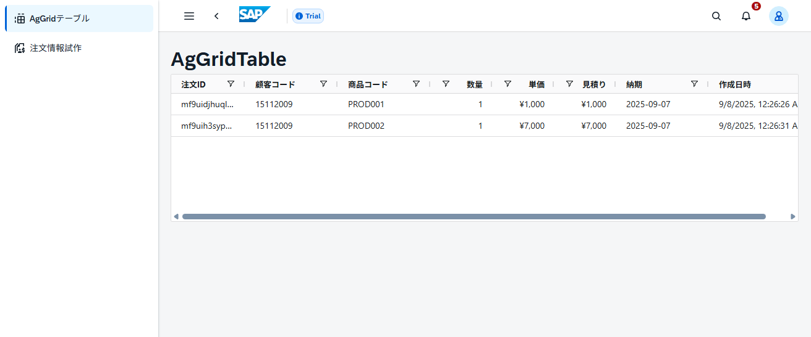
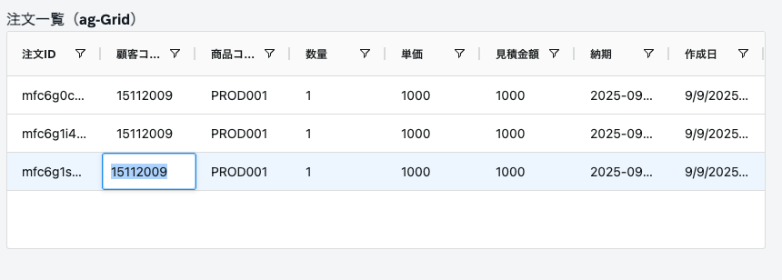
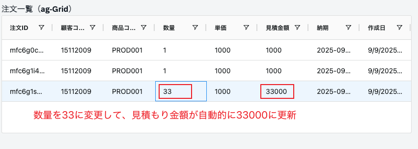
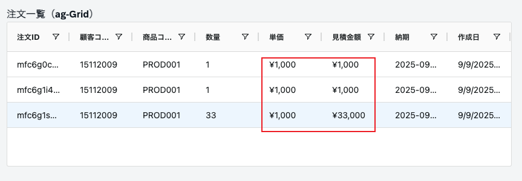

# Day 6: Ag-Grid

## ゴール
!!! success "Day 6 Goals"
    - Ag-Gridのインストール
    - セルを編集可能なエクセルライクテーブルの実装
    - セル編集時に他のセルを自動計算で更新

## Ag-Gridインストール
ターミナルで以下のコマンドを実行します。
```
npm install -D sass-embedded
npm install ag-grid-community@latest ag-grid-vue3@latest
```

---

## Ag-Gridの実装
### Step 1: 最小限のグリッド表示

`src/components/base/AgGridTable.vue`を作成し、以下のコードを追加します。
```
<template>
  <div class="mt-20 mx-5">
    <ui5-title level="H2">注文一覧（ag-Grid）</ui5-title>
    <ag-grid-vue
      :columnDefs="columnDefs"
      :rowData="rowData"
      :defaultColDef="defaultColDef"
      :theme="theme"
      style="height: 240px"
    ></ag-grid-vue>
  </div>
</template>

<script setup>
import { ref } from "vue";
import { AgGridVue } from "ag-grid-vue3";
import { themeAlpine, AllCommunityModule, ModuleRegistry } from "ag-grid-community";
import "@ui5/webcomponents/dist/Title.js";

// ag-Grid v33以降は必須
ModuleRegistry.registerModules([AllCommunityModule]);
const theme = ref(themeAlpine);

// テスト用の仮データ
const rowData = ref([
  { id: 1, customerCode: "CUST001", productCode: "PROD-A", quantity: 10 }
]);

// グリッドの基本設定
const defaultColDef = {
  sortable: true,    // ソート可能
  filter: true,      // フィルター可能
  resizable: true    // 列幅変更可能
};

// 表示する列の定義
const columnDefs = ref([
  { headerName: "注文ID", field: "id", flex: 1 },
  { headerName: "顧客コード", field: "customerCode", flex: 1 },
  { headerName: "商品コード", field: "productCode", flex: 1 },
  { headerName: "数量", field: "quantity", flex: 1 }
]);
</script>
```

`src/pages/AgGridPage`を作成し、以下のコードを追加します。
```
<template>
  <div class="mx-10 my-10">
    <AgGridTable />
  </div>
</template>

<script setup >
import AgGridTable from "@/components/base/AgGridTable.vue";
</script>
```

### ハンズオン 1: 作成したグリッド表示画面へのルートを追加する
`/src/router/index.ts`のTODO部分を追加し、`/aggrid`で上のページにアクセスできるようにしましょう。  
`npm run dev`でローカルサーバーを起動し、AG-Gridの画面にアクセスして確認します。  



#### ヒント
- 既存のルートを参考に、`path`と`component`を指定
- `component`は`@/pages/AgGridPage.vue`を指定

<details>
<summary>解答例</summary>
```
{
    path: "/aggrid",                                    // アップロードページのパス
    component: () => import("../layout/MainLayout.vue"), // 同じレイアウトを使用
    children: [
      {
        path: "",                                        // AgGridアクセス時の子コンポーネント
        name: "ag-grid",                                 // ルート名
        component: () => import("../pages/AgGridPage.vue"), // AgGridPage コンポーネントを表示
      },
    ],
},
```
</details>

---

### ハンズオン 2: ストアのデータをAg-Gridに表示する
Step1で実装したコードを修正し、Day5で作ったストアのデータを表示しましょう。

#### ヒント
- `useFormStore`をインポート
- `rowData`を仮データからストアのデータに変更

<details>
<summary>解答例</summary>
```
// インポート追加
import { useFormStore } from "@/stores/form-store";
const formStore = useFormStore();

// rowDataを変更
const rowData = formStore.orders; // refは不要（ストアが既にリアクティブ）
```
</details>

&nbsp;

####　確認ポイント
- Day5で作成した注文情報が表示されていること
- 新しく注文を追加した場合、Ag-Gridの表示も更新されること

---

### ハンズオン 3: セル編集と列の追加
- `columnDefs`を修正し、以下の列を追加しましょう。
    - 単価（unitPrice）
    - 見積り（estimatedCost）
    - 作成日（createdAt）
    - 納期（deliveryDate）
- `defaultColDef`に1行追加し、全ての列を編集可能にしましょう。

#### ヒント
- `columnDefs`に列を追加
- AgGridの[ドキュメント](https://www.ag-grid.com/vue-data-grid/cell-editing/)を参考にする

<details>
<summary>解答例</summary>
```
const defaultColDef = {
  sortable: true,
  filter: true,
  resizable: true,
  editable: true // 追加
};

const columnDefs = ref([
  { headerName: "注文ID", field: "id", flex: 1 },
  { headerName: "顧客コード", field: "customerCode", flex: 1 },
  { headerName: "商品コード", field: "productCode", flex: 1 },
  { headerName: "数量", field: "quantity", flex: 1 },
  // 以下を追加
  { headerName: "単価", field: "unitPrice", flex: 1 },
  { headerName: "見積金額", field: "estimatedCost", flex: 1 },
  { headerName: "納期", field: "deliveryDate", flex: 1 },
  { headerName: "作成日", field: "createdAt", flex: 1 }
]);
```
</details>
&nbsp;

#### 確認ポイント
- 追加した列が表示されていること
- どのセルでもクリックすると編集可能になっていること

<hr>

### Step 2: 見積りの自動計算
通貨フォマット関数を追加します。
```
// 通貨を扱うヘルパー関数
// "¥1,000"のような文字列を数値に変換
const parseCurrency = (val) => {
  if (typeof val === "string") {
    return parseFloat(val.replace(/[¥,]/g, "")) || 0;
  }
  return val || 0;
};
// 数値を"¥1,000"のような通貨フォーマットに変換
const formatCurrency = (val) => {
  const num = parseFloat(val);
  if (isNaN(num)) return "";
  return `¥${num.toLocaleString()}`;
};
```
自動計算関数を追加します。
```
// 見積り自動計算
const recalculateEstimateCost = (params) => {
  const data = params.data;
  const quantity = parseCurrency(data.quantity);
  const unitPrice = parseCurrency(data.unitPrice);
  
  // 見積金額を計算
  data.estimatedCost = quantity * unitPrice;
  
  // グリッドを更新
  params.api.applyTransaction({ update: [data] });
  
  // ストアも更新（永続化のため）
  formStore.updateOrder(data.id, data);
};
```
セル編集終了時に自動計算関数を呼び出すように指定します。
```
{ headerName: "数量", field: "quantity", flex: 1,
  onCellValueChanged: recalculateEstimateCost // 追加
},
{
  headerName: "単価", field: "unitPrice", flex: 1,
  onCellValueChanged: recalculateEstimateCost // 追加
}
```

#### 確認ポイント
- 数量や単価を変更し、見積りが自動計算されること

---
### ハンズオン 4: 金額の通貨フォーマット
単価と見積りの列に通貨フォーマットを追加しましょう。
#### ヒント
- `valueFormatter`プロパティを使用
- `formatCurrency`関数を使用

<details>
<summary>解答例</summary>
```
{
  headerName: "単価", field: "unitPrice", flex: 1,
  onCellValueChanged: recalculateEstimateCost,

  ////// 追加 //////
  // 通貨フォーマットを適用
  valueFormatter: (params) => formatCurrency(params.value) 
  /////////////////
},
{
  headerName: "見積金額", field: "estimatedCost", flex: 1,

  ////// 追加 //////
  valueFormatter: (params) => formatCurrency(params.value)
  ////////////////
}
```
</details>
&nbsp;

#### 確認ポイント
- 単価と見積りのセルが"¥1,000"のような通貨フォーマットで表示されていること


---

### チャレンジタスク
- 注文IDの列を編集不可にする
- 全てのセルをページをリロードしても編集内容が残るようにする

## トラブルシューティング
- Ag-Gridのスタイルが適用されない場合
  - `main.js`に以下のインポートがあるか確認
  ```
  import 'ag-grid-community/styles/ag-grid.css';
  import 'ag-grid-community/styles/ag-theme-alpine.css';
  ```

- モジュールが登録されていないエラーが出る場合
  - `AgGridVue`のインポートと`ModuleRegistry.registerModules`のコードがあるか確認
  ```
  import { AgGridVue } from 'ag-grid-vue3';
  import { AllCommunityModule, ModuleRegistry } from 'ag-grid-community';
  
  ModuleRegistry.registerModules([AllCommunityModule]);
  ```

## 参考資料
- [Ag-Grid公式ドキュメント（Vue3）](https://www.ag-grid.com/vue-data-grid/)
- [Ag-Grid公式ドキュメント（セル編集）](https://www.ag-grid.com/vue-data-grid/cell-editing/)
